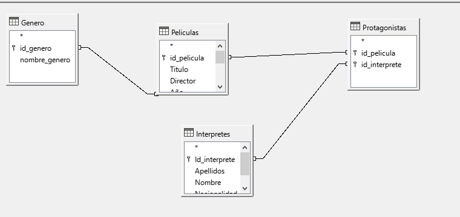
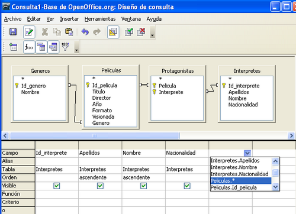
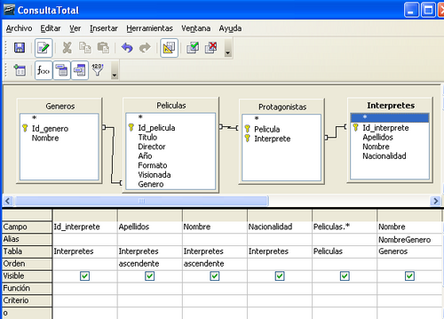
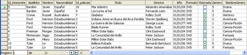
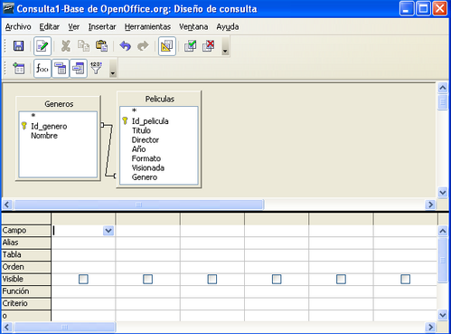
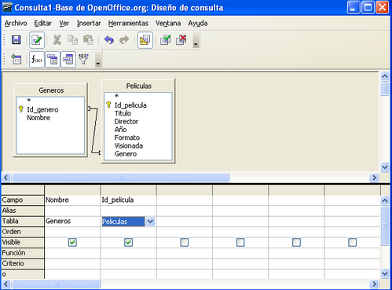
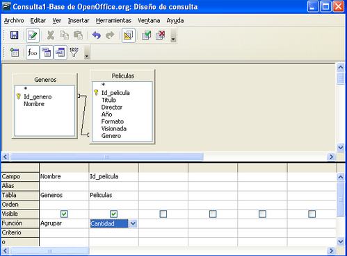
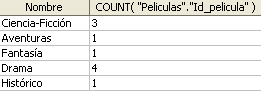

# 6.2. Creación en vista Diseño de consulta sobre varias tablas 

Vamos a crear nuestra primera consulta completamente en vista Diseño. En particular, vamos a crear una consulta que nos muestre todos los actores que protagonizan películas junto con los datos de la película, incluido el nombre del género. Es decir, vamos a construir una consulta que utiliza las cuatro tablas de nuestra base de datos. 

Para empezar, nos vamos a la ventana principal, a la sección Consultas y seleccionamos la tarea **Crear consulta en vista Diseño**.

## Seleccionar tablas a utilizar

Nada más entrar en el modo Diseño, nos mostrará una ventana donde indicar las tablas que queremos incluir en la consulta que se va a crear. En nuestro caso, vamos a añadir las cuatro disponibles y veremos como nos muestra las relaciones existentes automáticamente.

Las puedes recolocar un poco para que te sea más fácil ver las relaciones

## Especificar criterios

A continuación vamos a especificar que queremos que los resultados de la consulta se muestran ordenados por los apellidos y el nombre de los intérpretes.

Para incluir los campos de la **tabla peliculas** vamos a seleccionar Peliculas:* y así no tenemos que incluir los campos uno a uno

Para seleccionar los campos de la tabla Interpretes no hemos utilizado la posibilidad `Interpretes.*` porque es necesario seleccionar cada campo individualmente, ya que vamos a establecer algún criterio de ordenación en función de alguno de los campos de la tabla. 

Como en nuestro caso vamos a mostrar los resultados ordenados en función de los apellidos y el nombre de los intérpretes (ver Figura 6.4) necesitamos seleccionar uno a uno cada campo de Interpretes. 

Para terminar, vamos a seleccionar el campo Nombre de la **tabla Generos** y, en el alias, vamos a poner “NombreGenero”, para distinguirlo de los campos ya seleccionados, Nombre de la tabla Interpretes y genero de la **tabla peliculas**.

Guardamos la consulta con el nombre “ConsultaTotal” y al ejecutarla el resultado es el siguiente:

## Consultas con funciones

Vamos a crear una consulta que realiza operaciones sobre los resultados.

Así, vamos a crear una consulta que muestre el nombre de cada género almacenado y el total de películas que tenemos de cada género. 

Es decir, el objetivo es realizar una consulta sobre Generos y Peliculas de manera que agrupemos las filas devueltas en función de cada género para así poder contarlas y poder saber el número de películas asociadas a cada uno de ellos. 

El resultado de nuestra consulta, con las filas que tenemos actualmente en Generos y Peliculas, debe ser como la siguiente: 

Para empezar, elegimos las tablas sobre las que vamos a realizar la consulta, Generos y Peliculas.

Los campos que necesitamos son, por una lado Nombre de Generos, que es sobre el que agruparemos los resultados devueltos y, por otro, un campo de la **tabla peliculas** que estemos seguros que siempre tendrá un valor (no estará vacío) para cada fila de Peliculas. 

Por ejemplo, podemos elegir el campo **id_pelicula** que siempre va a tener valor para cada película. Los campos seleccionados se muestran.

A continuación, debemos asociar la función correspondiente a cada uno de los dos campos. 

## Especificar función

En primer lugar, hemos dicho que queremos agrupar los resultados en función de cada género, para ello vamos a incluir la función “Agrupar” asociada al campo Nombre de Generos. 

En segundo lugar, lo que queremos es contar las películas relacionadas con cada género. Esto último lo conseguimos asociando la función “Cantidad” al campo Id_pelicula de Peliculas.

Guardamos entonces la consulta como “Peliculas de cada Genero” 

Al lanzarla nos encontramos una pantalla como esta: 

Como vemos, la cabecera con el total de películas está mostrando la función que estamos utilizando junto con el nombre del campo.

Si queremos que el resultado aparezca como el que mostraremos en la figura., es decir, con una cabecera significativa, debemos añadir el alias “Total de Peliculas”.

