# 7. FORMULARIOS

Los formularios permiten la introducción de datos en las tablas de una forma más sencilla y más limpia. En vez de introducir los datos directamente sobre la tabla, los datos se introducen en la tabla a través de los formularios. 

En una base de datos se puede crear más de un formulario basado en una misma tabla. 

Un formulario puede tomar varios campos de una tabla o todos; incluso puede tomar campos de diferentes tablas o consultas. 

Las tablas almacenan la información, los formularios se encargan de recogerla. 

## Entorno de creación

Para crear un formulario nos vamos a encontrar dos posibilidades dentro del apartado de tareas disponibles en la sección formularios: 

- **Creación de formularios en vista Diseño:** permite crear un formulario totalmente personalizado.  
- **Usar el asistente para crear formulario:** crea automáticamente un formulario con los campos que el usuario seleccione.  

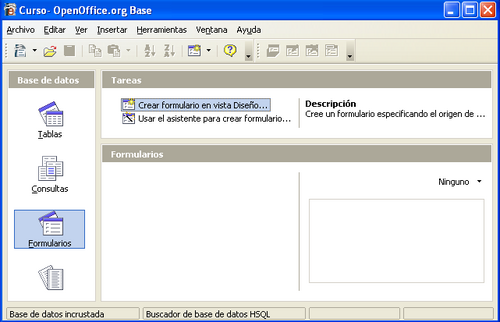

Nosotros vamos a crear formularios en la vista Diseño porque nos permite configurarlos con más detalles. Para ello pulsamos sobre “Crear formulario en vista Diseño…”. Nos aparece entonces la ventana de diseño de formularios 

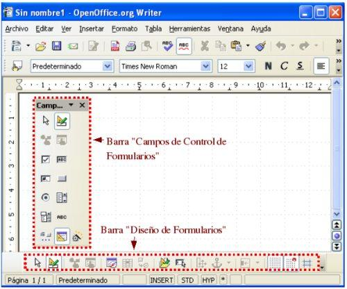

## Controles

Toda la información de un formulario está contenida en los **controles**.

Los controles son objetos de un formulario que muestran datos, realizan acciones o decoran el formulario. 

Los controles pueden ser dependientes, independientes o calculados: 

- Control dependiente: está unido a un campo de una tabla o consulta. Los controles dependientes se utilizan para mostrar, introducir y actualizar valores de los campos de la base de datos.  

- Control independiente: no tiene un origen en una tabla o consulta. Los controles independientes se pueden utilizar para mostrar información, líneas, rectángulos e imágenes, independientemente de que estos existan en la tabla creada de antemano.  

- Control calculado: el origen de los datos es una expresión, no un campo. Una expresión es una combinación de operadores (=,+,-,* y /), nombres de controles, nombres de campos, funciones que devuelven un solo valor y valores constantes. La expresión puede incluir datos de un campo de la tabla o consulta del formulario o datos de otro control del formulario.  

Los distintos campos de control se encuentran repartidos en las dos barras de herramientas que aparecen resaltadas en la Figura 7.2; por un lado, la barra “Diseño de Formularios” y, por otro, la barra “Campos de control de formulario”. 

Si esta última barra no nos apareciera por cualquier motivo, se puede acceder a ella a través del menú “Ver”, eligiendo la opción “Barra de Herramientas” y activando la casilla “Campos de control de formulario”. 

Antes de conocer los controles más importantes de ambas barras es recomendable, para hacer más cómodo el diseño de formularios, incrustar la barra “Campo de Control…” con el resto de barras de herramientas; para ello, basta con hacer doble clic con el ratón sobre la cabecera de esta barra y la ventana de diseño de formularios nos quedará como aparece. 

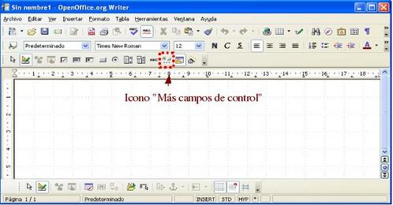

En esta última barra, por defecto, no aparecen todos los controles disponibles; si queremos que aparezcan todos, debemos pulsar el icono que abre la barra de herramientas “Más campos de control” y nuestra ventana de trabajo debería quedar como la que aparece

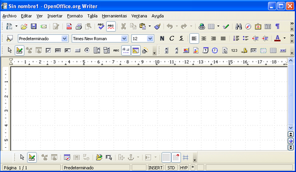

## Formulario para introducir intérpretes

El primer formulario que vamos a crear en Vista Diseño es uno para la tabla Interpretes que nos va a permitir introducir los intérpretes de una película. 

Lo primero que vamos a hacer dentro de la ventana de edición de formularios es indicar cómo se va a llamar el formulario y con qué tabla va a estar conectado. 

Para ello, pulsamos sobre el icono “Navegador de formulario” y hacemos clic con el botón derecho sobre el campo “Formulario”, elegimos la opción “Nuevo” y, dentro de ésta, “Formulario”.

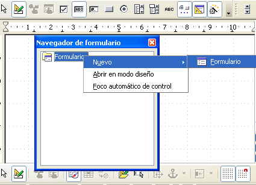

Por defecto, al nuevo formulario lo llama Standard pero nosotros lo vamos a renombrar como Form_Interpretes. 

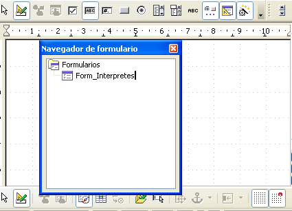

Para indicar que el formulario va a estar conectado con la tabla Interpretes hacemos clic con el botón derecho del ratón en el navegador de formulario sobre Form_Interpretes y elegimos “Propiedades”.

 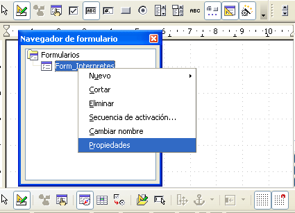

En el cuadro resultante, vamos a la ficha “Datos”, y seleccionamos dentro “Contenido”. Abrimos el menú desplegable y seleccionamos la tabla sobre la que vamos a construir el formulario, en nuestro caso Interpretes

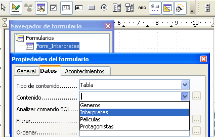

## Guardar el formulario

Cerramos las ventanas “Propiedades del formulario” y “Navegador de formulario” y, antes de continuar, guardamos el formulario pulsando en la pestaña “Archivo” y dentro “Guardar”, y también aquí le nombramos como Form_Interpretes.

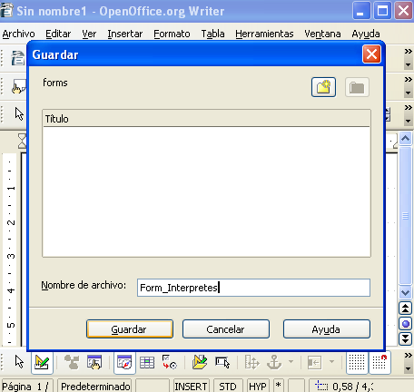

## Crear campo de texto

Ahora ya podemos continuar con la creación del formulario. En primer lugar, vamos a crear un campo de texto. Para ello:

1. Seleccionamos “Campo de texto” de entre todos los controles disponibles. 
2. Veremos que el cursor cambia de forma, y es cuando podemos insertar dicho campo. 
3. Llevamos el cursor a la posición de la zona de trabajo
4. Lo arrastramos hasta que el campo de texto alcance el tamaño deseado. 

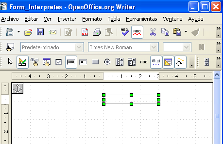

Ahora tenemos que dar unas propiedades al campo de texto y asignarle la tabla en la que se insertarán los datos introducidos desde este formulario. 

Seleccionamos dicho cuadro con el botón derecho y nos sale un cuadro emergente, y dentro de él escogemos “Campo de Control”.

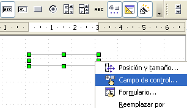

En el cuadro resultante, vamos a la ficha “Datos”, y seleccionamos dentro de “Campo de datos” el nombre del campo al cual se va a enlazar, en este caso, al campo Id_Interprete.

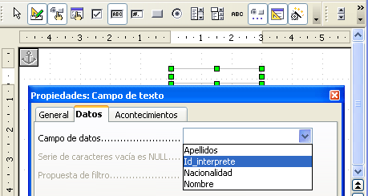

Dentro de esta misma ventana de propiedades del campo, nos vamos a la ficha “General” al campo “Nombre” y escribimos CampoId_Interprete.

Una buena práctica es dar un nombre significativo a cada campo que creemos, sobre todo cuando tengamos formularios con muchos campos. Así, podremos distinguir bien cada campo dentro de la ventana “Navegador de Formularios”.

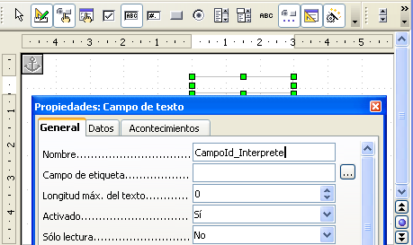

## Colocar un campo de etiqueta

Delante del campo de texto creado vamos a poner un “Campo etiqueta” para que cualquier usuario que utilice el formulario conozca lo que debe introducir.

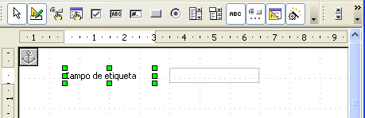

Si hacemos doble clic sobre la etiqueta aparecerá una ventana donde podremos indicar las diferentes propiedades de la etiqueta (nombre que aparecerá en la etiqueta, color de fondo, tipo de letra, tamaño, color,...). 

El formato de los formularios puede tener más colorido y distintas fuentes de texto.

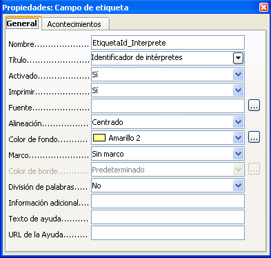

Dentro de estas propiedades vemos que hay algunas que nos abren una nueva ventana como, por ejemplo, la propiedad “Fuente” donde podemos variar el tamaño y el tipo de la fuente del texto.

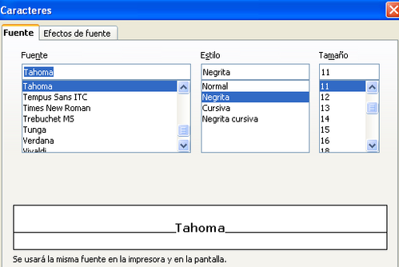

Una vez que hemos cambiado las propiedades de la etiqueta, nuestro formulario debería. parecerse al de la figura.

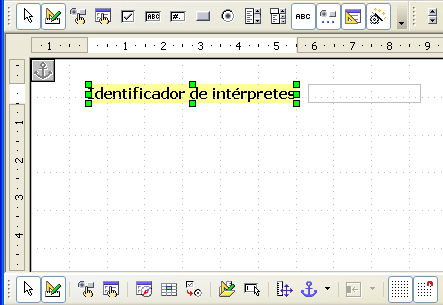

## Completar el resto de campos del formulario

Si repetimos los pasos realizados para el resto de los campos de la tabla Interpretes podríamos obtener un formulario parecido a este.

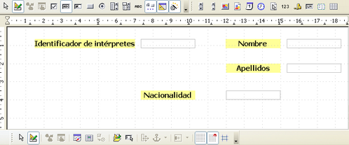

## Guardar cambios

Si salvamos los cambios realizados y cerramos la ventana de edición de formularios, en la ventana de objetos ya debe aparecer el formulario que acabamos de crear.

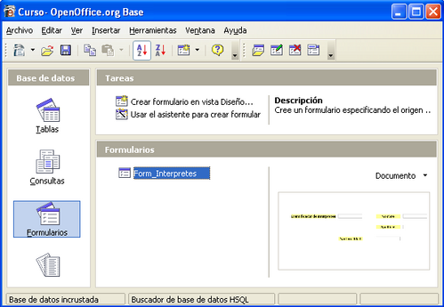

## Editar el formulario

Si queremos realizar algún cambio en el formato del formulario, pulsamos sobre el formulario con el botón derecho del ratón y elegimos la opción ‘Editar’.

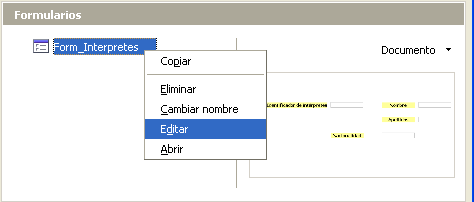

## Ejecutar el formulario

En cambio, si lo que queremos es ejecutar el formulario para empezar a insertar datos hacemos doble clic sobre él .

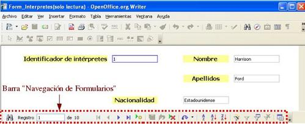

Veréis que abajo aparece el número de registros (filas) que hay guardados en esta tabla y podremos ir viendo la información guardada en el formulario.
