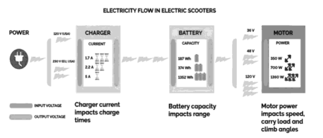
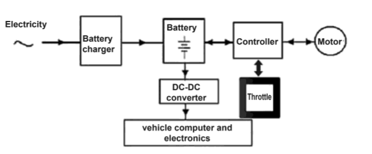
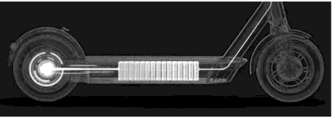
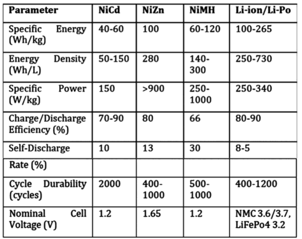

# Funcionamiento general

Motor eléctrico: El motor eléctrico es el componente principal del patinete eléctrico y se encarga de proporcionar la energía necesaria para que el patinete se mueva. El motor eléctrico generalmente se encuentra en la rueda trasera del patinete y puede ser de diferentes tipos, como motor de cubo o motor de correa.

Batería: La batería es la fuente de energía del patinete eléctrico y se utiliza para alimentar el motor eléctrico. La batería generalmente se encuentra debajo del tablero o del reposapiés y puede ser de diferentes tipos, como batería de plomo-ácido o batería de iones de litio.

Controlador: El controlador es el componente que se encarga de controlar el funcionamiento del motor eléctrico y la velocidad del patinete. El controlador se encuentra generalmente en el manillar y se utiliza para ajustar la velocidad y el frenado.

Freno: El freno es un mecanismo que se utiliza para detener el patinete eléctrico y se encuentra generalmente en la rueda trasera. Los frenos pueden ser de diferentes tipos, como freno de disco o freno de tambor.

Ruedas: Las ruedas son los componentes que permiten el movimiento del patinete eléctrico y se encuentran en la parte delantera y trasera del patinete. Las ruedas pueden ser de diferentes tamaños y materiales, y se utilizan para proporcionar estabilidad y agarre al patinete.

Tablero o plataforma: El tablero o plataforma es la superficie en la que se coloca el pie del usuario y se encuentra encima de las ruedas. La plataforma puede ser de diferentes tamaños y materiales, y se utiliza para proporcionar un espacio cómodo para que el usuario pueda pararse y equilibrarse.