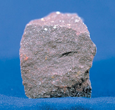
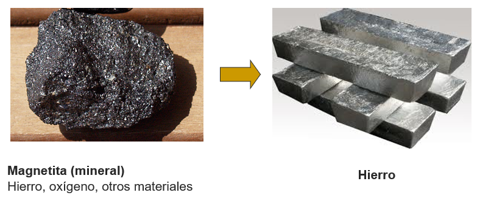
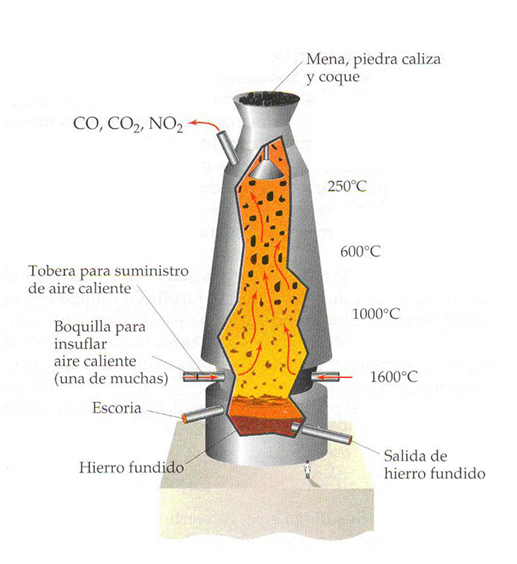
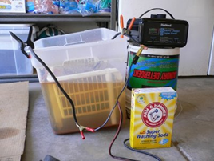
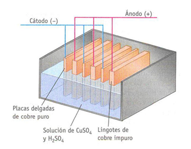

# Obtención de metales

La mayoría de metales deben extraerse de los minerales que los contienen.

Los **minerales** contienen elementos y compuestos químicos que pueden ser separados para extraer metales. Esto generalmente se logra a través de un proceso de **refinación** física o química.

- La refinación física implica separar los minerales mediante técnicas mecánicas, como la trituración y la molienda.
- La refinación química implica usar ácidos, bases y soluciones reactivas para separar los minerales del metal. Esta última técnica es comúnmente utilizada para extraer metales preciosos, como el oro.

Una vez obtenidos estos en la naturaleza, se pueden utilizan dos procesos para extraer el metal:
En el horno a altas temperaturas:
Por electrolisis; mediante una corriente eléctrica

## Forn a altes temperatures:

Els minerals es trituren i s'introdueixen en el forn altes temperatures on es fon el metall
Es recull el metall fos

## Electròlisi

Mitjançant un corrent elèctric s'introdueix mineral en un recipient amb líquid conductor. Es fa circular un corrent elèctric a través del líquid. S'incrementa la temperatura, provocant que el metall es foni. A continuació, es recull el metall fos.

Un cop el metall s'ha desprès de l'mineral per fusió, es conforma el metall (se li dóna la forma) per diferents processos:

- Fosa: S'aboca el metall fos en un motlle i es deixa refredar.
- Laminat: El metall fos passa per uns rodets, formant làmines.