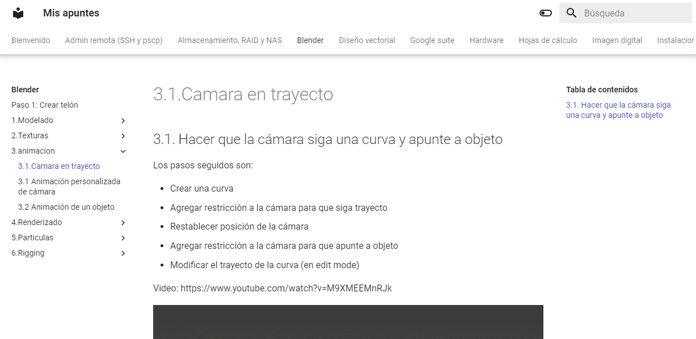

# Mkdocs

MkDocs es un generador de documentación rápido y simple escrito en Python. PErmite escribir y mantener la documentación de forma sencilla.

## Mis necesidades

Yo creo documentación **markdown**, la controlo con git y la almaceno en github. Mi intención es crear una web estática a partir de markdown, y que sea visible a través de la función **github pages**.

**Mkdocs** me permite generar automáticamente el contenido web estático a partir de los archivos .md y sus archivos asociados (imágenes, etc).

Además de este paquete, también utilizo el tema **mkdocs-material** para la interfaz de usuario.



## ¿Qué podemos hacer?

Aquí hay una breve descripción de lo que MkDocs puede hacer:

- Generar un sitio web hermoso a partir de su documentación
- Escriba su documentación en Markdown, un lenguaje de marcado simple y fácil de usar
- Generar automáticamente una tabla de contenidos
- Implemente su documentación en GitHub Pages, Amazon S3 o cualquier otro servidor web

Ahora comencemos con MkDocs!

## Instalación

Para la instalación necesitaremos tener instalado Python, puesto que utilizaremos pip para instalar los paquetes.

MkDocs se puede instalar con pip del siguiente modo:

```
python -m pip install mkdocs
```

En mi caso uso **python -m** puesto que estoy en windows y no reconoce python como comando en la shell de windows.

## Crear un proyecto nuevo

Una vez que **MkDocs** esté instalado, podrá usar el comando `mkdocs` para crear un nuevo proyecto.

```
python -m mkdocs new my-project
```

Esto creará un nuevo directorio llamado `my-project` con la siguiente estructura:

```
my-project/
    docs/
        index.md
    mkdocs.yml
```

- En la carpeta docs tendremos que meter todos nuestros documentos
- El archivo mkdocs es un archivo de configuración yaml que nos permitirá indicar como queremos que se cree la documentación.

## Crear documentación para un proyecto ya creado

Si ya tenemos la carpeta creada con anterioridad, para crear el proyecto nuevo:

```
python -m mkdocs new .
```

## Mostrar en servidor local

Podemos previsualizar su nuevo proyecto con el comando `serve`:

```
python -m mkdocs serve
```

Abra http://127.0.0.1:8000 en su navegador y debería ver la página de inicio.

Ahora editemos el archivo `docs/index.md` y agreguemos el siguiente contenido:

```markdown
# Mi proyecto

¡Bienvenido a mi proyecto!
```

Guarde el archivo y actualice la página en su navegador y debería ver el contenido actualizado:


## Construyendo la documentación

Si vemos que la documentación se muestra como queremos, podemos usar el comando `mkdocs build` para generar un sitio estático:

```
mkdocs build
```

Esto creará un directorio `site` con todos los archivos necesarios para alojar su sitio web.

## Desplegando la documentación

Si desea implementar su sitio en GitHub Pages, puede usar el comando `gh-deploy`. Esto creará una rama nueva para nuestro repo y la pusheará a github.

```
mkdocs gh-deploy
```

## Automatizando cosas

**Github Actions** nos permite automatizar el despliegue de mkdocs. Vamos a intentar que, tras pushear un commit nuevo a github, se construya y despliegue automáticamente todo directamente en github, en lugar de tener que hacerlo a nivel local.

Para ello tenemos que crear un workflow en la root de nuestro repo:


El contenido dependerá de lo que queramos hacer. En mi caso:

```yaml
name: ci
on:
  push:
    branches:
      - master
      - main
permissions:
  contents: write
jobs:
  deploy:
    runs-on: ubuntu-latest
    steps:
      - uses: actions/checkout@v3
      - uses: actions/setup-python@v4
        with:
          python-version: 3.x
      - run: pip install mkdocs-material
      - run: mkdocs gh-deploy --force
```
Cada vez que hagamos cambios, pusheamos primero.


Una vez pusheados los cambios, Github automáticamente detectará la configuración del yaml y comenzará el despliegue. Para comprobarlo iremos a la pestaña **actions**:


Se nos mostrarán los **workflow run** ejecutados cronológicamente:


Podemos ver última **run** a la fecha y hora del último pusheo, y el despliegue ha durado cerca de 5 minutos. Esto dependerá del tamaño del proyecto y la potencia de la máquina virtual.

Como vemos, el deploy es disparado via github pages, y podemos ver las fases de build y deploy. Al hacer deploy, automáticamente se crea previamente una build del proyecto.

El estado y los checks nos confirman que la run ha sido correcta.


Gracias a todo esto:

- Nos evitamos tener que hacer build y deploy localmente, que son 5 minutitos buenos en el caso de mi proyecto. Es bastante en comparacición con los add, commit y push que hago para guardar los proyectos.
- También evitamos tener que instalar mkdocs y, por extensión, python. En mi caso, al cambiar constantemente entre varios PC, algunos de los cuales me requieren instalar todos los programas de cero, me supone un ahorro importante.