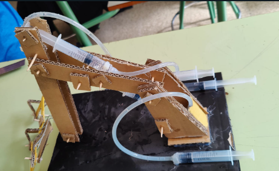
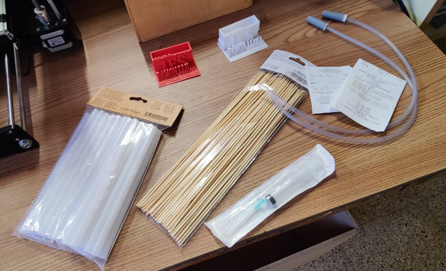
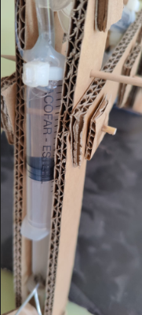
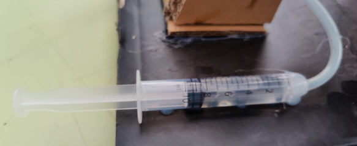
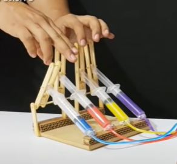

# Braç hidràulic

## Objectiu

Volem construir un braç hidràulic accionat per aigua. Per això farem servir 3 circuits amb xeringues, que transmetran la força d'un extrem al punt del braç que volem moure.

## Materials (per grup)

- 6 xeringues de 10 ml
- Brides
- Pals de pinxo
- Pals de gelat
- Tub de PVC 4 mm / 6 mm
- Cola termofusible
- Blau de metilé i altres tints

## Eines

- Pistola termofusible
- Cutter o tissores
- Pipeta i tassons per emplenar els circuits

## Procés

Mesurar totes les peces a partir del model de referència

Tallar la base de cartró

Tallar les peces de cartró a mida

Pintar les peces

Aferrar les peces de catró i fixar-les amb pals

Col·locar les xeringues, procurant fer els forats necessaris amb un pern calent

Fixar les xeringues corresponents amb brides

Fixar les xeringues a la base amb cola termofusible

Emplenar els circuits de les xeringues amb aigua tintada

Comprovar el funcionament

Muntar la pinsa

## Opcional

Podem crear un sistema de palanques per tal d'accionar les xeringues.

