# Hidràulica

---

### 1. Els líquids no es poden comprimir

Els sistemes hidràulics són similars als sistemes pneumàtics. Però també tenen importants diferències.

---

La principal és que mentre que els sistemes ``pneumàtics`` utilitzen un ``gas`` (aire comprimit) per transmetre moviment i força, els sistemes ``hidràulics`` utilitzen un ``líquid``, l'oli hidràulic, que és un tipus d'oli mineral (olis extrets del petroli).

Els dos utilitzen els ``mateixos tipus de components``: cilindres i motors rotatius com ara actuadors, canonades i vàlvules que controlen el circuit, i compressors o bombes que transmeten energia als fluids.

---

# Diferència gas i líquid

Els líquids no són compressibles: si sotmetem a pressió un líquid tancat en un recipient, aquest no es comprimirà, cosa que sí passarà amb els gasos, com l'aire.

Els líquids, com l'``aigua`` o l'``oli``, no es poden comprimir.

---

### 2. Frens hidràulics

Els frens dels automòbils, motos o bicicletes són un exemple de sistema hidràulic. En trepitjar el pedal de fre, un pistó exerceix força contra un líquid, el ``líquid de frens``. El fluid transmet la força fins als frens, situats a les rodes. A cada fre, un o diversos pistons reben la força i l'apliquen contra l'eix de la roda, per tal d'aturar-la o reduir-ne la seva velocitat.

A les rodes davanteres s'utilitzen ``frens de disc``, formats per un disc d'acer i pastilles de fre. A les rodes posteriors se solen utilitzar frens de tambor, compostos per sabates de fre i un tambor giratori solidari a la roda.

---

### 3. Un sistema hidràulic pot multiplicar la força, com una palanca

Els sistemes hidràulics, a diferència dels pneumàtics, són ``tancats``. El líquid que hi ha a l'interior no es perd. Això, unit al fet que en ser un líquid és incompressible, fa que un sistema hidràulic compost per un cilindre de superfície petita i un cilindre de superfície gran es comporti com una ``palanca``.

---

En fer una petita força al cilindre petit obtenim una gran força al cilindre gran.  A canvi d'obtenir més força, el desplaçament que ha de realitzar el cilindre petit és molt més gran del que realitzarà el cilindre gran.

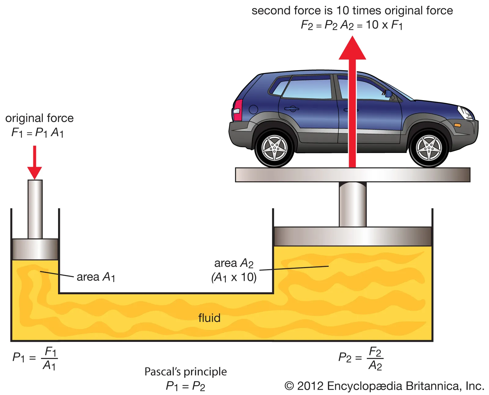

---

Els sistemes hidràulics poden generar una ``força enorme``. Aquesta característica s'utilitza en tot tipus de màquines que requereixen gran potència, com excavadores, tractors, maquinària de la construcció, camions, grues, etc.

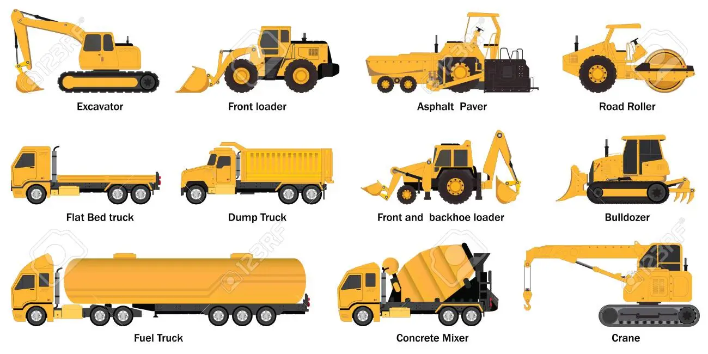

En aquestes màquines, el ``cilindre`` de petit diàmetre se substitueix per una ``bomba`` impulsada per un ``motor`` de combustió o un motor elèctric.

---

# Excavadora

La ``pala`` d'aquesta excavadora utilitza un sistema hidràulic que és capaç de generar una força enorme.
En lloc d'utilitzar dos cilindres (un de petit i un de gran) per multiplicar la força, en aquesta màquina el cilindre petit se substitueix per una bomba hidràulica accionada per un motor.

---

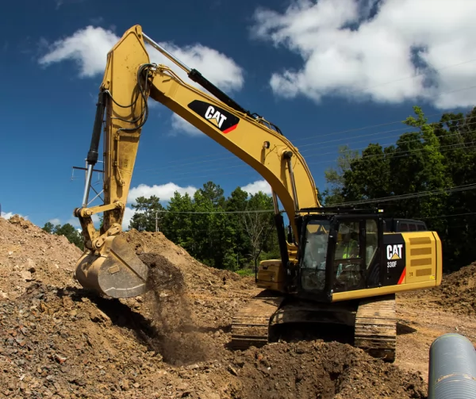

---

La funció de les grues és aixecar càrregues pesades de forma segura. Això és possible gràcies a l'ús de ``cilindres hidràulics``, que poden aturar-se a ``qualsevol punt`` del recorregut, ja que l'oli que hi ha al seu interior no és compressible.

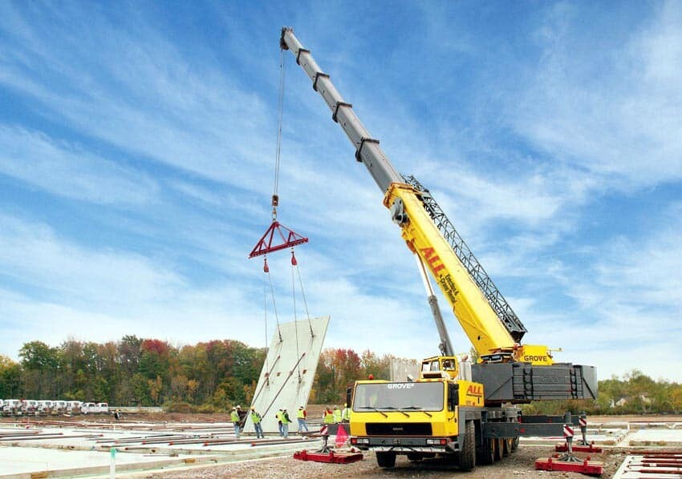

---

Els cilindres hidràulics d'aquesta grua poden aixecar molt de ``pes`` i aturar-se en qualsevol ``altura``. El braç d'aquesta grua funciona gràcies a diversos cilindres hidràulics.

---

Una ``grua de cilindres pneumàtics`` no seria segura ja que l'aire pot comprimir-se, per la qual cosa els cilindres es mourien bruscament en agafar o deixar una càrrega.

---

Els actuadors hidràulics (cilindres i motors rotatius) es poden moure amb ``precisió mil·limètrica``
Això els fa molt útils en el disseny de tot tipus de màquines industrials, com els ``braços robòtics``.

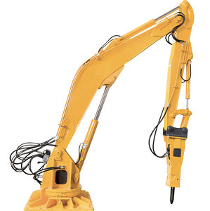

---

Els robots utilitzats en la ``fabricació en cadena de cotxes`` han de moure's amb gran precisió, per aquesta raó la majoria d'ells són hidràulics.

---

# Gats hidràulics

Alguns sistemes hidràulics funcionen gràcies a la força exercida per una persona (els frens dels automòbils, els ``gats hidràulics`` que utilitzen els mecànics per aixecar cotxes als tallers, etc.), tot i que la gran majoria estan accionats per una bomba connectada a un motor.

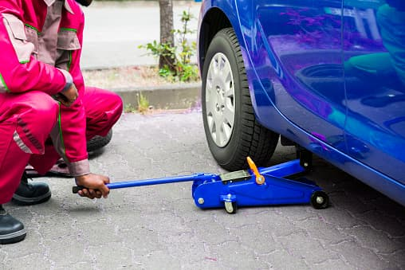

---

# Premses hidràuliques

En màquines industrials, com les ``premses hidràuliques``, s'utilitza un motor elèctric i en vehicles pesants, com les excavadores o les grues, és el mateix motor de combustió del vehicle el que impulsa la bomba.

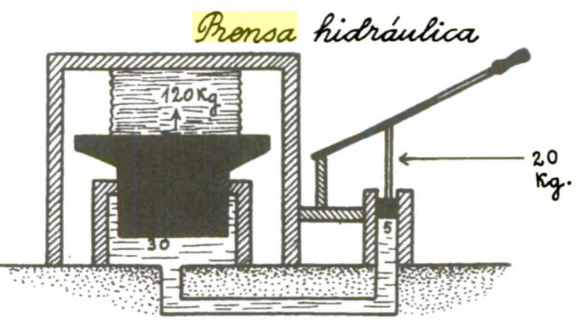

---

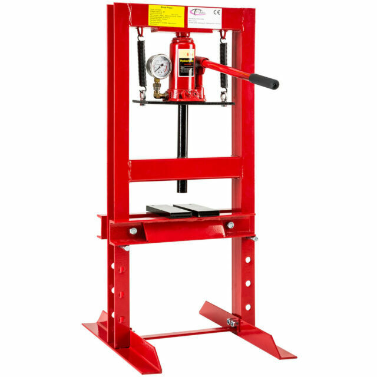

---

Detall del cilindre que aixeca el ``bolquet`` d'un camió. És un cilindre telescòpic, perquè ocupi poc espai quan està en repòs.

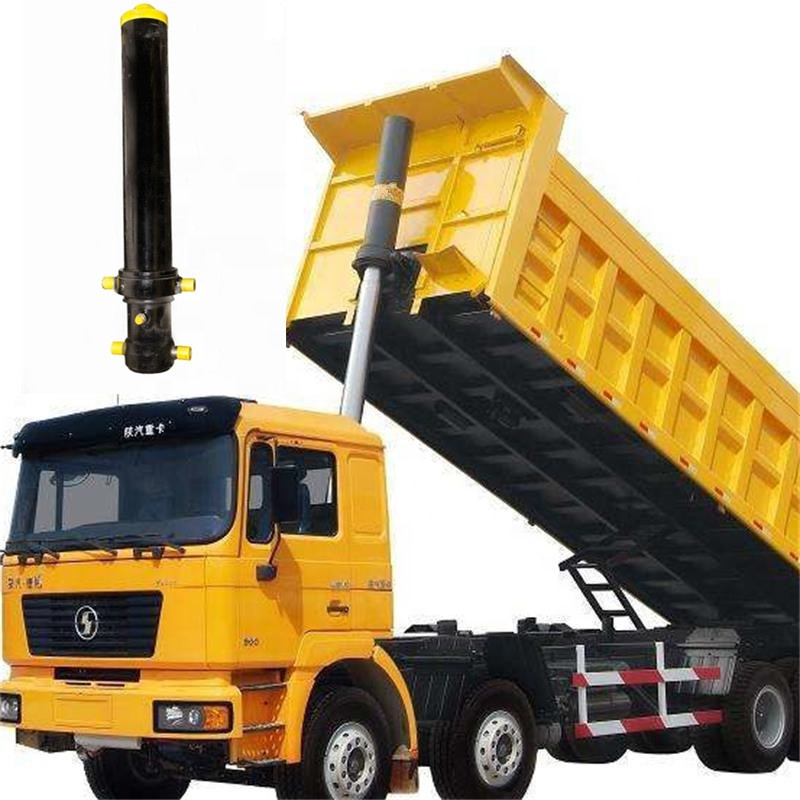

---

Una ``bomba hidràulica`` (una bomba d'engranatges) impulsa l'oli que prové d'un dipòsit. L'oli s'envia als actuadors, en el cas de l'exemple de sota és un cilindre. Una vàlvula distribuïdora controla el moviment del cilindre fent que l'oli circuli en un sentit o en un altre.

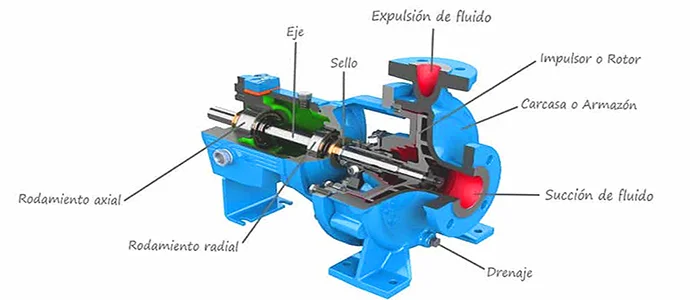

---

## Inconvenients de la hidràulica respecte de la pneumàtica

El principal inconvenient dels sistemes hidràulics respecte dels pneumàtics és que són circuits ``tancats``.

L'oli no es pot escapar del circuit (sí, però, l'aire comprimit), cosa que provoca que els seus components siguin ``més difícils i cars`` de construir i, tinguin un ``manteniment`` més complex.

---

Moltes de les aplicacions hidràuliques són de gran potència, com aral l'excavadora. Com que ha de suportar majors pressions internes i esforços externs, els seus components han de ser molt més reforçats i per tant més cars, encara que això no és tant un desavantatge, sinó una conseqüència del tipus de tasca per a la qual estan dissenyats.

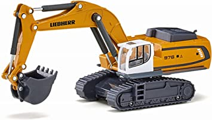
