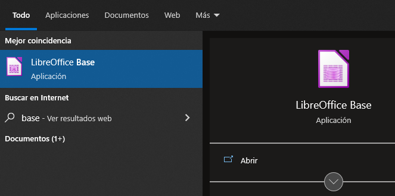
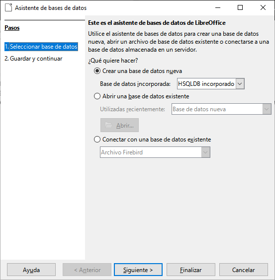
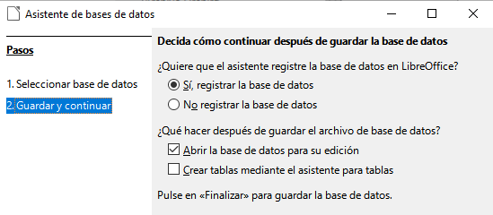
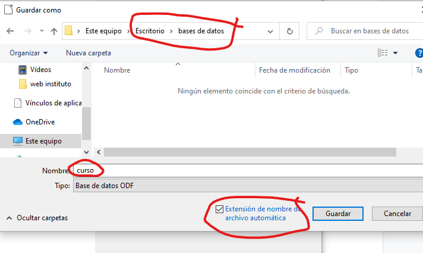

# 1. Bases de datos

## ¿que es una base de datos?

Una base de datos es una colección organizada de datos almacenados en un ordenador. Estos datos se pueden recuperar, consultar y actualizar mediante un lenguaje específico. Las bases de datos se utilizan para guardar información que se utilizará para muchas aplicaciones diferentes, como el procesamiento de informes, el análisis de datos, el procesamiento de transacciones y la administración de información.

## ¿Qué tipos de bases de datos podemos encontrar?

Ejemplos de bases de datos podrían ser:

- Información académica: alumnos, profesores, evaluaciones, amonestaciones, etc.
- Información hospitalaria: pacientes, enfermedades, listas de espera, recetas, médicos, etc.

## ¿Cómo se guarda toda esta información?

Toda esta información está guardada en forma de tablas separadas:

- Tabla alumnos
- Tabla materias
- Tabla profesores
- Tabla clases
- Etc.

## ¿Cómo se relacionan estas tablas?

Toda esta información está guardada en forma de tablas que se interrelacionan entre ellas. Es decir:

- Un alumno puede cursar X materias
- X alumnos pertenecen a 1 grupo concreto.
- Un profesor puede tener X alumnos
- Un profesor es tutor de un grupo
- Un profesor puede dar X asignaturas

## Primera ejecución de Base y creación de base de datos

Base forma parte del paquete de ofimática de Libreoffice. Una vez tenemos instalado Libreoffice base buscamos en **inicio** hasta dar con la aplicación.

Al entrar en Base nos encontraremos la ventana “Asistente para base de datos” donde se nos da a elegir entre crear una nueva base de datos, abrir una base de datos existente o conectar con una base de datos existente.

## Crear una base de datos

En esta unidad se va a crear la base de datos que se usará el resto del curso; por tanto, en este caso, elegiremos la primera opción.

Una vez que esté creada y volvamos a entrar a Base tendremos que marcar la segunda opción y elegir nuestra base de datos.

Nos debe aparecer una ventana. Por un lado, debemos elegir entre registrar o no la base de datos y, por otro, entre abrir o no la base de datos para editarla y crear tablas usando el asistente. Lo vamos a dejar todo tal cual.

A continuación le damos al botón finalizar.

## Guardar la base de datos.

La base de datos se guarda toda dentro de un único **archivo** en nuestro ordenador. Recordad que tenéis que guardar de vez en cuando para no perder la información.

Para finalizar debemos elegir la carpeta donde guardaremos nuestra base de datos y el nombre de la misma.

La base de datos que vamos a crear se llamará **peliculas** y la vamos a guardar. La extensión que tienen los tipos de archivo de base de datos es **.odb**.

