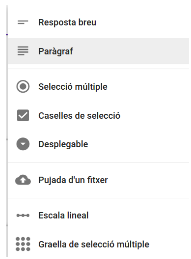

# 3.1. Google forms

Google forms es una herramienta de **Google suite** (las herramientas online de google, como gmail, docs, drive,etc.) que permite realizar formularios para recoger información. Gracias a ella se pueden realizar encuestas, exámenes, planifica eventos, etc.

**Qué podemos hacer con google forms**

1. Cualquier persona puede crear un formulario con una cuenta de Google. El formulario se guarda en el Google Drive del usuario.
2. El creador del formulario lo comparte con otros y les pide que lo completen.
3. Todas las respuestas al formulario se guardan en un archivo de Excel almacenado en Google Drive.
4. Una vez que haya terminado de recopilar respuestas, se puede cerrar el formulario y descargar los resultados.

Al final de la tarea deberéis compartir el formulario con el profesor a través de la tarea creada en Google Classroom.

## 1. Crear el formulario

- Crear un formulario de **google forms** accediendo a [www.google.com/forms](www.google.com/forms). Fíjate que estés utilizando al cuenta del instituto.
- Visualizar qué plantillas existen. Las plantillas nos permiten utilizar formularios ya creados para no tener que hacerlos desde cero.
- Crear un formulario de google llamado “formulario de” y vuestro nombre. Este es el formulario que deberéis modificar para que luego lo contesten vuestros compañeros.

## 2. Agregar preguntas

Agregar preguntas y tipos. 5 preguntas, una de cada tipo de los que se especifican a continuación:

    1. Selección múltiple
    2. Casillas de selección
    3. Desplegable
    4. Respuesta breve
    5. Fecha

## 5. Reglas de validación

Agrega alguna regla de validación en las preguntas. Así podemos evitar que se escriban respuestas incorrectas o con un formato no deseado. Por ejemplo, puedes decir que en una respuesta solo se pueda escribir un número, o un mínimo de diez palabras, por ejemplo.

## 6. Compartir por correo

- Compartir con tres miembros de la clase (los que tu quieras, a ser posible compañeros con los que tengas contacto a menudo)
- Esperar a qué te contesten los tres para continuar.

## 7. Desactivar el formulario

Una vez que no queremos que contesten más, tendremos que desactivar el formulario. Para ello, tenemos que darle a **desactivar formulario** cuando veas que los cinco compañeros han terminado de contestar.

## 8. Ver respuestas individuales de todos los compañeros

Esta útil herramienta también nos permite planificar eventos, hacer preguntas a nuestros compañeros o amigos y así recopilar otro tipo de información de forma fácil y sencilla. Un formulario de Google puede conectarse a una **hoja de cálculo** de Google (llamada Google **sheets**).

Si hay una hoja de cálculo vinculada al formulario, las respuestas se enviarán automáticamente a la hoja de cálculo. De no ser así, los usuarios pueden verlas en la página **Resumen de respuestas**, accesible desde el menú **Respuestas**.

Añade una captura donde se vean las respuestas de tus compañeros.
