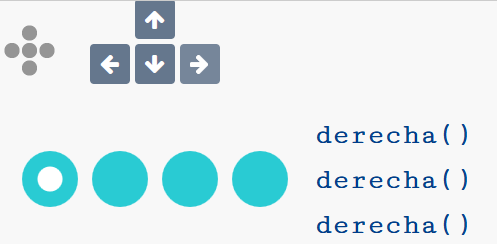
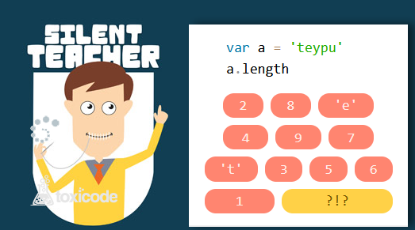
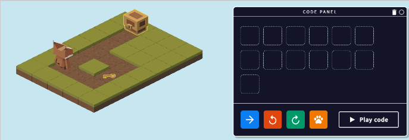

# Introducción a la programación

## Actividades de iniciación

Para introducirnos en el mundo de la programación, os propongo varios ejercicios online que os ayudarán a razonar cómo funciona un programa informático.

Por ahora, lo importante es que te familiarices con los programas informáticos, cómo se crean y cómo funcionan. Para ello te he preparado algunas actividades que ya han sido creadas en Internet que creo que te pueden ayudar a introducirte en la programación.

## Actividad 1

[Compute it](http://compute-it.toxicode.fr/?hour-of-code) nos propone una serie de actividades para comprobar que sabemos seguir las instrucciones y funcionamiento de un programa sencillo.

Cuando termines la actividad, adjunta una foto como la siguiente de la pantalla principal (enfocando con tu smartphones al monitor) y con un papelito al lado del monitor con tu nombre, para comprobar que lo has hecho tú.

## Actividad 2

En la siguiente actividad aprenderemos a tratar con **variables**. Las variables son como cajitas donde podemos guardar ciertos valores, como números, letras o palabras, y darles un nombre.

## Actividad 3

Juego del lince. En este juego tenéis que colocar diferentes bloques de instrucciones en los huecos, para conseguir que el lince consiga recoger piñas o abrir un cofre.

[Help the Lynx collect
pine cones!](https://www.w3schools.com/codegame/)
