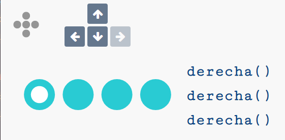
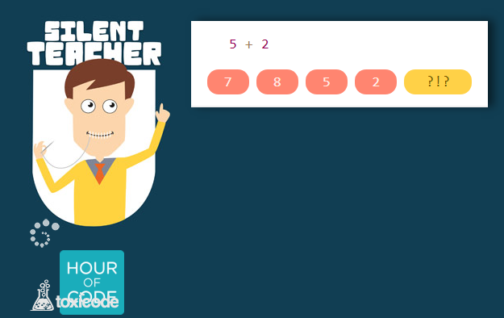
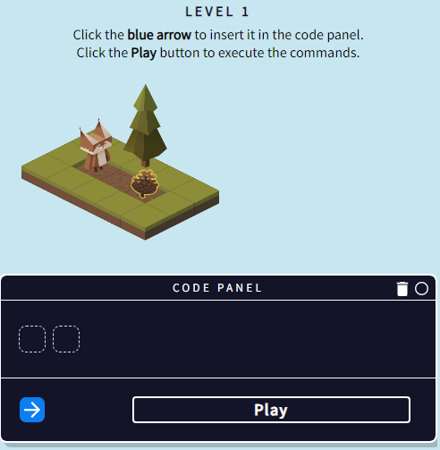
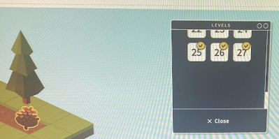

# Pensamiento computacional

## Actividad 1. Seguir instrucciones

La siguiente página nos propone una serie de actividades para comprobar que sabemos seguir las instrucciones y funcionamiento de un programa sencillo.
Cuando termines la actividad, adjunta debajo de este párrafo una foto como la siguiente de la pantalla principal (enfocando con tu smartphone al monitor) y con un papelito al lado del monitor con tu nombre, para comprobar que lo has hecho tú.

http://compute-it.toxicode.fr/?hour-of-code

## Actividad 2. Introducción a las variables

En la siguiente actividad aprenderemos a tratar con variables. Las variables son como cajitas donde podemos guardar ciertos valores, como números, letras o palabras, y darles un nombre.

http://silentteacher.toxicode.fr/hourofcode

## Actividad 3

En este juego deberás ayudar al lince a recoger la piña. Para ello, deberás colocar las instrucciones en unas casillas en el orden determinado.

https://www.w3schools.com/codegame/

Disponéis de 27 niveles diferentes. Al terminar, deberéis tomar una captura de pantalla para demostrar que lo habéis terminado:

