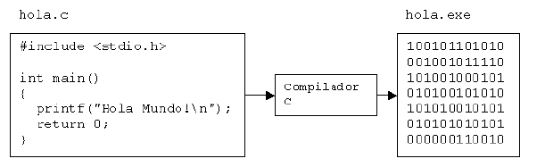

# Compiladores e intérpretes

Al programador y a la máquina les cuesta hablar el mismo idioma. Por eso se inventaron los programas traductores.

Los traductores son programas que traducen los programas en código fuente, escritos en lenguajes de alto nivel, a programas escritos en lenguaje máquina.

## Compilador

El programa original (fichero fuente) sólo se traduce una vez, creando un nuevo archivo (fichero ejecutable) que puede ejecutarse cuantas veces se desee.
Como una parte fundamental de este proceso de traducción, el compilador le hace notar al usuario la presencia de errores en el código fuente del programa. Vea la siguiente figura.

Los lenguajes C y C++ son lenguajes que utilizan un compilador. El trabajo del compilador y su función es llevar el código fuente escrito en C/C++ a un programa escrito en lenguaje máquina. Entrando en más detalle, un programa en código fuente es compilado obteniendo un archivo parcial (un objeto) que tiene extensión obj. Luego  el compilador invoca al “linker” que convierte al archivo objeto en un ejecutable con extensión exe; este último archivo es un archivo en formato binario (ceros y unos) y puede funcionar por sí sólo.

## Intérprete

El programa es traducido cada vez que se vaya a ejecutar.
Los intérpretes no producen un lenguaje objetivo como en los compiladores. Un intérprete lee el código como está escrito e inmediatamente lo convierte en acciones; es decir, lo ejecuta en ese instante.
Existen lenguajes que utilizan un intérprete (como por ejemplo `Java`) que traduce en el instante mismo de lectura el código en lenguaje máquina para que pueda ser ejecutado.

## COMPILADOR + INTÉRPRETE

El programa es compilado la primera vez a un formato intermedio. El archivo resultante debe ser interpretado cada vez que desee ejecutarse.

El lenguaje `Java`, primero pasa por una fase de compilación en la que el código fuente se transforma en “bytecode”, y este “bytecode” puede ser ejecutado luego (interpretado)en ordenadores con distintas arquitecturas (procesadores) que tengan todos instalados la misma “máquina virtual” `Java`.

## DIFERENCIA ENTRE COMPILADOR E INTÉRPRETE

Los compiladores difieren de los intérpretes en varios aspectos:

- Un programa que ha sido compilado puede correr por sí sólo, pues en el proceso de compilación se lo transformo en otro lenguaje (lenguaje máquina).
- Un intérprete traduce el programa cuando lo lee, convirtiendo el código del programa directamente en acciones. La ventaja del intérprete es que dado cualquier programa se puede interpretar en cualquier plataforma (sistema operativo). En cambio, el archivo generado por el compilador solo funciona en la plataforma en donde se le ha creado. Sin embargo, hablando de la velocidad de ejecución, un archivo compilado es más rápido que un archivo interpretado. ¿Cuánto? Investigad.