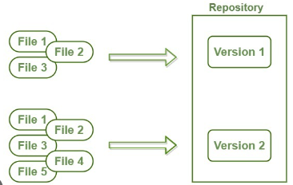

# 01. Git

Git es un software de **control de versiones** que permite a los desarrolladores llevar un seguimiento de las diferentes **versiones** de un archivo o conjunto de archivos mientras se crea un nuevo software.

Esto es útil porque permite a los desarrolladores volver a una **versión anterior** de un archivo si hicieron un cambio que resultó en un error. También permite a los desarrolladores **colaborar** en el mismo proyecto al mismo tiempo.

Para usar git, primero debe instalarlo en su computadora. Luego, debe configurarlo para que sepa quién está haciendo cambios en qué archivos. Esto se hace mediante el uso de una cuenta de git. Una vez que haya configurado git, puede empezar a usarlo para controlar las versiones de sus archivos.
