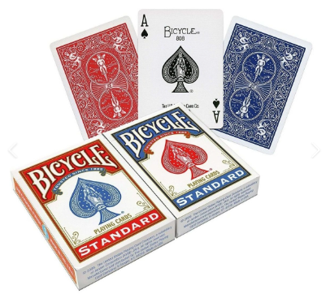
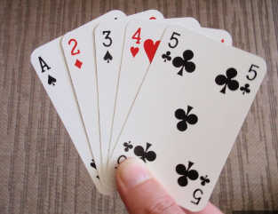

# Juegos de cartas

Vamos a introducir el concepto de programación orientada a objetos utilizando un juego de cartas.

Para ello, vamos a crear los siguientes objetos:

- ``Carta`` es el objeto más básico
- ``Baraja`` (conjunto de 52 objetos ``Carta`` diferentes)
- ``Mano`` (conjunto de objetos ``Carta`` de un jugador en una partida)


# 1. Clase Carta

Comenzaremos creando la clase ``Carta``. Cada carta tendrá dos propiedades, el ``palo`` (tréboles, corazones) y el ``valor`` (7,8, as, etc.).

- También tendremos 2 métodos: el primero de ellos es el ``constructor``, que será el encargado de crear el objeto
- El segundo es el método que nos ofrecerá una representación del objeto en formato de texto al hacer ``print()`` sobre el objeto.

Guardaremos la clase ``Carta`` en un archivo ``carta.py``.

#### **`carta.py`**
``` py linenums="1"
class Carta:
    def __init__(self, palo, valor):
        self.palo = palo
        self.valor = valor

    def __repr__(self):
        return f"{self.valor} de {self.palo}"
```

Si queremos utilizar esta clase dentro de otro archivo, tendremos que importarla en primer lugar.

#### **`pruebacartas.py`**
``` py linenums="1"
from carta import Carta
```

La línea de código ``from carta import Carta`` se utiliza en Python para importar una clase llamada ``Carta`` desde un archivo de Python llamado ``carta.py``.

La primera línea llamará al método ``__init__`` (constructor) de la clase.

#### **`pruebacartas.py`**
``` py linenums="1"
from carta import Carta
cartaprueba = Carta("tréboles", 2)
```
- La segunda línea llamará al método ``__repr__`` para imprimir información sobre la carta.

#### **`pruebacartas.py`**
``` py linenums="1"
from carta import Carta
cartaprueba = Carta("tréboles", 2)
print(cartaprueba)
```


## 2. Clase baraja

La baraja de póker se compone de 52 cartas. Para ello crearemos la clase ``Baraja`` lo tanto, contendrá 52 objetos ``Carta``.



- El método constructor nos creará una lista de cartas con todas las combinaciones posibles. ``Baraja.cartas`` contendrá una lista de objetos ``Carta``.
- ``Baraja.barajar()`` mezclará las cartas de la baraja
- ``Baraja.contar()`` nos dirá cuantas cartas quedan en la baraja
- ``Baraja.sacar_carta()`` nos devolverá un objeto ``Carta`` de ``Baraja.cartas``.
- ``Baraja.contar()`` nos dirá cuantas cartas quedan en la baraja
- ``Baraja.quedan_cartas()`` devolverá ``True`` en caso de que queden cartas en la lista ``Baraja.cartas``. En caso contrario, ``False``.

``` py linenums="1"
import random
from carta import Carta

class Baraja:
    def __init__(self):
        self.cartas = []
        palos = ["♥", "♦", "♣", "♠"]
        valores = ["As", "2", "3", "4", "5", "6", "7",
                   "8", "9", "10", "Jota", "Reina", "Rey"]
        for palo in palos:
            for valor in valores:
                self.cartas.append(Carta(palo, valor))

    def barajar(self):
        random.shuffle(self.cartas)

    def __repr__(self):
        return f"Baraja de {self.contar()} cartas"

    def contar(self):
        return len(self.cartas)

    def sacar_carta(self):
        if len(self.cartas) > 0:
            return self.cartas.pop()
        else:
            return None

    def quedan_cartas(self):
        """Devuelve True si quedan cartas en la baraja, False si no."""
        return len(self.cartas) != 0

    def mostrar_cartas(self):
        for carta in self.cartas:
            print(carta)
```

Para probar este nuevo objeto podemos hacer lo siguiente:

``` py linenums="1"
mibaraja = Baraja()
print("La baraja tiene", mibaraja.contar(), " cartas")
print(mibaraja.quedan_cartas())
# Sacar todas las cartas de la baraja

while mibaraja.quedan_cartas():
    print(mibaraja.sacar_carta(),  " La baraja tiene",
          mibaraja.contar(), " cartas")

mibaraja.barajar()
```

## 3. Clase Mano

En la clase ``Mano`` guardaremos las cartas que tiene cada jugador durante una partida concreta.



- Agregaremos objetos ``Carta`` a la lista ``Mano.cartas`` mediante el método ``añadir_carta()``.
- Con el método ``mostrar_mano`` mostraremos todos los objetos ``Carta`` de ``Mano.cartas``.
- ``calcular_valor`` nos dirá el valor que suman todas las cartas de nuestra mano.

```python
# Esta clase define el objeto Mano, el cual representa un conjunto de cartas.
class Mano:

    # El método __init__ establece la lista de cartas como una lista vacía y el valor como 0.
    def __init__(self):
        self.cartas = []
        self.valor = 0

    # El método añadir_carta añade una carta a la lista de cartas.
    def añadir_carta(self, carta):
        self.cartas.append(carta)

    def calcular_valor(self):
        self.valor = 0

        for carta in self.cartas:
            if carta.valor in ["Jota", "Reina", "Rey"]:
                self.valor += 10
            elif carta.valor == "As":

                self.valor += 11
            else:
                self.valor += int(carta.valor)

        return self.valor

    def mostrar_mano(self):
        for carta in self.cartas:
            print(carta)
```


Pruebas:

``` py linenums="1"
from baraja import Baraja
from mano import Mano

mibaraja = Baraja()
mibaraja.barajar()

mano_J1 = Mano()

if mibaraja.quedan_cartas():
    mano_J1.añadir_carta(mibaraja.sacar_carta())
    mano_J1.añadir_carta(mibaraja.sacar_carta())
    mano_J1.añadir_carta(mibaraja.sacar_carta())

mano_J1.mostrar_mano()

print("En la baraja quedan", mibaraja.contar(), "cartas")
```

## 4. Juego completo

A continuación mostraremos el juego completo del 21.

- El ``Juego`` será también una clase
- La única propiedad del juego será  ``self.baraja``, que contendrá la baraja con la que vamos a jugar.

### Paso 1. Importar las clases que vamos a utilizar

Importamos las clases Baraja y Mano desde los módulos baraja y mano, respectivamente. Esto permite al programa usar los métodos y atributos definidos en estas clases.

``` py linenums="1"
from baraja import Baraja
from mano import Mano
```

### Paso 2. Crear la clase ``Juego``

``` py linenums="1"
from baraja import Baraja
from mano import Mano

class Juego:
    def __init__(self):

```

### Paso 3. constructor

El método ``__init__()`` se ejecuta al crear una nueva **instancia** de la clase. Este método crea una nueva baraja y la baraja utilizando el método barajar().

``` py linenums="1"
from baraja import Baraja
from mano import Mano

class Juego:
    def __init__(self):
        self.baraja = Baraja()
        self.baraja.barajar()
```

### Paso 4. método jugar

``` py linenums="1"
from baraja import Baraja
from mano import Mano

class Juego:
    def __init__(self):
        self.baraja = Baraja()
        self.baraja.barajar()

    def jugar(self):
        mano_jugador = Mano()
        mano_jugador.añadir_carta(self.baraja.repartir())
        print("Tu mano es: ", mano_jugador.cartas,
              "lo que hace un total de: ", mano_jugador.calcular_valor())
```

### Paso 5. Cálculo de valor de la mano

``` py linenums="1"
from baraja import Baraja
from mano import Mano

class Juego:
    def __init__(self):
        self.baraja = Baraja()
        self.baraja.barajar()

    def jugar(self):
        mano_jugador = Mano()
        mano_jugador.añadir_carta(self.baraja.repartir())
        print("Tu mano es: ", mano_jugador.cartas,
              "lo que hace un total de: ", mano_jugador.calcular_valor())
        while mano_jugador.valor < 21:
            action = input("Quieres PEDIR carta o PASAR? ").lower()
            if action == "pedir":
                mano_jugador.añadir_carta(self.baraja.repartir())
                print("Tu mano es: ", mano_jugador.cartas,
                      "lo que hace un total de: ", mano_jugador.calcular_valor())
            else:
                print("Tu puntuación final es de",
                      mano_jugador.calcular_valor())
                return

```

### Paso 6. Cálculo de fin del juego

``` py linenums="1"
from baraja import Baraja
from mano import Mano

class Juego:
    def __init__(self):
        self.baraja = Baraja()
        self.baraja.barajar()

    def jugar(self):
        mano_jugador = Mano()
        mano_jugador.añadir_carta(self.baraja.repartir())
        print("Tu mano es: ", mano_jugador.cartas,
              "lo que hace un total de: ", mano_jugador.calcular_valor())
        while mano_jugador.valor < 21:
            action = input("Quieres PEDIR carta o PASAR? ").lower()
            if action == "pedir":
                mano_jugador.añadir_carta(self.baraja.repartir())
                print("Tu mano es: ", mano_jugador.cartas,
                      "lo que hace un total de: ", mano_jugador.calcular_valor())
            else:
                print("Tu puntuación final es de",
                      mano_jugador.calcular_valor())
                return
        if mano_jugador.valor == 21:
            print("has GANADO.")
        else:
            print("has PERDIDO.")
        print("Tu puntuación final es de",
              mano_jugador.calcular_valor())
```

### Paso 7. Comienzo de la partida (main)

``` py linenums="1"
from baraja import Baraja
from mano import Mano

class Juego:
    def __init__(self):
        self.baraja = Baraja()
        self.baraja.barajar()

    def jugar(self):
        mano_jugador = Mano()
        mano_jugador.añadir_carta(self.baraja.repartir())
        print("Tu mano es: ", mano_jugador.cartas,
              "lo que hace un total de: ", mano_jugador.calcular_valor())
        while mano_jugador.valor < 21:
            action = input("Quieres PEDIR carta o PASAR? ").lower()
            if action == "pedir":
                mano_jugador.añadir_carta(self.baraja.repartir())
                print("Tu mano es: ", mano_jugador.cartas,
                      "lo que hace un total de: ", mano_jugador.calcular_valor())
            else:
                print("Tu puntuación final es de",
                      mano_jugador.calcular_valor())
                return
        if mano_jugador.valor == 21:
            print("has GANADO.")
        else:
            print("has PERDIDO.")
        print("Tu puntuación final es de",
              mano_jugador.calcular_valor())

if __name__ == '__main__':
    print("hola")
    juego = Juego()
    juego.jugar()
```