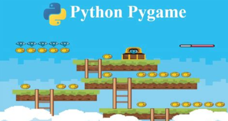
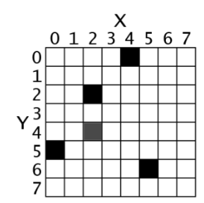
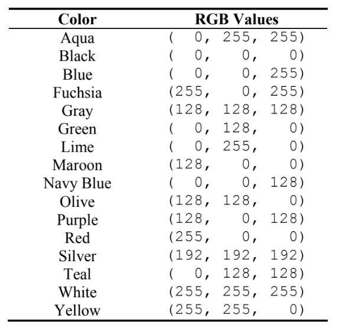

# Pygame

En este tema, aprenderemos a crear pequeños juegos en Python utilizando una librería llamada Pygame (Pygame.org), que nos permitirá crear gráficos y manipularlos.

- Librería Pygame
- Ventanas
- Objetos
- Interacción con el teclado
- ColisionesSonido

## Ejemplo de programa



## Coordenadas de pixels



## Colores



## Ejemplo

```py

import pygame

# Initialize Pygame
pygame.init()

# Set up the window
win_width = 640
win_height = 480
win = pygame.display.set_mode((win_width, win_height))
pygame.display.set_caption("My Pygame Program")

# Set up the circle
circle_color = (0, 0, 255)  # Blue
circle_radius = 50
circle_pos = (win_width // 2, win_height // 2)

# Game loop
running = True
while running:
    # Handle events
    for event in pygame.event.get():
        if event.type == pygame.QUIT:
            running = False

    # Draw the circle
    win.fill((255, 255, 255))  # Fill the window with white
    pygame.draw.circle(win, circle_color, circle_pos, circle_radius)

    # Update the display
    pygame.display.update()

# Quit Pygame
pygame.quit()

```