Variables, tipos y convenciones

 Asignación de valores a las variables

Asignar un valor a una variable es hacer que la variable guarde este valor. Ese valor se ASIGNA usando el símbolo igual (=)

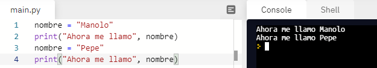

Aquí a la variable nombre primero le asigno el valor manolo, hasta que en la línea 3 le asigno otro valor. Las variables toman el último valor que se les asigne.

Otro ejemplo de asignación

En este caso, cojo el valor que tenía la variable nombre, y le añado otra palabra. Esto también es muy habitual. En este caso el + no sirve para sumar, puesto que se trata de texto.

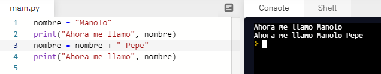

<div class="break"></div>

Tipos de variables

Hablemos un poco en detalle de los tipos, y así podré dejar de poner “palabras” entre comillas…

Uno de los tipos de variables que más usaremos son los enteros (integer en inglés, abreviado como int con frecuencia). Ya sabéis número sin decimales, positivos y negativos.

Si necesitamos números decimales, usaremos “punto flotante” (float).

Tenemos las cadenas de caracteres (en inglés string ), conjuntos de símbolos que incluyen las letras mayúsculas y minúsculas, los signos de puntuación, los caracteres especiales, etc.

También se puede tener una variable en la que se vaya a guardar sólo un carácter

(char)

Las hay que almacenan nada más que un bit, un uno o un cero ( boolean ) y algunos más…

Aquí podéis ver algunos ejemplos. Lo que está después de # son comentarios que no hacen nada en el programa. Solo explican qué tipo de dato hay en cada variable.

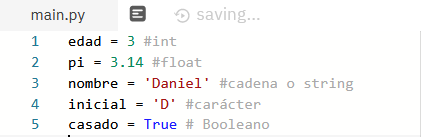

Según cómo escribimos las cosas, Python interpreta si esa variable contiene un número, una letra, un decimal, una palabra, etc. En nuestro ejemplo, la variable nombre era de tipo string.

<div class="break"></div>

¿Cómo podemos llamar a nuestras variables?

Ya has visto que llamamos a la variable como mejor nos pareció, pero hay ciertas reglas.

No podemos usar palabras “reservadas” del propio lenguaje de programación (print, input… no son nombres de variables permitidos)

Deben consistir en una sola palabra ( edad del usuario no es un nombre válido)

Sólo pueden contener letras, números y el guion bajo

No pueden empezar con un número

Mayúsculas y minúsculas

Aunque se pueden usar mayúsculas, y Python es muy cuidadoso con eso, entendiendo que Nombre, NOMBRE y nombre son variables DISTINTAS, lo mejor que podemos hacer es no liarnos siguiendo ciertas recomendaciones.

Fijaos en el ejemplo:

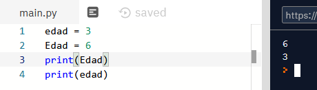

También es típico empezar con minúsculas, como hicimos en nombre. Y usar alguno de estos dos estilos para separar palabras:

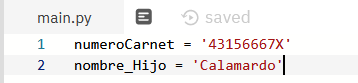

Consejos

Los acentos suelen dar problemas por lo que mejor evitarlo.

Para la ñ hay quien para no escribir año usa anio , o bien, anyo .

En programas elaborados es muy conveniente elegir nombres de variables que nos den una pista de qué están representando

## Ejemplo nombre y edad

Vamos a hacer un programa que pida al usuario su nombre y año de nacimiento para decirle al final:

Hola, Paco, tienes 45 años.

Para pedirle el nombre y el año de nacimiento usamos la misma estructura que antes. Una línea con un PRINT para que sepan lo que queremos y otra línea con un INPUT para recoger lo que nos han dicho.

Todas las líneas que pongo aquí las tienes que escribir unas debajo de las otras en el mismo ejercicio. Va todo junto.

```python
print('¿Cómo te llamas')
nombre = input()
print('¿En qué año naciste?')
year = input()
```

Estupendo. Ahora cómo calculamos la edad. Bueno, pues sabemos que la edad será el año actual menos el año de nacimiento.

Pero fíjate, esa resta nos da un valor, que es justo lo que queremos, pero que…

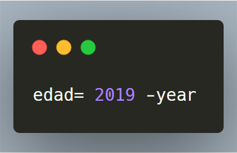Cálculos con variables

El siguiente paso será calcular nuestra edad.

Con esto creamos la variable edad y le ASIGNAMOS el valor de la resta entre el año 2019 y el valor que tenga la variable year , que nos acaba de dar el usuario, y QUE SERÁ DISTINTO EN CADA EJECUCIÓN.

Pintar información por pantalla

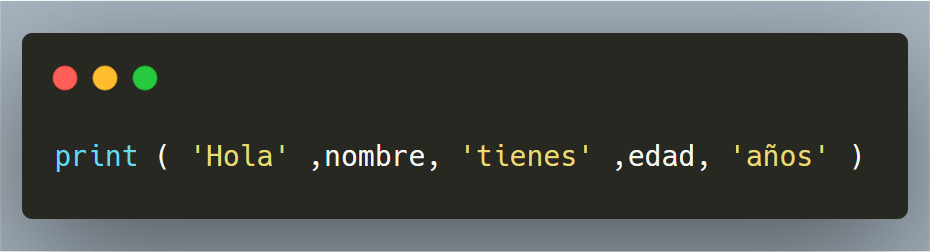

Escribe y ejecuta el código anterior junto y adjunta una captura de pantalla. Te dará error, pero es normal. Luego lo arreglaremos

Arreglar errores

Al ejecutar el programa veremos que nos aparece en rojo un error. LOS ERRORES SON NORMALES. Leamos el mensaje de error.

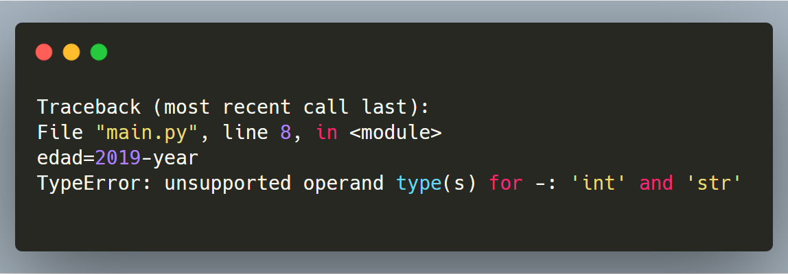

La línea 8 es donde yo tengo escrita la operación edad= 2019 -year. En la última línea me dice que el operador “menos” no puede trabajar con un tipo entero y un tipo string a la vez.

El asunto es que TODAS LAS ENTRADAS POR TECLADO se toman como CADENAS DE CARACTERES.

Así que el año que introdujo el usuario, para Python son LETRAS (caracteres), y no sabe cómo restar letras y números.

## Convertir letras en números

Las variables pueden ser de diferentes tipos, y podemos transformar una variable de un tipo en otro. En este caso es necesario, puesto que para hacer operaciones matemáticas hay que convertir las letras en números.

¿Hay una manera en Python de tomarse 45 como si fuera un número o como si fuera una cadena de caracteres? Sí.

Hay que usar la función int(). Convierte, si se puede, una cadena de caracteres en un número entero. Veamos el siguiente ejemplo. Edad contiene un string, es decir, las “letras” 3 y 5. Por eso va entre comillas. Cuando queremos sumar una palabra y un número no podemos (no es posible). Los dos objetos a sumar deben ser números o floats (decimales), por eso falla.

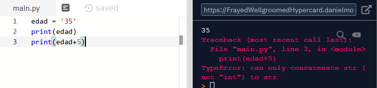

En este otro caso, veréis que la variable edad no lleva comillas. Ahora está guardando 35 como número, no como palabra. Por ello, cuando quiero sumar la variable edad y el número 5, al ser ambos números, funciona.

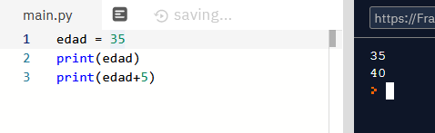

## Convertir tipos de variables

Cambiar de un tipo a otro se llama **casting**. Si queremos hacer una operación y necesitamos convertir una variable de un tipo a otro, podemos utilizar unas funciones que los transforman.

En nuestro caso, podríamos hacer:

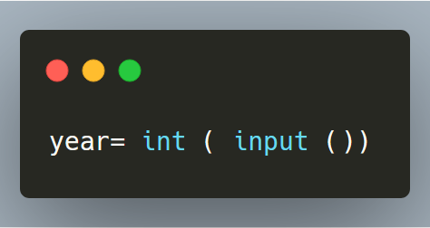

Lo que significa: toma lo que pongan en el teclado, conviértelo en un número entero y almacenarlo como tal en la variable year.

Finalmente, si queremos una salida por pantalla, podríamos poner:


Por supuesto, si haces algo como int(Paco) aparecerá un error.

Actividad 2. Escribe y ejecuta el código anterior junto y adjunta una captura de pantalla. Ya debería funcionar y dar el resultado deseado

## Comentarios

Hagámonos una pregunta, ¿después de unas semanas te acordarás qué significaba esta línea?


Sería estupendo poder incluir algo en los programas que nos explicara qué están haciendo, pero si escribimos texto en castellano, Python nos dará un error porque se pensará que son instrucciones de Python.

El símbolo # nos permite añadir comentarios al programa y que Python sepa que debe ignorar lo que va después de la almohadilla.

Por ejemplo, en nuestro programa podríamos.

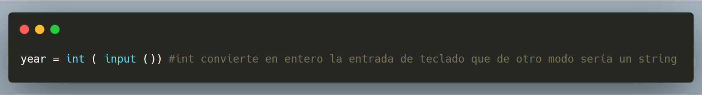

Al leer los comentarios, entendemos el programa si no es nuestro, o recordamos qué habíamos hecho si somos los autores.

Con esto en mente el programa de antes quedaría así:

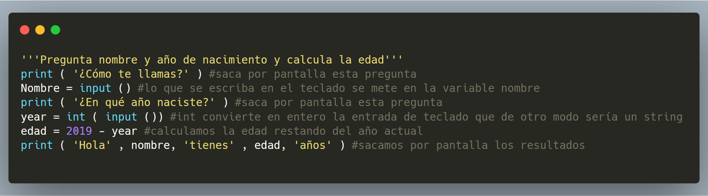

Quizá te suene muy lioso, sobre todo porque estamos explicando cosas que ya son bien conocidas. Igual podíamos dejarlo en:

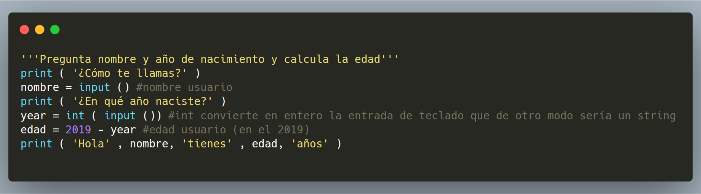

Más sencillo y con información suficiente para entenderlo.

Has podido ver que empezamos el programa explicando qué hace. Aquí también se puede añadir información del autor, fecha, contacto y otros detalles que se consideren relevantes.

Has visto también que cuando vamos a poner un comentario que ocupa más de una línea usamos tres comillas sencillas.

Actividad 3. Modifica el código anterior para que calcule el año en que te vas a jubilar (supuestamente) a partir de tu edad. Piensa que hoy en día la edad de jubilación es 65. En mi caso, yo le escribiré 35 años con el teclado y el me dirá que me quedan 30 años para la jubilación. Adjunta una captura

<div class="break"></div>

## Operaciones matemáticas

Ya hemos visto que podemos restar una variable numérica de otro número, también las podemos sumar, multiplicar o dividir, pruébalo.

Hay otras operaciones muy comunes en programación que merecen mencionarse.

Módulo , resto, residuo…

Es el resto de una división. Si dividimos 7 entre tres, dará como cociente 2 y como resto 1. Escribe en la consola 7%3 y verás que da como resultado 1

División entera

Nos da el cociente de la división sin obtener decimales. Si escribes en la consola 7 // 3 obtendrás 2 En cambio si escribes 7 / 3 obtendrás 2.333333333

Potencias

Si escribes en la consola 2**3 obtendrás 8 (dos elevado a tres). El asterisco sólo te dará la multiplicación 2*3 será 6

Imaginemos que nuestro personaje sube de nivel y necesita una cantidad de experiencia para subir.

Nivel 1 -> 10*2^1= 20

Nivel 2 -> 10*2^2 = 40

Nivel 3 -> 10*2^3 = 80

Nivel 4 -> 10*2^4 = 160

Orden de operaciones

Para las operaciones hay un orden de prevalencia, como en las matemáticas comunes, por lo cual debes tener cuidado y usar paréntesis, así como asegurarte de que lo que escribes funciona como deseas.

Las operaciones con números te son conocidas… pero también pueden hacerse operaciones con cadenas de caracteres.

Aquí tienes un resumen con los símbolos de las principales operaciones matemáticas:

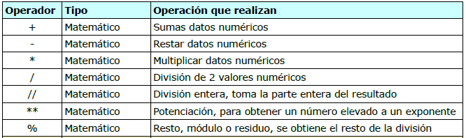

Actividad 4. Escribe un programa en que dados dos números (el día de mes de tu cumpleaños y el número de personas que viven en tu casa), muestre:

El cociente entero (sin decimales)

El resto

La división exacta

La potencia del primer número elevado al segundo

En mi caso estos números son 13 (13 de septiembre) y 3 (mi mujer y mi hija) y lo que saldría por pantalla es:

4

1

3,25

13.013

Adjunta una captura de la pantalla

<div class="break"></div>

Operaciones con cadenas de caracteres

Concatenación

Por ejemplo, ¿qué pasará si escribes ‘Mamá’ + ‘Papá’? Prueba… Efectivamente, concatena (junta) las dos cadenas, haciendo una cadena mayor.

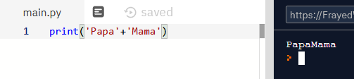

Repetición

Intenta hacer ‘Mamá’*5 a ver qué pasa…

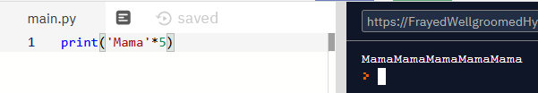

También podemos obtener partes de un string. Para ello utilizaremos [ ]. Si dentro colocamos un número, nos dará la letra que ocupa esa posición. En informática, comenzamos a contar por el 0. Por lo tanto, la D ocupará la posición 0, y la a la posición 1, etc.

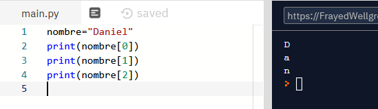

Actividad 5. Crea un programa que te pida tu nombre y tus dos apellidos  uno a uno, los guarde en 3 variables y te pida por pantalla las iniciales. En mi caso, saldría por pantalla DMR. Necesitarás utilizar las operaciones anteriores y lo estudiado anteriormente