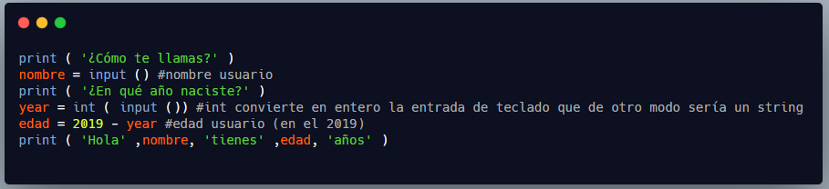
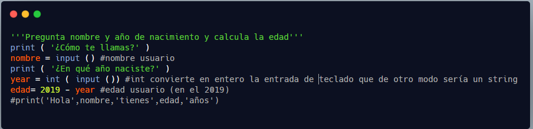
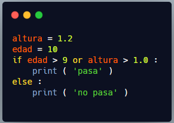
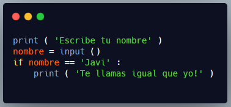
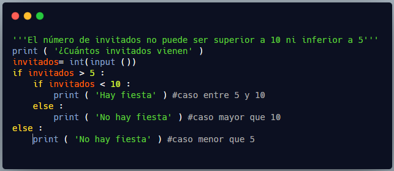
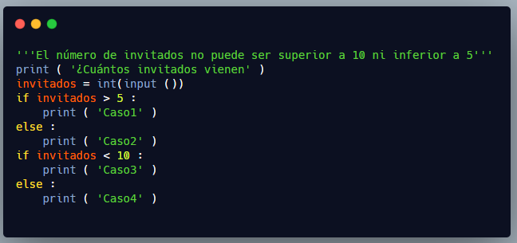
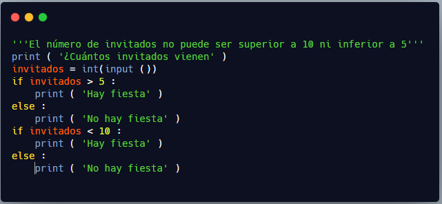
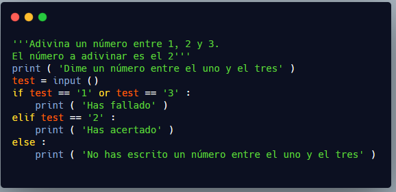
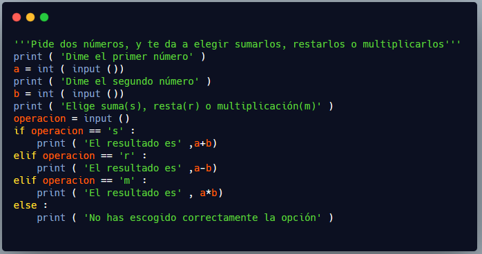

# Estructuras condicionales

POR QUÉ NECESITAMOS CONDICIONALES

Nuestros programas, hasta ahora, hacen siempre lo mismo, sean cuales sean los datos que les introducimos, pero es muy útil que puedan tomar decisiones diferentes según sean los datos que reciben o los resultados que van obteniendo.

Por ejemplo, recordemos un programa que nos pregunte el año de nacimiento y nos diga “Hola Javi tienes 47 años”, podría ser divertido que nos diese diferentes respuestas según los años que nos calcule (por ejemplo, si somos mayores de edad o no). Para eso necesitamos los CONDICIONALES.

PARTES DE UN CONDICIONAL

Un condicional tiene tres “partes”.

1. La condición que queremos comprobar (en este caso edad>18)
2. Las acciones que tomamos si se cumple la condición (nos dirá que somos viejos)
3. Las acciones que tomamos si NO se cumple la condición (dirá que somos jóvenes)

Partiremos del siguiente programa.



Actividad 1: Copia el código en un repl, ejecútalo y adjunta una captura

ACTIVAR Y DESACTIVAR LÍNEAS DE CÓDIGO

Nos sirve todo, menos la línea final, ahí es donde vamos a meter el condicional y daremos otras salidas por pantalla diferentes a la que tenemos aquí.

No la borréis, os voy a enseñar un truco muy común cuando estamos probando código y queremos “activar” y “desactivar” líneas de código, a ver cómo funcionan, a ver qué pasa cuando las quitamos o modificamos.

¿Recordáis que cuando ponemos la almohadilla (#) Python ignoraba lo que se escribía después y que nos servía para poner comentarios? Pues podemos poner una almohadilla delante de la línea que queremos anular temporalmente y Python la ignorará. A esto se le llama comentar código.



Así es como si no existiera, pero la tenemos por ahí por si queremos volver a activarla o tomarla como referencia. Por supuesto, cuando terminemos el programa eliminaremos estas líneas que sólo confundiría a un futuro lector del código.

Actividad 2: Comenta todas las líneas que sean de print y adjunta una captura (luego des coméntalas para seguir con el resto de ejercicios)

## Crear un condicional

Bien, vayamos al condicional

1. Debemos empezar con la palabra if
2. Después ponemos la condición
3. Después añadimos dos puntos (:)

COLOCAR COSAS DENTRO DE LA ESTRUCTURA: SANGRADO

Si miras la segunda línea, verás que está un poco hacia la derecha. Esto se llama sangrado (indent en inglés) y sirve para tener claro que las líneas siguientes tienen que ver con el if, que es un pequeño bloque de código dentro de ese condicional.

```python
if edad > 18:
    print('Hola', nombre, 'eres muy viejo')
```

!!! Note

    ¿Veis que print está un poco hacia la derecha? Esto significa que está “dentro” del if

Para hacer esto no se escriben espacios simples con la barra espaciadora, sino que se usa la tecla tabuladora ++TAB++.

En esa línea siguiente ponemos las instrucciones que queremos se ejecuten cuando se cumpla la condición (puede ser una o muchas)

Si edad guarda un valor de más de 18 años (19, 20, etc.) se imprimirá la frase por pantalla. Si no, no se imprimirá nada.

Actividad 3: Prueba el código, recuerda que la ausencia de errores no asegura que funcione bien. Mete uno que nos dé mayoría de edad y otro que no. Cubre todos los casos. Adjunta una captura donde se vean las dos pruebas

En el caso de que se cumpla la condición, ejecuta el código “interior” y nos imprime este “simpático” mensaje. Pero, en el caso de que NO se cumpla. No hace nada. Esto no nos gusta. Para remediarlo, tenemos else.

## Instrucción else

Añadiremos al programa que tenemos las líneas debajo del else

```python
if edad > 18:
    print('Hola', nombre, 'eres muy viejo')
else
    print('Hola', nombre, 'eres demasiado joven')
```

Actividad 4: Prueba el código. Mete uno que nos dé mayoría de edad y otro que no. Cubre todos los casos. Adjunta una captura donde se vean las dos pruebas

Date cuenta de que:

El else está a la altura del if correspondiente.

Después de else también tenemos dos puntos porque viene un código “interior”

El código “interior” de else también está indentado.

Lo que escribimos justo después del if debe ser una EXPRESIÓN LÓGICA, algo que sea como una pregunta que pueda responderse con SÍ o NO, VERDADERO o FALSO. En nuestro ejemplo ¿Es edad mayor que 18? Efectivamente, puede responderse VERDADERO o FALSO.

También valdrían expresiones complejas. Por ejemplo, si queremos dejar pasar a un chaval a una atracción un poco peligrosa, quizá queramos que sea mayor que 10 años o que su altura sea mayor que un metro. Podríamos expresarlo así:

```python
edad>10 or altura>1.0
```

Por ejemplo:



Actividad 5: Cambia el código para que te deje pida el nombre (input) y te deje pasar solo si eres mayor de edad o mides más de metro y medio. Las frases deben ser:

“Daniel, puedes pasar” o

“Daniel, no puedes pasar”

 En lugar de Daniel saldrá el nombre que habéis introducido (necesitáis variables). Adjunta captura

Con la altura y la edad que he puesto, el programa me dice que ‘pasa’, porque tiene más altura y más edad de la exigida. Así que, funciona bien con un ejemplo y no da errores sintácticos, ¿puedo quedarme tranquilo? ¿Cuántos casos diferentes hay?

A mí me salen cuatro (refiriéndome a edad y altura):

menos-menos

menos-más

más-menos

más-más

Debéis cambiar a mano (es un ejemplo sencillo) los valores para ejemplificar los cuatro casos y ver que se comporta adecuadamente. Y esto, sí que es comprobar que un programa funciona debidamente.

De la misma forma que hemos usado “or” podemos usar “and” o “not” y combinar expresiones todo lo complejas que necesitemos.

## Comparar valores

Pero quería pararme un momento para un caso que suele dar problemas a los que somos principiantes: ¿cómo escribir que quiero comprobar si la edad es igual a 18?

Lo primero que se nos ocurre es poner if edad=18: pero esto está MAL. Recordad que:

Un solo IGUAL (=) lo usábamos para ASIGNAR.

Para COMPARAR usaremos un DOBLE IGUAL (==).

Lo correcto es, por ejemplo:



Podemos usar también en lugar de ==:

Mayor o igual (>=)

Menor o igual (>=)

Distinto (!=).

Actividad 6: modifica el programa anterior para que mire si el nombre es distinto del tuyo y, si lo es, te diga “No te llamas igual que yo”.

Ya conoces todo lo que hay en este programa, pero permíteme señalar unos detalles.

Las cadenas de caracteres (string) se escriben entre comillas

PRINT no mira si lo que hay entre las comillas es código Python o español, o tiene faltas de ortografía como es el caso, simplemente pone los caracteres que haya.

## Condicionales anidados

Dentro de un condicional podemos tener otro condicional, esto se llama anidar. Como sucede en matemáticas, dentro de un paréntesis puedo tener otro.

Por ejemplo: Quiero celebrar mi cumpleaños y, por supuesto, me gustaría que vinieran más de cinco personas, pero no tengo sitio para más de diez.



Comprueba el funcionamiento con un valor de cada zona interesante (menos que cinco, entre cinco y diez, más de diez.

Creando los diferentes casos

Analicemos el código de la derecha.

Primer if, estamos por encima de 5, si es así ejecutamos el código interior, si no fuera así, nos iríamos al else que está a su altura (el último).

Si entramos en el primer if es que estamos por encima de 5, pero ahora nos preguntamos: sabiendo que estamos por encima de 5, ¿estamos por debajo de 10?

Si fuera verdad, estamos en la franja adecuada entre cinco y diez, y si no se cumple que seamos menor que diez, pasaríamos al else que está a la altura del segundo if.

Igual lo ves más claro, si entendemos por qué no funcionaría bien el código si no estuvieran anidados. Pongamos los dos if a la misma altura.

Añadiendo los mensajes de verdad en cada caso

¿Dónde pongo, “hay fiesta” y “no hay fiesta”? No va a funcionar en ningún caso. Te pongo un ejemplo para que veas que “casca”. Prueba tú con otros, si crees que van a funcionar, pero recuerda probar los tres casos posibles.

Si los pongo así, por ejemplo:

Imagina que tengo 3 invitados. El primer condicional me dirá que no hay fiesta, pero el segundo condicional me dice que sí, porque tres invitados es menor que diez. Al no estar anidados no estoy mirando si es menor que diez SABIENDO ya que es mayor que cinco.

Actividad 7: prueba el código anterior con 3 invitados, 6 y 12, y adjunta una captura.

## Estructura elif

A veces abreviamos estos condicionales con el comando **elif** que sería else...if

Algo así como:

1. ¿Se cumple esta condición? No
2. Sabiendo que no se cumple la primera condición, ¿se cumple la segunda?

Por ejemplo, adivina un número entre uno, dos y tres.



Se leería así:

¿Es test igual a 1 o a 3? Si es así, di que ha fallado.

SABIENDO que no es igual a 1 o a 3, ¿es igual a dos? Si es así, di que ha acertado

En CUALQUIER OTRO CASO, di que no ha escrito bien lo que le pedíamos.

Actividad 8: cambia el código anterior para que te pregunte un número del 1 al 5. Si es par (2,4) que te diga que es par, si es impar (1,3,5) que te diga que es impar. Si es otro número que te diga que no es un número entre 1 y 5.

## Crear un menú

En este caso es sencillo porque las opciones son excluyentes, pero en otros casos hay que ser cuidadoso para escoger adecuadamente las condiciones y en el orden que se piden, quién se anida en quién...y, finalmente, hacer pruebas para todos los casos posibles.

Esto podría usarse para crear un “menú”.

Hagamos un programa que te pida dos números y te dé la posibilidad de elegir sumarlos, restarlos o multiplicarlos.



Actividad 9: cambia el código anterior para que te permita también calcular una potencia. Las potencias se calculan como a**b. Haz la prueba de que funciona y adjunta una captura.