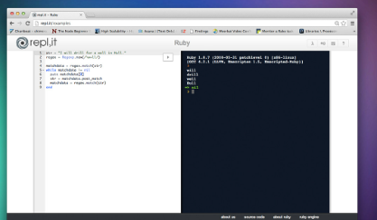

# Python

En este apartado nos vamos a centrar en aprender nosotros a crear un programa para hacer una determinada tarea.

Existen muchos lenguajes de programación, que son como diferentes idiomas. Cada uno tiene unas palabras propias y una determinada forma de escribirse, y se utilizan para tareas muy variadas. Nosotros vamos a aprender a utilizar **Python**, uno de los lenguajes más populares, pero hay muchos más.

## Herramientas

Para crear nuestros programas vamos a usar un entorno de programación online. En nuestro caso, [Repl.it](http://www.repl.it) donde podéis crear programas utilizando cualquier lenguaje a través de un navegador sin necesidad de instalar nada, y todos los proyectos que hagáis se guardarán ahí automáticamente.



## Elementos de un programa

A tener en cuenta:

- Un programa es conjunto de una o más **instrucciones**
- Intentar que cada instrucción ocupe línea
- Si queremos agrupar 2 instrucciones en una línea (;)

```python linenums="1"
print("cada línea temrina en ;");
print("esta línea está mal")
print("la línea anterior tendria que terminar en ;");
```

- Si no cabe toda la instrucción, ontinuar en siguiente línea (/)
- Al final de las líneas no se coloca ; ni se utilizan { }

En un programa, las líneas están numeradas para conocer en qué lugar del programa nos encontramos, pero los números no tienen ningún efecto en especial.

```python linenums="1"
print("estas es la línea 1 ;");
print("esta la 2. va a dar error aquí")
print("esta la 3");
```

## Nombres de archivos

- Se guardan con extensión .py
- Nombre escritos en minúsculas
- Utilizar guiones bajos para separar palabras o números

Ejemplos:

- operaciones_3_2.py
- operaciones_masa_corporal.py