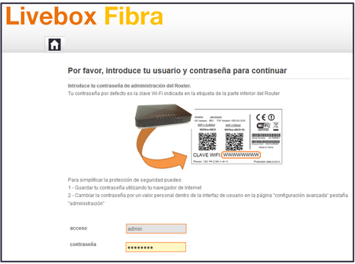

# 05. Configurar un router wifi

Un router es un dispositivo harware que sirve para interconectar varias redes informáticas.

# 5.1. Características

---

# 5.2. Parámetros importantes

Los parámetros habituales son:

- El **SSID**: Código identificador de una red inalàmbrica.
- El estándar de **seguridad**: Utilizado para poder acceder a la red inalàmbriaca.
- La **contraseña**: Necesaria para poder acceder a la red inalàmbrica.

# Etiqueta

# Acceder al router

Para acceder al router, necesitamos estar conectados a él y conectarnos mediante un **navegador**, como Firefox o Chrome.

# Acceder al router

1. Abrir el **explorador** de Internet
2. Teclear la dirección IP del router: suele ser http://192.168.1.1
3. Escribir el nombre de usuario y la contraseña del router, proporcionados por el ISP.
4. A continuación, se mostrará el menú de configuración del router.

# Acceder al router

Desde aquí, no queda más que explorar las distintas opciones para encontrar en qué menú se hallan los paràmetros que se desean cambiar.

Cada **modelo y marca** de router tiene su propio menú y opciones diferentes, por lo que hay que buscar en qué lugar se encuentran y como se modifican.

# Proteger una red inalámbrica

- Ocultación
- Encriptación
- Filtrado MAC

# Cambiar el nombre de la red y ocultarla.

- Abrir la pestaña Wireless LAN para visualizar las opciones.
- Marcar la casilla Enable Wireless LAN para activarla.
- Activar la opción Hide ESSID para ocultar el nombre de la red.

# Encriptar la red

- Elegir el tipo de encriptación: WEP, WPA o WPA2.
- Establecer la clave deseada en el campo de Key

# Activar el cifrado MAC

- Hacer clic en MAC Filter, dentro de las opciones Wireless LAN.
- Poner la opción Active en Yes
- Si se desconoce esta dirección, se debe abrir el terminal y ejecutar ipconfig-all (windows) o ifconfig-a (ubuntu)
