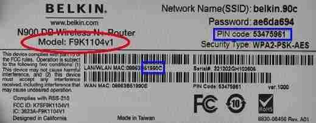

- [5. Configurar un router wifi](#5-configurar-un-router-wifi)
  - [5.1. Características](#51-caracter%c3%adsticas)
  - [5.2. Parámetros importantes](#52-par%c3%a1metros-importantes)
  - [5.3. Acceder al router](#53-acceder-al-router)
  - [5.4. Proteger una red inalámbrica](#54-proteger-una-red-inal%c3%a1mbrica)
    - [Cambiar el nombre de la red y ocultarla.](#cambiar-el-nombre-de-la-red-y-ocultarla)
    - [Encriptar la red](#encriptar-la-red)
    - [Activar el cifrado MAC](#activar-el-cifrado-mac)

# 5. Configurar un router wifi

Un router es un dispositivo harware que sirve para interconectar varias redes informáticas.

## 5.1. Características

En la foto podemos ver los componentes principales de un router wifi:

## 5.2. Parámetros importantes

Los parámetros habituales son:

- El **SSID**: Código identificador de una red inalàmbrica.
- El estándar de **seguridad**: Utilizado para poder acceder a la red inalàmbriaca.
- La **contraseña**: Necesaria para poder acceder a la red inalàmbrica.

## 5.3. Acceder al router

Para acceder al router, necesitamos estar conectados a él y conectarnos mediante un **navegador**, como Firefox o Chrome. Para ello:

1. Abrir el **explorador** de Internet
2. Teclear la dirección IP del router en la barra de direcciones. La dirección es la correspondiente a la puerta de enlace, y suele ser http://192.168.1.1
3. Escribir el nombre de usuario y la contraseña del router, proporcionados por el ISP. A continuación, se mostrará el menú de configuración del router.

Desde aquí, no queda más que explorar las distintas opciones para encontrar en qué menú se hallan los paràmetros que se desean cambiar. Cada router tiene su propio menú y opciones diferentes, por lo que hay que buscar en qué lugar se encuentran y como se modifican.

## 5.4. Proteger una red inalámbrica

### Cambiar el nombre de la red y ocultarla.

- Abrir la pestaña Wireless LAN para visualizar las opciones.
- Marcar la casilla Enable Wireless LAN para activarla.
- Activar la opción Hide ESSID para ocultar el nombre de la red.

### Encriptar la red

- Elegir el tipo de encriptación: WEP, WPA o WPA2.
- Establecer la clave deseada en el campo de Key

### Activar el cifrado MAC

- Hacer clic en MAC Filter, dentro de las opciones Wireless LAN.
- Poner la opción Active en Yes
- Si se desconoce esta dirección, se debe abrir el terminal y ejecutar ipconfig-all (windows) o ifconfig-a (ubuntu)

