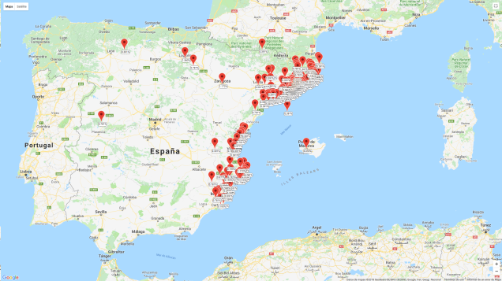

# Cómo se reparten las direcciones IP

## IANA

La **IANA** es la responsable de coordinar el espacio de direcciones IP a nivel mundial. Hoy en día existen 2 tipos principalmente: IPs de versión 4 e IPs de versión 6.

En la web de la IANA se puede encontrar el espacio de direcciones y su estructura en IPv6 . Como ejemplo:

El espacio de direcciones 2000::/3 está destinado a direcciones unicast globales.
Existen otros espacios de direcciones para multicast,  direccuibes unicast locales y para enlaces locales.
Las direcciones se asignan jerárquicamente. En general:

## RIR

La IANA reparte bloques IP entre los diferentes registros de internet regionales o RIR. Existen 5 englobados por continentes. Para España, el RIR de referencia es el **RIPE NCC**.

## ISP

En segundo lugar las RIR reparten bloques de IP a los proveedores de servicio o ISP. Podemos ver la lista de miembros (local internet registries) asociados a RIPE en España.

En última estancia, los ISP reparten las direcciones IP a los usuarios finales.

Como curiosidad, en la propia página del RIPE podemos introducir una IP pública y conocer, entre otros datos, a que ISP pertenece. También podemos ver un mapa de geolocalización de las IP de la red al que pertenece la nuestra.



Por lo visto parecen bloques destinados a la zona del levante Español. Pertenece a un bloque asignado al operador de /14, que daría espacio para más de 260.000 direcciones.

## Reparto de direcciones IPv6 entre las RIR

En IPv6 existen diferentes tipos de direcciones IP según el uso. La IANA se encarga de repartir las direcciones IP unicast globales entre los diferentes registros regionales o RIR. En su página web tienen un esquema de la repartición de los diferentes bloques de direcciones IP a los RIR.

A día de hoy, la última asignación a RIPE NCC (para Europa) ha sido el bloque:

```
2a00:0000::/12
2a00 = 0010101000000000
```

Las direcciones asignables serían:

```
Desde 0010101000000000:0000:0000:0000:0000:0000
Dirección 2a00:0000:0000:0000:0000:0000 (2a00::)
Hasta 0010101000001111:FFFF:FFFF:FFFF:FFFF:FFFF
Dirección 2a0f:ffff:ffff:ffff:ffff:ffff:ffff:ffff
```

Este espacio da para la friolera de:

```
2^116 = 83,076,749,736,557,242,056,487,941,267,521,536 direcciones
```

Cabe recordar que las direcciones unicast globales se componen de:

- 48 bits o más para enrutamiento
- 16 o menos para subnetting
- 64 para identificador de interfaz
- El cuarto hexteto es el dedicado a la creación de subredes.