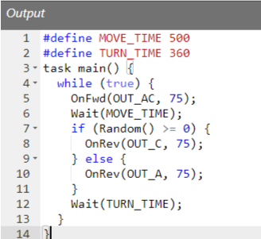
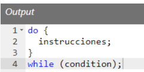
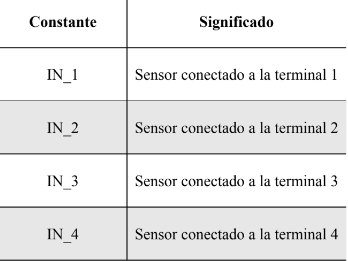
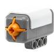
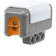
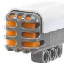
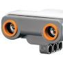
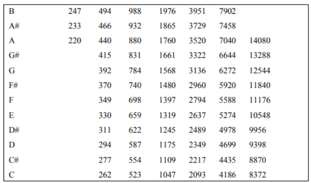
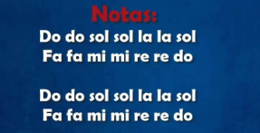

# Ejercicios

## 1. Prueba motores

```c
task main()
{
    OnFwd(OUT_AC, 75);
    Wait(800);
    OnRev(OUT_C, 75);
    Wait(360);
    Off(OUT_AC);
}
```

## 2. Utilización de constantes

```c
#define MOVE_TIME 1000
#define TURN_TIME 360
task main()
{
    OnFwd(OUT_AC, 75);
    Wait(MOVE_TIME);
    OnRev(OUT_C, 75);
    Wait(TURN_TIME);
    Off(OUT_AC);
}
```

## 3. Repeticiones

```c
#define MOVE_TIME 500
#define TURN_TIME 500
task main()
{
    repeat(4)
        {
        OnFwd(OUT_AC, 75);
        Wait(MOVE_TIME);
        OnRev(OUT_C, 75);
        Wait(TURN_TIME);
        }
    Off(OUT_AC);
    }
```

## 4. Repeticiones 2

```c
#define MOVE_TIME 500
#define TURN_TIME 500
task main()
{
    repeat (4)
    {
        repeat(4)
        {
            OnFwd(OUT_AC, 75);
            Wait(MOVE_TIME);
            OnRev(OUT_C, 75);
            Wait(TURN_TIME);
        }
        Off(OUT_AC);
    }
}
```

## 5. Repeticiones 3

```c
#define TURN_TIME 360

int move_time;

task main()
{
    move_time = 200;
    repeat(50)
    {
        OnFwd(OUT_AC, 75);
        Wait(move_time);
        OnRev(OUT_C, 75);
        Wait(TURN_TIME);
        move_time += 200;
    }
    Off(OUT_AC);
}
```

## 6. Condicional if-else

A veces queremos que una parte de nuestro programa se ejecute solamente en ciertas situaciones. En esos casos se usa la sentencia if. Vamos a ver un ejemplo. Vamos a modificar el programa con el que hemos estado trabajando, pero queremos que gire bien a la derecha o a la izquierda, y que haga esa elección de modo aleatorio. Elegiremos al azar un número que puede ser positivo o negativo, y si es positivo el robot girará a la derecha y si no, girará hacia la izquierda.

Si la condición entre paréntesis es cierta, se ejecuta la parte entre paréntesis, si no lo es, se ejecutará la parte detrás de la sentencia else.

Prestemos atención a la condición que hemos usado: Random() >= 0, esto significa que Random() debe ser igual o mayor que cero para que la condición sea cierta. Se pueden comparar los valores de otras maneras, aquí vemos las más importantes:

|     |                 |
| --- | --------------- |
| ==  | igual a         |
| <   | menor que       |
| <=  | menor o igual a |
| >=  | mayor o igual a |
| ¡=  | no igual a      |

Se pueden combinar condiciones usando &&, que significa “y” o “||” que significa “o”. Veamos algunos ejemplos:
true siempre cierto

Fíjate que la sentencia if tiene dos partes. La parte inmediatamente después de la condición, que se ejecuta cuando la condición es cierta, y la parte después del else, que se ejecuta si la condición es falsa.

La palabra clave else y la parte que le sigue son opcionales, de manera que puedes omitirlas si no hay nada que hacer en caso de que la condición sea falsa.



## 7. Bucles while

```c
int move_time, turn_time;
task main()
{
    while(true)
    {
        move_time = Random(600);
        turn_time = Random(400);
        OnFwd(OUT_AC, 75);
        Wait(move_time);
        OnRev(OUT_A, 75);
        Wait(turn_time);
    }
}
```

## 8. Bucle while y condicional combinados

```c
#define MOVE_TIME 500
#define TURN_TIME 360
task main()
    {
    while(true)
    {
        OnFwd(OUT_AC, 75);
        Wait(MOVE_TIME);
        if (Random() <= 0)
        {
        OnRev(OUT_A, 75);
        }
        else
        {
        OnRev(OUT_C, 75);
        }
        Wait(TURN_TIME);
    }
}
```

## 9. Bucles do-while

Hay otra estructura de control, la sentencia do. Tiene la siguiente forma:



Las instrucciones entre llaves que hay después del do se ejecutan mientras la condición sea cierta. La condición tiene la misma forma que el if. Éste es un ejemplo de un programa. El robot da vueltas de modo aleatorio durante 20 segundos y después se para.

Fíjate que la sentencia do es casi igual que la sentencia while. Pero en el while, la condición se comprueba antes de entrar en las instrucciones, mientras que en el do, se comprueba al final. En el caso del while puede ocurrir que las sentencias no se ejecuten nunca, pero en el do, se ejecutarán al menos una vez.

```c
int move_time, turn_time, total_time;
task main()
{
    total_time = 0;
    do
    {
        move_time = Random(1000);
        turn_time = Random(1000);
        OnFwd(OUT_AC, 75);
        Wait(move_time);
        OnRev(OUT_C, 75);
        Wait(turn_time);
        total_time += move_time;
        total_time += turn_time;
    }
    while (total_time < 20000);
    Off(OUT_AC);
}
```
Fíjate que la sentencia do es casi igual que la sentencia while. Pero en el while, la condición se comprueba antes de entrar en las instrucciones, mientras que en el do, se comprueba al final. En el caso del while puede ocurrir que las sentencias no se ejecuten nunca, pero en el do, se ejecutarán al menos una vez.

## 10. Sensor contacto


Cada sensor lo tenéis que conectar a uno de los puertos de entrada:



En este ejemplo, el sensor de contacto es el botón que tenéis detrás en el robot. Debería conectarse al puerto ``IN_1``.



```c
task main()
{
    SetSensor(IN_1,SENSOR_TOUCH);
    OnFwd(OUT_AC, 75);
    until (SENSOR_1 == 1);
    Off(OUT_AC);
}
```

Otro ejemplo:

```c
task main()
{
    SetSensorTouch(IN_1);
    OnFwd(OUT_AC, 75);
    while (true)
    {
        if (SENSOR_1 == 1)
        {
        OnRev(OUT_AC, 75); Wait(300);
        OnFwd(OUT_A, 75); Wait(300);
        OnFwd(OUT_AC, 75);
        }
    }
}
```

## 11. Sensor de luz

Comprobad que tenéis conectado el sensor de luz en el puerto ``IN_3``.



```c
#define SPEED 60
#define motoren OUT_BC
#define THRESHOLD 45
task main ()
{
    SetSensorLight(IN_3);
    OnFwd(motoren, SPEED);
    while(true)
    {
        if(SENSOR_3 < THRESHOLD)
        {
        Off(OUT_B);
        OnFwd(OUT_C, SPEED);
        }
        else
        {
        Off(OUT_C);
        OnFwd(OUT_B, SPEED);
        }
    }
}
```

## 12. Sensor de sonido

Comprobad que tenéis el sensor de sonido conectado al puerto ``IN_2``.



En este caso, le tenemos que decir a partir de qué valor va a decirnos que detecta un sonido, en función del volumen, indicado de 0 a 100.

En este caso, está fijado en 40 decibelios.

```c
#define UMBRAL 40
task main()
{
    SetSensorSound(IN_2);
    while(true)
    {
        until(MIC > UMBRAL);
        OnFwd(OUT_AC, 75);
        Wait(300);
        until(MIC > UMBRAL);
        Off(OUT_AC);
        Wait(300);
    }
}`
```

## 13. Sensor de ultrasonidos

Tenemos que comprobar que tenemos conectado el sensor de ultrasonidos en el puerto correcto. En este caso, ``IN_4``.



Con la función siguiente, le indicamos al programa que lo vamos a utilzar, y le decimos donde lo hemos conectado.

``SetSensorLowspeed(IN_4);``

Definiremos la distancia a la que queremos que detecte un objeto. En este caso, serán 15 cm, pero lo podéis modificar.

```c
#define DISTANCIA 15

task main()
{
    SetSensorLowspeed(IN_4);
    while(true)
    {
    OnFwd(OUT_AC,50);
    while(SensorUS(IN_4)>DISTANCIA);
    Off(OUT_AC);
    OnRev(OUT_C,100);
    Wait(800);
    }
}
```

## 14. Subrutinas

Podemos crear subrutinas o funciones para no tener que repetir el código muchas veces. En este ejemplo, creamos una función llamada ``girar`` a la que le pasaremos como parámetro la potencia.

El código de la función no se ejecuta de primeras, sólo cuando se la llama dentro de la función.

El programa siempre comienza a ejecutarse en ``task main()``

```c
sub girar(int potencia)
{
    OnRev(OUT_C, potencia);
    Wait(900);
    OnFwd(OUT_AC, potencia);
}
task main()
{
    OnFwd(OUT_AC, 75);
    Wait(1000);
    girar(75); //Aufruf der Subroutine
    Wait(2000);
    girar(75); //Aufruf der Subroutine
    Wait(1000);
    girar(75); //Aufruf der Subroutine
    Off(OUT_AC);
}
```

## 15. Música

El robot nos permite reproducir sonido. Para ello podemos utilizar la función ``PlayToneEx``. Si le pasamos como argumentos una frecuencia de sonido y una duración, nos generará dicho sonido.

Las frecuencias de las notas son las siguientes:




Si queremos que un sonido dure un segundo, utilizaríamos el valor 1000, 500 para medio segundo, etc.

Veamos un ejemplo

``PlayToneEx(262,400,3,FALSE);``

En este caso se reproduce un do (C), durante 400 milisegundos, a volumen 3. False indica que no se repetirá.

Si queremos crear silencios:

``Wait(500);``

Prueba a crear la siguiente canción



Podéis coger este ejemplo de referencia

```c
#define VOL 3
task main()
{
PlayToneEx(262,400,VOL,FALSE); Wait(500);
PlayToneEx(294,400,VOL,FALSE); Wait(500);
PlayToneEx(330,400,VOL,FALSE); Wait(500);
PlayToneEx(294,400,VOL,FALSE); Wait(500);
PlayToneEx(262,1600,VOL,FALSE); Wait(2000);
}
```

## 16. Música y movimiento

Podemos hacer que dos ``task`` (tareas) se ejecuten al mismo tiempo. Por ejemplo, podemos mover el robot al mismo tiempo que suena la música.

```c
task music()
{
    while (true)
    {
        PlayTone(262,400); Wait(500);
        PlayTone(294,400); Wait(500);
        PlayTone(330,400); Wait(500);
        PlayTone(294,400); Wait(500);
    }
}
task movement()
{
    while(true)
    {
        OnFwd(OUT_AC, 75); Wait(3000);
        OnRev(OUT_AC, 75); Wait(3000);
    }
}
task main()
{
    Precedes(music, movement);
}
```

## 17. Motores con inercia

La función ``coast`` se utiliza para detener los motores mientras todavía se les permite girar libremente. Esto se utiliza a menudo cuando el robot necesita disminuir o detenerse de repente, pero sin aplicar los frenos a los motores, lo que causaría que el robot se detenga de repente.

La función ``float`` se utiliza para hacer que un motor flote, lo que significa que el motor continuará girando a su velocidad actual sin ser influenciado por el programa

```c
task main()
{
    OnFwd(OUT_AC, 75);
    Wait(500);
    Off(OUT_AC);
    Wait(1000);
    OnFwd(OUT_AC, 75);
    Wait(500);
    Float(OUT_AC);
}
```
