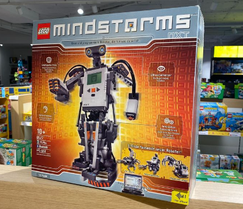

# Lego mindstorm NXT

Los kits de **Lego Mindstorm NXT** son una de las últimas series de Lego, diseñados para permitir a los niños construir y programar robots.

Lego Mindstorm NXT es un sistema de construcción de robots basado en la plataforma **Lego Mindstorms**. Está diseñado para usuarios principiantes y avanzados, y ofrece una variedad de sensores y actuadores para que los usuarios construyan y programen robots para realizar tareas específicas.

## Kits

Los kits incluyen piezas de Lego, controladores y sensores, y una variedad de herramientas de programación. Los sensores incluyen un sensor de línea, un sensor de luz, un sensor de distancia, un sensor de temperatura y más. Los actuadores incluyen motores, servos, motores paso a paso y más.

Con los kits de Lego Mindstorm NXT, los niños y adultos pueden construir y programar robots desde cero. Estos robots pueden realizar tareas como seguir líneas, detectar objetos, evitar obstáculos y más. Estos robots se pueden programar para realizar tareas específicas mediante el uso de diferentes herramientas de programación. Estos robots se pueden controlar con un control remoto o con una computadora de escritorio.

## Principales características

El kit básico de LEGO MINDSTORMS NXT está compuesto (Ver figura 5)por:

* Un controlador
* Cuatro sensores (ultrasonidos, contacto, micrófono y luz)
* 3 servomotores
* Un conjunto de piezas para crear estructuras mecánicas compatibles con las de otros productos LEGO.