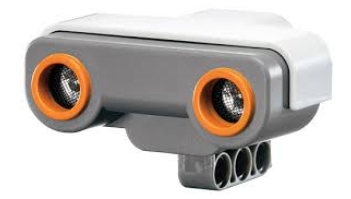
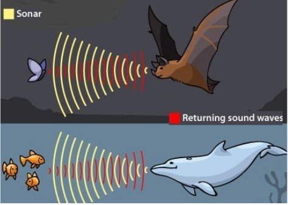
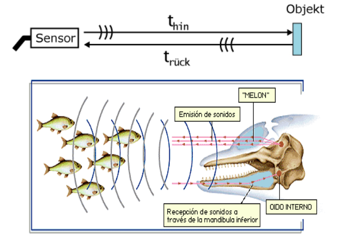
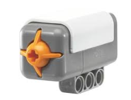
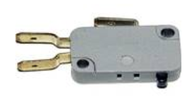
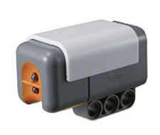

# ROBÓTICA CON LEGO MINDSTORMS NXT


---

# 1. INTRODUCCIÓN

En este tema trabajaremos la programación y montaje de robots, utilizando sensores y motores y coordinando su funcionamiento para realizar diferentes tareas.


---

# 2. ROBÓTICA

La robótica es una ciencia o rama de la tecnología, que estudia el análisis, diseño, construcción y aplicación de robots,

---

# Máquinas, autómatas y robots

Una ``máquina`` es capaz de realizar una tarea siendo dirigida por un usuario, pero no es capaz de realizar una tarea sencillamente si no está dirigida por un usuario.

El ``autómata`` es capaz de realizar un trabajo sencillo y repetitivo sin supervisión.

El ``robot`` es capaz de decidir cuál es la tarea a realizar y realizarla sin necesidad de una persona.

---


---

# Inteligencia artificial y autonomía

Se dice que un robot tiene inteligencia artificial (IA) cuando tiene la capacidad de obtener información de su entorno y en función de esta actuar. Es decir, decidir por sí mismo.

---

Se considera a un robot como un agente autónomo inteligente cuando cumple los requisitos siguientes:


---

``Autonomía``: El sistema de control / movilidad reside en la propia máquina, que debe operar sin conexión física a equipos externos.

``Inteligencia``: El robot tiene capacidad de razonar hasta el punto de ser capaz de tomar sus propias decisiones y de seleccionar, fusionar e integrar las medidas de sus sensores.

---

# 3. KITS DE LEGO

En el instituto disponemos de ``kits`` de Lego de la serie ``Mindstorms NXT``. Se trata de un sistema programable creado por Lego en 2006. En total hay 6 kits de robots y una caja de ampliación.

Los ``kits`` incluyen piezas de Lego, controladores y sensores, y una variedad de herramientas de programación.

---

# Sensores y actuadores

Los ``sensores`` incluyen un sensor de línea, un sensor de luz, un sensor de distancia, un sensor de temperatura y más.

Los ``actuadores`` incluyen motores, servos, motores paso a paso y más.

Aviso: Normalmente utilizamos en clase solo 4 robots simultáneos, y el resto queda para piezas de recambio. Hemos hecho un fondo común de piezas,  los alumnos las van cogiendo de allí.

---

# Kit básico

El `kit básico` es el de las cajas con el código 9797. Contienen las piezas para fabricar y probar un robot básico.


---

# Principales características


---

El `kit básico` está compuesto por:

* Un controlador
* Cuatro sensores (ultrasonidos, contacto, micrófono y luz)
* 3 servomotores
* Un conjunto de piezas para crear estructuras mecánicas compatibles con las de otros productos LEGO.

Las piezas vienen colocadas en dos cajas independientes, una dentro de la otra. El contenido de cada kit es el siguiente:

---


En la bandeja naranja tenemos todas las piezas de montaje de Lego para crear la estructura del robot.


AVISO: La caja número 5 está incompleta pues faltan algunas piezas y una bandeja de color naranja.

---

# Kit de ampliación


La caja azul trae piezas nuevas para crear nuevos robots.

---

<!-- _class: invert -->

# <!--fit --> Brick o unidad de control

---

# Unidad de control


El cerebro o unidad de control del robot es el `brick`. Está alimentado por 6 pilas de 1.5V, aunque también puede utilizar una batería que viene con el kit.

---

# Brick. Entradas y salidas

Tiene 3 salidas que controlan los motores (A, B y C)

Tiene 4 entradas para adquirir datos de los sensores que se le añadan.

---

# Brick. Pantalla

Tiene una ``pantalla LCD`` en la que se puede observar el estado del Microbot así como acceder a programas cargados en memoria. Los programas se tienen que cargar desde el ordenador, por lo que trae un puerto USB

---

# Brick. Procesador

Cuenta con un microprocesador Atmel ARM7 de 32 bits a 48 MHz. Se trata de un microprocesador utilizado extensivamente en electrónica de consumo (PDAs, teléfonos móviles,reproductores digitales multimedia,...) así como en otras aplicaciones empotradas como por ejemplo en la industria del automóvil.

---

# Brick. Memoria

Además, la plataforma cuenta con un coprocesador, Atmel AVR de 8 bits, y con:

- una memoria Flash de 256 KB
- una memoria RAM de 64 KB

---

# Baterías

Las baterías recargables proporcionan hasta 2.200 mAh. Se cargan a 9v a unos 500 mA.

Hay 2 cargadores de voltaje variable ajustados a 9v.


---

# Recarga

Dejamos siempre uno de los robots cargando, y al gastar la batería de uno que estamos utilizando cogemos este y el gastado lo ponemos a cargar.


Se puede configurar el `brick` un periodo de espera y entrar en suspensión transcurrido este periodo para ahorrar batería.

Tenemos también una serie de cargadores variados. Ahora mismo tenemos 2 que funcionan.

---

<!-- _class: invert -->

# <!--fit --> Sensores

---

# Sensores

El sensor traduce la información que le llega del exterior en un impulso eléctrico, normalmente digital (pasa o no pasa corriente), que puede ser analizado y procesado por la unidad de control del sistema


---

# Sensores de ultrasonidos

Los "Sensores de ultrasonidos" o "Sensores Ultrasónicos" son detectores de proximidad detectan objetos a distancias que van desde pocos centímetros hasta varios metros.



---

# Características

Estos sensores trabajan sólo en el aire, y pueden detectar objetos con diferentes formas, distintos colores, superficies y de distintos materiales. Los materiales pueden ser sólidos, líquidos o polvorientos, pero deben ser deflectores de sonido.

---

# Ultrasonidos

Los ``ultrasonidos`` son ondas mecánicas. La frecuencia está por encima del umbral de audición del oído humano (aproximadamente 20 000 Hz).
Algunas especies del reino animal como ciertos insectos y mamíferos (delfines y murciélagos) lo utilizan de forma parecida a un radar para su orientación; a este fenómeno se le conoce como ``ecolocalización``.

---



Los sensores de ultrasonidos trabajan según el tiempo de transcurso del eco, es decir, se valora la distancia temporal entre el impulso de emisión y el impulso del eco.

---



---

# Aplicaciones prácticas

- Control de niveles en depósitos
- Antichoques
- Detección objetos
- Recuento de objetos (fábricas)

---

# Sensor de contacto

Se utilizan para detectar el final del recorrido o la posición límite de componentes mecánicos. Por ejemplo: saber cuándo una puerta o ventana que se abren automáticamente están ya completamente abiertas y por tanto el motor que las acciona debe detenerse.



---

Los principales son los llamados ``finales de carrera``. Se trata de un interruptor que consta de una pequeña pieza móvil que al ser accionada corta o abre el paso de corriente.



---

# Aplicaciones

- Puertas de garaje
- Ascensores
- Industria
- Robótica

---

# Sensor de luz - fotoeléctrico

Permite distinguir entre luz y oscuridad. El ``LED emisor`` integrado posibilita medir la intensidad de luz reflejada sobre objetos.

Puede diferenciar objetos mediante su color (clasificación a nivel de escala de grises) o para poder seguir una línea de color negro.



---

Algunas aplicaciones:

- Detectores de movimiento
- Detectores de luz/oscuridad
- Recuento de objetos (fábricas)
- Domótica (movimiento, luces, etc...)

---

# Montaje

Pasos:

1. Revisar las cajas y organizar las piezas
2. Montar los robots y hacer las primeras comprobaciones.
3. Una vez montados se guardan las cajas y los robots por separado ya montados.

---

# Mejoras

Sería interesante etiquetar con cintas de colores los cables RJ-12 de diferentes longitudes para que sea más fácil montarlos

---

# 4. MONTAJE BÁSICO

El kit de Lego nos permite crear diferentes robots. Además de estos, se pueden hacer todos los que se quiera o incluso coger ideas de Internet.

Montar nuestro robot será el primer paso que necesitaremos. Para ello hay un libro de instrucciones, que podemos seguir para ir creando una estructura básica con 2 motores y varios sensores.

---


---

A la vez que vamos agregando sensores, podemos comenzar a programar sencillos programas directamente desde el robot (las instrucciones explican cómo).

---

# MONTAJE ROBOT BÁSICO Y EJERCICIOS

Lo primero que hay que hacer es montar y programar el robot básico, con sensores de luz y ultrasonidos. Las instrucciones del kit tienen montajes diferentes para realizar.


---

Una vez montados los robots, los podéis programar desde el propio menú del robot para comprobar que todo funciona.

---

<!-- _class: invert -->

# <!--fit --> Programación

---

# 5. PROGRAMACIÓN AVANZADA CON NXC

``Lego Mindstorms`` se puede programar mediante un entorno gráfico visual, que es la forma oficial. También podemos programarlo de otras formas y lenguajes no oficiales, gracias a gente que crea programas y librerías para ello.


---

# 5.1. El lenguaje NXC

NXC es un lenguaje de programación, inventado por John Hansen, que fue especialmente diseñado para los robots de Lego.

Para facilitar aún más la escritura de programas, está el Centro de Comando Bricx (``BricxCC`` ). Esta utilidad ayuda a escribir sus programas, descargarlos al robot, iniciarlos y detenerlos, explorar la memoria flash NXT, convertir archivos de sonido para usar con el ladrillo y mucho más.

---

# 5.2. Instalación

La instalación del software de LEGO Mindstorms NXT para este curso se divide en 2 partes:

1. La instalación del driver. El controlador para el NXT se puede descargar desde el CD de instalación o buscándolo en internet
2. La instalación del Bricx Command Center. Se puede descargar aquí: ``BricxCC``.

``BricxCC`` funciona casi como un procesador de texto, pero con algunos extras. Se trata de un entorno de desarrollo integrado (IDE).

---

# 5.3. Funcionamiento del lenguaje NXC

---

# Tareas: definición

Los programas de NXC consisten en ``tareas``. Nuestro programa tiene una única tarea, llamada ``main``. El programa siempre debe tener una tarea principal llamada ``main``, que siempre ejecuta el robot.

```c
task main() {

}
```

---

# Treas: contenido

Una tarea consiste en una serie de órdenes, también denominadas instrucciones. Hay paréntesis alrededor de estos bloques de órdenes de forma que quede claro a qué tarea pertenecen.

Todas las instrucciones terminan con un punto y coma.


---

# Ejemplo de programa

![]img/2023-02-09-17-41-43.png)

Antes de compilar tenéis que guardar el archivo del programa en el ordenador como .NXC. Si no, os dará error.

---

# 5.4. EJERCICIOS BÁSICOS

En esta página tenéis varios ejercicios básicos para probar con el robot. Podéis ir haciéndolos hasta donde lleguéis.

[ejrcicios](ejercicios.md)

---

# 5.5. PROGRAMAS DE AÑOS ANTERIORES

En esta página podéis encontrar códigos de programación que hemos ido haciendo en cursos anteriores:

[Reositorio de programas en GitHub](https://github.com/danimrprofe/lego-nxt)

---

# 6. Proyectos de NXTprograms.com (AMPLIACIÓN)

En esta web [NXTprograms](http://www.nxtprograms.com) se pueden encontrar otras ideas NO OFICIALES para construir y programar otros robots, así como guías y instrucciones


Hay dos robots principales:

- Express-bot (no té programes)
- Multi-bot (inclou exemples de programes)

---

# 7. INSTALACIÓN Y USO DEL BRICX COMMAND CENTER (BRICX CC)

---

# 쯈ué es BricxCC?

[Bricx Command Center](http://bricxcc.sourceforge.net/) es el software que provee de una interfaz y de los programas necesarios para programar el NXT.  Aquí crearemos nuestros programas y los cargaremos en el robot.

---

# Paso 1: Conectar el robot

Al ejecutar ``BricxCC`` , lo primero que observamos es una ventana de diálogo la cual configuraremos de la siguiente forma:

- Prt: USB
- Brick Type: NXT
- Firmware: Standard

Si lo hacemos correctamente, en el robot aparecerán las letras USB.

---

# Paso 2: Crear el programa

Buscamos el programa ``BricxCC``  en alguno de los ordenadores, y pegamos el código que vamos a programar.

![]img/2023-02-09-17-42-29.png)

---

# Paso 3: Compilar el programa

Para compilar el programa presione el botón ``Compile Program`` ++F5++, la compilación no debe de producir errores.

---

# Paso 4: Cargar el programa en el robot

Ahora que tenemos compilado el programa, es posible cargarlo al NXT. Basta con presionar ``Download Program`` ++F6++, para que comience a descargarlo.

---

# Paso 5:  Ejecutar el programa

Una vez cargado el programa en el Robot, tenemos que seleccionarlo desde el propio robot para poder ejecutarlo.

1. hora, en el menú del robot NXT seleccione ``My Files``, esta opción contiene los archivos que se han cargado a la memoria del NXT.
2. Seleccione ``Software Files`` y luego el nombre que elegimos para el programa que creamos anteriormente.
3. Finalmente, ``Run``, para correr el programa.

---

<!-- _class: invert -->

# <!--fit --> Guitarra eléctrica

---

# 8. PROYECTO GUITARRA ELÉCTRICA

Buscando en Internet podemos encontrar muchos proyectos realizados por usuarios en su tiempo libre. Uno de los más interesantes es el de fabricar una guitarra eléctrica.

---

# Explicación del proyecto

En este video grabado por la promoción 19/20 de 2º de bachillerato se explica el funcionamiento general del proyecto:
Video explicativo del proyecto guitarra con Lego (marzo de 2020)

---

# Prueba de funcionamiento con la canción de Deep Purple, smoke on the water

Guitarra lego mindstorms nxt - Smoke on the water


---

# Montaje de la guitarra

Una vez montada, la guitarra quedará de esta forma:


---

# Explicación musical

Dividiremos el mástil en 5 zonas para cada una de las notas del riff principal. Separamos las zonas con cinta aislante para separar el mástil en trastes y saber dónde estamos tocando

La ecuencia del riff principal de la canción es la siguiente:

D4 F4 G4 - | D4 F4 G#4 G4 | D4 F4 G4 - | F4 D4

---

Para ello necesitaremos las siguientes notas:

- D4 para distancias entre 5 y 8
- F4 para distancias entre 9 y 13
- G4 para distancias entre 14 y 18
- G#4 para distancias entre 18 y 21

---

# Correspondencia entre tonos y notas

Las posiciones más cercanas al sensor serán las notas más graves.


---

# Mejoras

Sería ideal que hubiera un decaimiento del volumen poco a poco

Podíamos intentar que en vez de que suenen notas sueltas suenen acordes

Intentar grabar en un iPad con la guitarra y probar de distorsionar. Para ello necesitaríamos grabar el sonido con un micrófono y meterlo con una tarjeta de sonido externa en el Garageband.

---

# 9. PROYECTO MINDCUBER

Este proyecto no lo pudimos terminar por falta de tiempo y alguna que otra pieza que no teníamos.


---

<!-- _class: invert -->

# <!--fit --> Ejercicios propuestos

---

Estos ejercicios los realizaremos con el montaje básico del robot.

---

# Ejercicio 1

Crear la función mover_tiempo (int tiempo, int velocidad, char sentido)

Tiepo indica el tiempo que se moverá

Velocidad indica la velocidad a la que se moverá

Sentido indicará si se mueve hacia adelante o hacia atrás (D o A)

---

# Ejercicio 2

Crear una función girar sobre sí mismo llamada darvueltas (int tiempo, char sentido). Para ello, una rueda debe de girar y otra no.

Le asaremos 2 parámetros:

Duración, que determinará el tiempo que da vueltas.

Sentido: indicaremos H para horario y A para antihorario

---

# Ejercicio 3

Crear una función que sea girar (char direccion, char sentido, int tiempo, int velocidad), donde:

Dircción: indica si gira a derecha o izquierda

Sentido: indica si gira hacia delante o hacia atrás

Velocidad: indica lo rápido que gira

Tiempo: es el tiempo durante el cual girará

---

Dirección será un char valdrá:

- I para girar a la izquierda
- D para girar a la derecha

Sentido valdrá:

- D para ir hacia Delante
- A para ir hacia Atrás

---

Nota: para girar una rueda debe girar más rápido que la otra. En función de la diferencia entre las dos velocidades, el giro será más abierto o más cerrado.

Modificar la función para que funcione correctamente y probar las cuatro combinaciones de dirección y sentido.

---

# Ejercicio 4

En este ejercicio crearemos una función que nos permita avanzar una distancia especificada en cm. La nueva función se llamará mover_distancia(int distancia, int velocidad, char sentido).

Funión RotateMotor

Dentro de la función creada utilizaremos la función RotateMotor, ya incluida en las librerías, que nos permite girar el motor por ángulo en lugar de por tiempo.

---

# Ejercicio 4

Por ejemplo: RotateMotor(OUT_AB, 75, 360) nos permitiría

Mover los motores conectados a A y B

A una potencia de 75

Girar la rueda una vuelta (360 grados)

---
# Calcular la distancia

Para ello, necesitamos calcular los grados que tenemos que girar las ruedas para avanzar x distancia. Dependerá del tipo de rueda (tamaño).

Necesitamos saber cuánto avanza una rueda en 1 vuelta (360 grados). Esta distancia se corresponde con el perímetro de la rueda, que se calculará como:

- 2 · pi · radio
- diámetro · pi

---
# Calcular la distancia

Una vez calculada la distancia, con una regla de 3:

- 360 grados corresponden a pi · diámetro
- ángulo grados corresponden a dist cm
- Donde Y es la distancia que queremos que recorra.
- Así pues, ángulo = (dist * 360)/(pi * diámetro)
- Necesitaremos crear las 3 variables: ángulo, dist y diámetro

---

# Resumen

Al finalizar vuestra práctica, deberéis tener las siguientes funciones:

- movr_tiempo (int tiempo, int velocidad, char sentido)
- mover_distancia (int distancia, int velocidad, char sentido)
- dar_vueltas (int tiempo, char sentido)
- girar (char direccion, char sentido, int tiempo, int velocidad)

---

# Prueba final

Programar el robot para que realice la siguiente secuencia (en la task main):

- Moverse 2 segundos adelante a la velocidad máxima
- Moverse 1 segundo hacia atrás a la mitad de velocidad
- Dar vueltas en sentido horario
- Dar vueltas en sentido antihorario
- Girar hacia adelante y a la izquierda 2 segundos
- Girar hacia atrás y a la derecha 2 segundos
- Dar vueltas 5 segundos