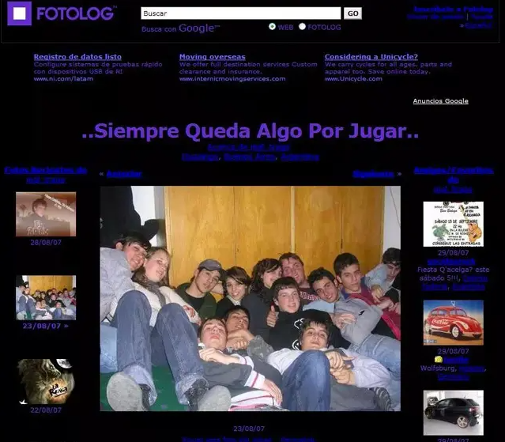
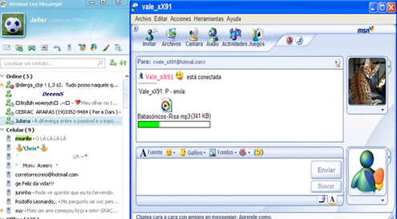
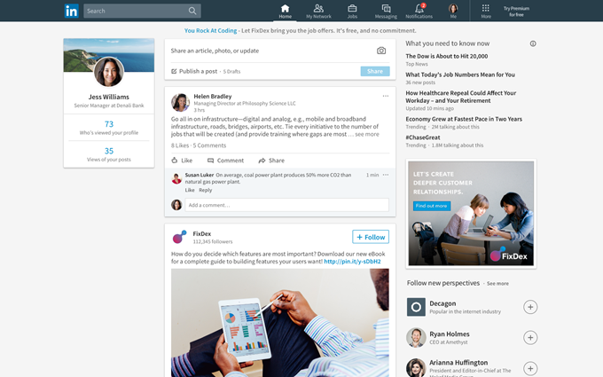
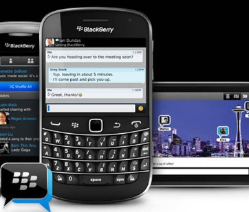
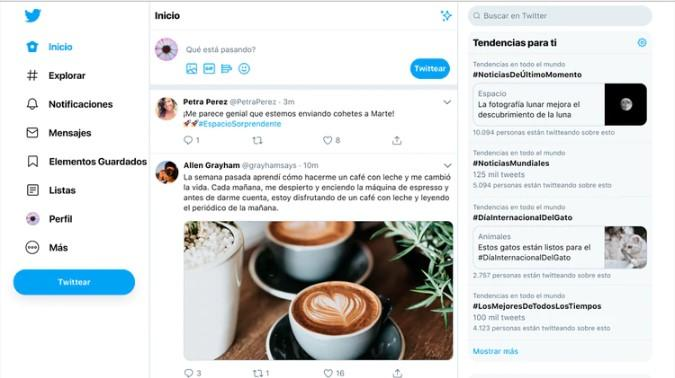
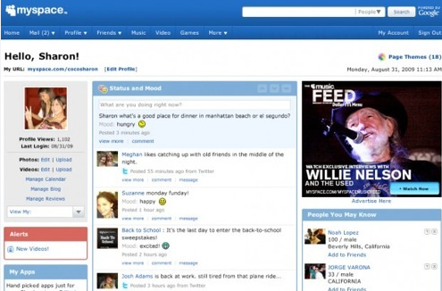
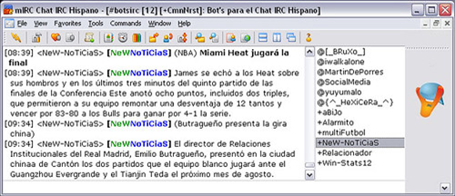
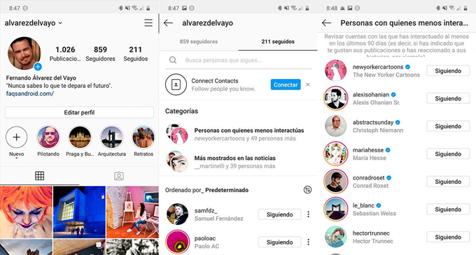
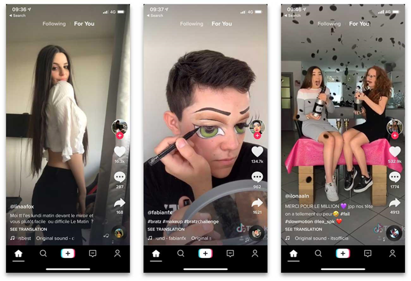

# Cronologia

## 1999: Fotolog

Fotolog va ser una xarxa social que permetia als usuaris publicar fotos i escriure-hi comentaris. Va ser llançada al maig de 2002 per l'argentí Scott Heiferman i el nord-americà Adam Seifer.

## 2000: MSN Messenger

MSN Messenger permetia als usuaris enviar missatges de text, emoticones, imatges i fitxers a altres usuaris que tinguessin un compte de Microsoft o una adreça de correu electrònic.

## 2003: LinkedIn

LinkedIn permet als usuaris crear un perfil professional en què poden detallar la seva experiència laboral, habilitats, educació i èxits professionals. També poden connectar amb altres usuaris, unir-se a grups i seguir empreses al seu sector.

## 2004: Facebook

2005: YouTube és llançat com una plataforma dintercanvi de vídeos.

2005: Reddit és llançat com un lloc web de discussió i agregació de notícies.

## 2005 Blackberry messenger

BlackBerry Messenger, va ser un servei de missatgeria instantània propietat de BlackBerry Limited. Va ser llançat per primera vegada a l'agost de 2005 per a usuaris de BlackBerry.

## 2006: Twitter

És llançat com una xarxa social de microblogging. Twitter és una xarxa social i plataforma de microblogging fundada el 2006. Els usuaris poden publicar missatges anomenats "tweets" de fins a 280 caràcters, que poden incloure text, imatges, vídeos i enllaços. Aquests tweets es publiquen al perfil de l'usuari i poden ser vistos pels seus seguidors.

## 2006: Myspace

MySpace va ser una xarxa social creada el 2003, que permetia als usuaris crear perfils personals amb fotos, música i altres continguts multimèdia. Els usuaris podien connectar-se amb amics, unir-se a grups i compartir-ne el contingut amb altres usuaris.

## 2006: mIRC es converteix en una de les aplicacions de xat més populars.

## 2007: Tumblr és llançat com una plataforma de blocs i xarxes socials.

## 2009: WhatsApp fue fundado

## 2010: Instagram és llançat com una plataforma dintercanvi de fotos.

## 2011: Google+ és llançat com la xarxa social de Google.

Google+ va ser una xarxa social llançada per Google el 2011, que oferia funcions semblants a les d'altres xarxes socials com Facebook i Twitter.

Una de les característiques distintives de Google+ va ser la possibilitat d'organitzar els contactes en cercles, cosa que permetia als usuaris controlar amb qui compartien contingut. Tot i alguns intents de revitalitzar la plataforma, Google va anunciar el tancament de Google+ el 2018 a causa d'una bretxa de seguretat.

## 2012: Pinterest

Pinterest és una xarxa social d'imatges que permet als usuaris crear i compartir col·leccions de fotos i altres continguts multimèdia anomenats "**pins**". Els usuaris poden organitzar els pins a taulers temàtics, i també poden explorar i buscar pins d'altres usuaris.

## 2012: Tinder

És llançat com una aplicació de cites que senfoca en la connexió de persones properes geogràficament.

Als EUA el 40% de les parelles heterosexuals es troben a internet, desplaçant els amics (20%) i la feina (12%), que als noranta dominaven. La meitat dels joves usen aquestes apps

## 2013: Telegram

2014: Forocotxes es converteix en la xarxa social més gran d'Espanya.

## 2014: Twitch

## 2015: Periscope

Periscope fue una aplicación de transmisión en vivo de Twitter que permitía a los usuarios transmitir videos en vivo y ver las transmisiones en vivo de otros usuarios. La aplicación se lanzó en 2015 y se cerró en 2021.

## 2016: Discord

Discord és una plataforma de comunicació en línia que inicialment es va centrar als jugadors de videojocs, però s'ha expandit a altres comunitats. Ofereix eines de xat de veu, text i vídeo, així com eines de gestió de servidors i rols per als usuaris. Permet als usuaris crear i personalitzar les pròpies comunitats en línia al voltant dels seus interessos i hobbies.

## 2016: TikTok

TikTok és una popular plataforma de xarxes socials que permet als usuaris crear i compartir vídeos curts, generalment amb música de fons.

2016: OnlyFans és llançat com una plataforma de xarxes socials de contingut per a adults.