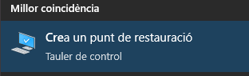

# 5.4. Pasos que debe darse en caso de infección

- **Restaurar el sistema** a un estado anterior: De esta manera no se pierde información, pero si se elimina el virus.

- **Actualizar** la base de datos del **antivirus** y realizar un análisis del sistema.

- Arrancar el sistema con un **LiveCD o Live USB**: permite analizar el equipo con un sistema que no está contaminado y recuperar información.

- Ejecutar **utilidades de desinfección específicas**, que eliminas amenazas concretas: esto sirve cuando ya ha sido detectada la amenaza.
