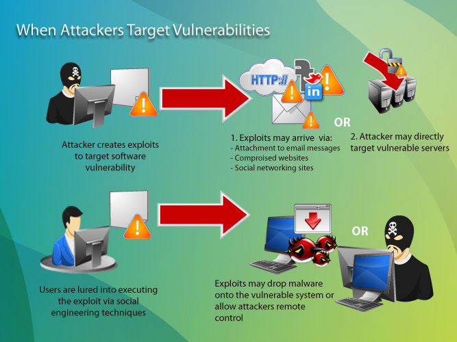
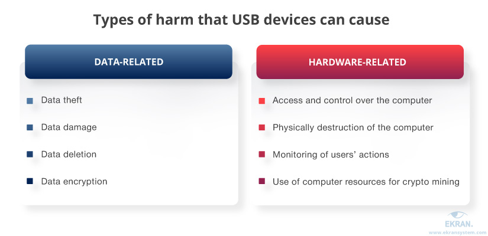

# 3.2. Cómo se infecta un ordenador

## Explotando una vulnerabilidad

Los sistemas operativos o programas no siempre se comportan como se espera en determinadas situaciones y esto es aprovechado para ejecutar comandos no
deseados o introducir programas maliciosos.

La **vulnerabilidad** es un fallo de seguridad que puede ser explotado por un atacante para obtener acceso no autorizado a un sistema o datos.

Un **exploit** es un método, código o técnica que aprovecha una vulnerabilidad para atacar a un sistema.

- Ejecutar código no autorizado en un sistema objetivo.
- Obtener acceso a un sistema o datos que de otra forma estarían prohibidos.

## Ingeniería social

Mediante técnicas de abuso de confianza para apremiar a un usuario a que realice determinada acción.

A menudo, los delincuentes cibernéticos utilizan técnicas de ingeniería social para:

1. Obtener acceso a cuentas de correo electrónico, redes sociales y otros servicios en línea.
2. Una vez que han obtenido acceso a estas cuentas, enviar correos electrónicos falsos a otros usuarios o publicar enlaces maliciosos en redes sociales.
3. También pueden usar estas cuentas para acceder a otros servicios en línea, como bancos en línea y sitios de comercio electrónico.

## Por un archivo malicioso

Es la forma en que gran cantidad de malware llega al ordenador, en archivos adjuntos, por medio del correo no deseado o spam, por la ejecución de aplicaciones web, archivos descargados de redes p2p, cracks, etc.

## Dispositivos extraibles

Muchos gusanos dejan copias de si mismos en dispositivos extraibles y por
medio de la ejecución automática al conectarlo o reproducirse.

- Un ejemplo sería si se conecta una unidad **USB** infectada a un ordenador, ya que esta podría transferir el virus al pc. T
- También es posible que un ordenador se infecte si se **descargan** archivos infectados desde internet.

## Cookies maliciosas

Pequeños ficheros que monitorizan y registran las actividades del usuario en
internet con fines maliciosos, por ejemplo tener hábitos de navegación para empresas de publicidad.