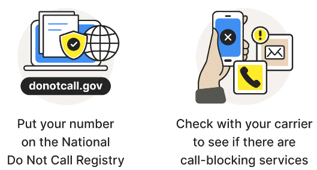
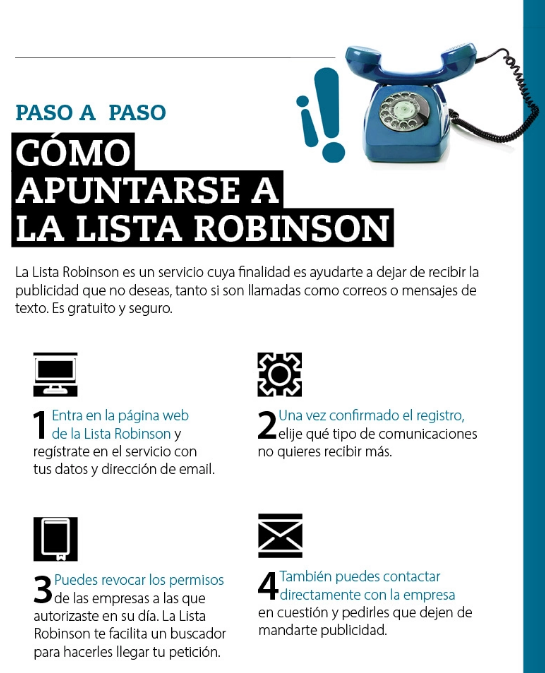
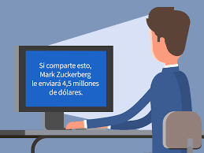

## Spam

Envío de correo electrónico publicitario de forma masiva a cualquier dirección de correo electrónico existente. Su finalidad en general suele ser la de
vender productos.

## ¿Qué hacer si lo recibo?

Consejos:

## ¿Cómo evitar recibir spam?

## La lista robinson

- https://www.listarobinson.es/
- https://www.ocu.org/consumo-familia/derechos-consumidor/consejos/como-apuntarse-lista-robinson

## Hoax

Mensajes de correo distribuidos en cadena, cuyo objetivo es realizar engaños masivos. Por ejemplo:

- Historias solidarias inventadas
- Mensajes que traen mala suerte
- Alertas falsas sobre virus
