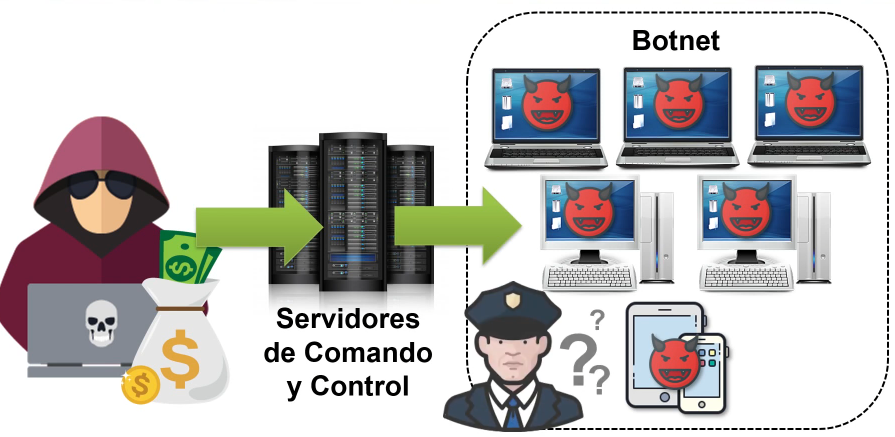
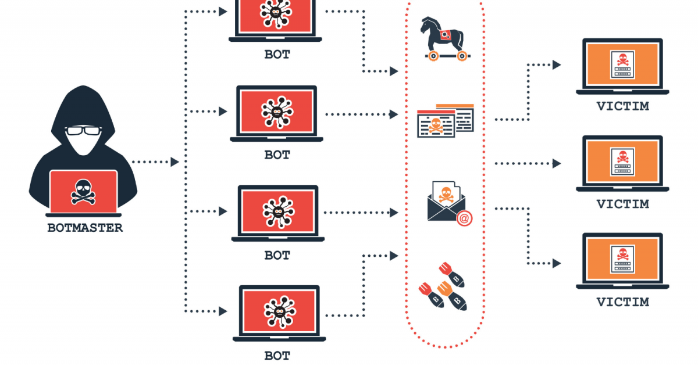
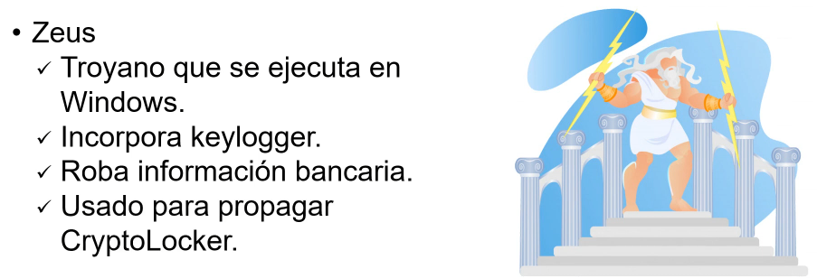

# 4.3. Botnets

Una botnet, o mejor dicho, una red de bots (también conocida como ejército zombi) es una red constituida por un gran número de equipos informáticos que han sido "secuestrados" por malware, que quedan bajo control del atacante.

# Usos

Al tomar el control de cientos o miles de equipos, las botnets se suelen utilizar para:

- Enviar spam o virus
- Realizar ataques de denegación de servicio distribuido (DDoS).
- Minería de criptomonedas
- Ataques de fuerza bruta

Para que un equipo forme parte de una botnet, primero es necesario que se **infecte** con algún tipo de **malware** que se comunica con un servidor remoto o con otros equipos infectados de la red. De esta forma, recibe instrucciones de quien controla la botnet, normalmente hackers y ciberdelincuentes.

## Servidores de comando y control

## Ejemplos

