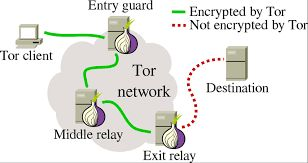

# 4. TOR

## ¿Qué es TOR?

**Tor** es un software de código abierto y una red anónima que permite a los usuarios navegar por la web de forma privada y segura. Funciona encriptando datos y enrutando el tráfico a través de múltiples nodos o "saltos" para ocultar la ubicación original del usuario.

Además, se puede usar para acceder a "sitios de cebolla" o "servicios ocultos", que son sitios web alojados en la red Tor y solo se puede acceder a ellos a través de Tor. En este tutorial, explicaremos cómo usar Tor y acceder a los sitios de cebolla.

## ¿Qué te puede ocurrir?

Algunas personas utilizan estas páginas web  y esta capa diferente para publicar o vender todo tipo de cosas ilícitas. Si tú navegas por internet no pasa nada, puedes ver lo que hay y comprobarlo.

El problema es comprar, vender o prestarse a mercadear con este tipo de servicios. En general, hay muchos estafadores (la mayoría).

## Aspectos positivos

- Es positiva porque te permite navegar de forma anónima. Debido a que no pueden rastrear la IP.
- También es un navegador que te permite también acceder a la web superficial, pero escondiendo tu dirección IP.
- La navegación es lenta, a menos que lo necesite para navegar de forma anónima,  que puede utilizar otro tipos de sistemas de navegación.

## ¿Quién usa TOR?

- El principal objetivo de Tor es proteger la privacidad de sus usuarios, es por esto que lo usan los que les preocupa proteger la privacidad.
- La gente normal usa Tor para navegar sin dejar rastros de navegación.

## ¿Quién usa TOR?

- Usuarios que viven en países que censuran contenido usan Tor para navegar sin restricciones.
- Los periodistas usan Tor para compartir información y proteger la confidencialidad de la navegación por Internet.
- Los agentes del orden usan Tor para llevar a cabo investigaciones enmascarando su rastro
- Los activistas y denunciantes utilizan Tor para proteger su identidad de los que censuran la libertad.
- Muchas personas más usan Tor de manera cotidiana para sus actividades en línea

