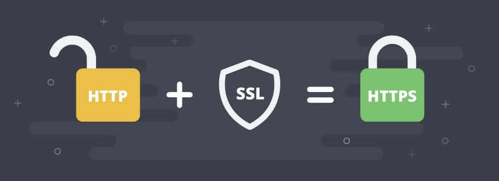
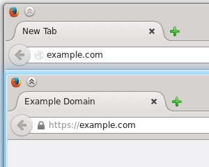

# HTTPS

## Protocolo HTTPS


El objetivo de este protocolo es realizar una  _transferencia_  de datos de forma  _segura_

Las transacciones bancarias o de pago, o en general cualquier servicio que requiera el envío de datos personales y contraseñas




El formato de la URL es igual al de  **HTTP** , excepto que el nombre del protocolo cambia por  **HTTPS**



## Características

* Necesita de un certificado X.509
* Dos tipos de certificados
  * Autofirmados
  * Firmados por una CA (autoridad de certificación)
* Permite que el tráfico de datos viaje cifrado
* Permite autenticación si el certificado está firmado por una CA
* HTTPS = HTTP \+ SSL/TLS
* Negociación SSL dependiente de la IP. No se pueden servir diferentes certificados con la misma IP

Puerto por defecto:  _443_  (80 en HTTP)

HTTPS opera  _cifrando_  el mensaje antes de ser enviado y decodificándolo antes de que llegue a su destino.

Para cifrar los mensajes se utiliza un  _sistema de clave pública _ (pública\-privada)


## Obtener un certificado

- Make\-ssl\-cert (paquete ssl\-cert)
- Openssl
- Xca

Obtener un certificado

**Openssl**

```
Openssl
# Generamos clave privada
openssl genrsa -out key 1024

# Generamos CSR y firmamos con nuestra clave privada
openssl req -new -key key -out csr
openssl x509 -req -days 365 -in csr -signkey key -out crt

# Copiamos clave y certificado en el destino
cat key crt > /etc/ssl/private/nombre-sitio.pem
CSR = solicitud de firma de certificados
```

## Características

El principal  _inconveniente_  que presenta es que si alguien consiguiera corromper la clave pública de nuestro servidor web, cambiándolo por la suya, podría descodificar los mensajes del emisor.

HTTPS no nos garantiza que quien hay detrás de la página es quien dice ser, únicamente que la información va cifrada hasta el servidor.

Si nos conectamos por HTTPS a una página fraudulenta, obtendrán nuestros datos igualmente.