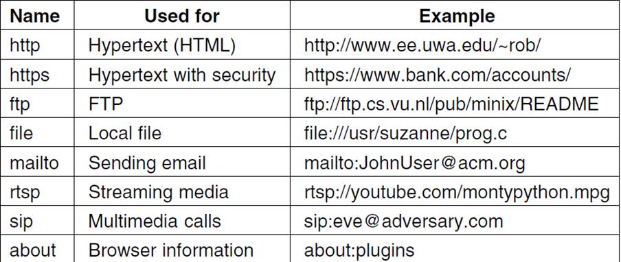
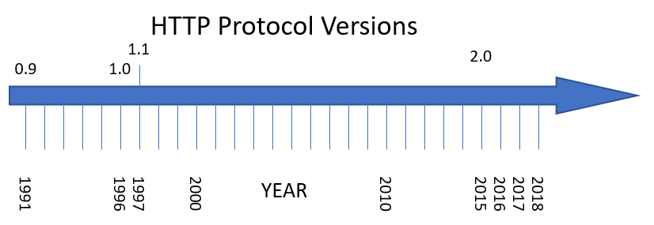
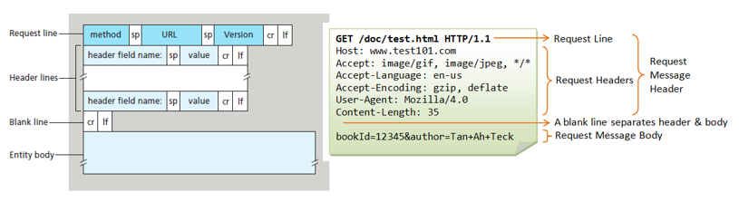
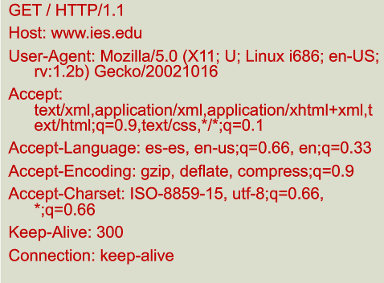

# Protocolo HTTP

* La URL es una cadena de texto formada por:
  * _Protocolo_  de comunicaciones ( **http, ftp, https...) ** – HTTP en muchos casos
  * _Host o IP _ ( **www.softuni.bg, gmail.com, 127.0.0.1, web** )
  * _Puerto_  al que queremos conectar. El puerto por defecto es 80, pero podría ser uno del rango \[0…65535\]
  * _Ruta_  ( **/**  **forum**  **, /**  **path**  **/**  **index.php** )
  * _Cadena query_  <span style="color:#FFC000"> </span> ( **?id=27&lang=en** )
  * _Fragmento_  ( **\#lectures** ) – usado en el cliente para navegar a alguna sección


**URL válidas y no válidas**

* Las URL se codifican acorde a la norma RFC 1738 ([https://www.ietf.org/rfc/rfc1738.txt](https://www.ietf.org/rfc/rfc1738.txt))
* Únicamente se pueden utilizar los siguientes caracteres dentro de la URL

```
[0-9a-zA-Z], $, -, _, . , +, *, ', (, ), ,, !
```

* Si queremos utilizar en la URL un carácter no válido, se pueden indicar codificados precedidos por  **%\+ un código hexadecimal**
* No están permitidos los espacios en una URL, para indicarlo utilizaríamos el carácter %20

| Char  | URL<br /> Encoding |
| :---: | :----------------: |
| space |        %20         |
|   щ   |       %D1%89       |
|   "   |        %22         |
|   #   |        %23         |
|   $   |        %24         |
|   %   |        %25         |
|   &   |        %26         |

URL según diferentes protocolos



## El protocolo HTTP

El protocolo de transferencia de hipertexto o HTTP establece el protocolo para el intercambio de documentos de hipertexto y contenido multimedia en Internet

HTTP fue desarrollado por la W3C y la IETF en 1999 a través de la especificación RFC 2616

Las  _versiones_  de HTTP son HTTP/1.0, 1.1, 1.2 y 2



## Clientes y servidores

Los **clientes web** son máquinas que acceden a la información en la web a través de un **navegador**.

El **servidor web**, por otro lado, proporciona contenido web a través del protocolo HTTP. Para ello, se debe instalar algún programa que actúe como servidor web en la máquina, como por ejemplo Apache.


## ¿Qué es una página web?

* Una  _página web _ (web page) consiste en un archivo HTML base que incluye referencias a un conjunto de objetos, que pueden ser:
  * Páginas HTML, Imágenes JPEG
  * Applets Java, Archivos de Audio
  * Scripts (JavaScript), Hojas de estilos (CSS)
* Estos objetos están localizados en diferentes servidores de internet. Una imagen o un vídeo de la página puede estar alojada en otro servidor.
* Cada objeto se puede direccionar mediante una dirección URL diferente, que indica la ruta para llegar a él.

## El servicio HTTP

* **Las principales características de HTTP son:**
* Utiliza una estructura  _cliente/servidor. _ Los servidores alojan las páginas web, y los clientes acceden a ellas a través de un navegador.
* Para visualizar los datos a través de HTTP se requiere un  _navegador_  _ _  _web. _ El navegador analiza el contenido de las páginas, interpreta la forma de la página y la representa en pantalla.
* Las páginas se pueden ver  _en cualquier dispositivo_ , independientemente del hardware y SO que utilice.

* **Las principales características de HTTP son:**
  * Para la comunicación se establece una conexión TCP a través del  _puerto 80 _ (por defecto). Todos los servidores web escuchan en el mismo puerto, y por ello no hace falta especificarlo cada vez que se visita una página.
  * La comunicación se basa en mensajes de  _petición y respuesta. _ Para cada página diferente a la que accedemos, se crea una petición. El servidor contesta a esta petición con el contenido de la página.
  * Se crea una petición y respuesta por cada  _objeto_  que contiene la página.

## Ejemplo de sesión

Una **sesión** HTTP consiste en una secuencia de transacciones solicitud y respuesta, en la cual el usuario escribe una dirección en su navegador, el cual realiza una consulta **DNS** para averiguar la dirección IP asociada a la URL y luego intenta establecer una conexión **TCP** al **puerto** 80.

Después de establecer la conexión, el navegador envía la **petición HTTP** solicitando la URL; el servidor responde con un **código de estado** y el **recurso** solicitado. Este proceso es completamente transparente al usuario, que únicamente ve la carga de la página, que en realidad fue realizada por el navegador.


Cuando una página web es visitada, el navegador debe solicitar todos los **objetos externos** que la componen, como una hoja de estilos CSS para definir la apariencia de la página, un archivo de script JavaScript para hacerla dinámica, e incluso una imagen en formato png.


# Peticiones HTTP

**Ejemplo de sesión**

* El mensaje de  _solicitud_  del cliente tiene la siguiente estructura:
  * Línea de petición (request line)
  * Cabeceras de petición (request headers)
  * Una línea en blanco separa las cabeceras del cuerpo del mensaje
  * Un cuerpo de mensaje, si fuese necesario especificar algo más.



## Formato de la petición

* _Línea de petición_
* Es la primera línea de una petición. Por ejemplo:
```
GET  /Ciclos/CFGS/DAW.html   HTTP/1.1
```
* _Formato_
* Está formada por 3 partes separadas por espacios
* En primer lugar el  **método**  de petición HTTP:  _GET._  Se trata por tanto de una petición GET (queremos que nos den algo)
* Identificador URL del recurso. Tenemos que especificar la ruta hacia el objeto que queremos:  _/Ciclos/CFGS/DAW.html. _ Si queremos el documento raíz, indicaremos únicamente _ /_
* Versión HTTP que queremos utilizar:  _HTTP/1.1_

## Métodos

* El método utilizado por defecto por los navegadores es el  **GET** . Pero en determinadas situaciones se pueden utilizar otros.
* HTTP define 8  _métodos_ , los cuales indican la acción que se desea realizar sobre el recurso
  * GET
  * HEAD
  * POST
  * PUT
  * DELETE
  * TRACE
  * OPTIONS
  * CONNECT

* _Método GET_
  * Solicita una representación del recurso solicitado
  * GET /images/logo.png HTTP/1.1 (obtiene una imagen)
  * GET /pages/index.html HTTP/1.1 (obtiene una página web)
* _M_  _étodo_  _ HEAD_
  * Solicita una respuesta, idéntica a la que se generaría en una consulta GET, pero sin el cuerpo de la respuesta
  * Es útil para conseguir los metadatos incluidos en la cabecera de la respuesta, sin tener que enviar todo el contenido
* _Método POST_
  * Envía datos para ser procesados (en un formulario HTML) a un recurso específico

* _Método PUT_
  * Carga en el servidor un recurso especificado (archivo)
    * PUT /path/filename.html HTTP/1.1
* _Método DELETE_
  * Borra un recurso especificado.

* _Método TRACE_
  * Solicita al servidor que en el mensaje de respuesta incluya el mensaje de solicitud
  * Se utiliza en tareas de diagnóstico y comprobación
* _Método OPTIONS_
  * Retorna los métodos HTTP para un recurso URL específico
  * Permite adivinar qué se puede hacer sobre un recurso URL
* _Método CONNECT_
  * Se utiliza para convertir la conexión HTTP en un túnel TCP/IP transparente para utilizar comunicaciones cifradas mediante el protocolo SSL

## Cabeceras

  * Las cabeceras indican información extra que queremos hacer llegar al cliente o al servidor, relacionada con la petición o la respuesta.
  * Existen cabeceras que se pueden utilizar solo en una petición, en la respuesta o en ambas. Son opcionales y pueden o no incluirse en los mensajes.
  * El formato de las cabeceras es  _nombre:valor_

### Ejemplos de cabeceras de petición

  * _Host: _ especifica el recurso solicitado
  * _User\-agent_  _: _ informa del navegador que se utiliza
  * _Accept\-language_  _: _ indica en que idioma se desea recibir la página solicitada
  * _Accept\-encoding_  _, _  _accept\-charset_  _: _ indican al servidor que tipo de contenidos conoce el navegador y sabe representar

Ejemplo de sesión



Cabeceras de petición


### Formato de petición HTTP


## Respuestas HTTP


La petición realizada fue satisfactoria ya que el servidor respondió con un código de estado 200 OK, indicando que el recurso fue encontrado. Además, el servidor informó la fecha y hora de respuesta, la versión y módulos del servidor web y el tipo de contenido (text/html).

Finalmente, el servidor entregó el contenido pedido, en este caso el archivo index.html.


## Códigos de estado

El servidor responde con códigos de estado. El  **código de estado ** es importante y le dice al cliente cómo interpretar la respuesta del servidor

Los códigos de estado están formados por 3 dígitos y incluyen una descripción. Ejemplo:  **404 **  **Not**  ** **  **Found**  ** **

Los códigos de estado se dividen en 5  **clases**  diferentes, según el primer dígito:


Los códigos de estado HTTP son números de 3 dígitos que indican el resultado de una solicitud. Los primeros dígitos indican el estado general de la solicitud, mientras que los otros 2 dígitos proporcionan información adicional. Por ejemplo:

- el código de estado 200 OK significa que la solicitud se completó exitosamente y los datos se devuelven, mientras que
- el código de estado 301 Moved Permanently indica que el recurso solicitado se ha movido y se especifica la nueva ubicación.
- El código de estado 302 Moved Temporarily significa que la URL está temporalmente fuera de servicio y se especifica una nueva ubicación.
- Los códigos de estado 400 Bad Request indican un error de sintaxis en la solicitud, mientras que el código de estado 403 Forbidden significa que el usuario no tiene permiso para realizar la solicitud. El código de estado 404 Not Found indica que el documento solicitado no existe, mientras que el código de estado 408 Request Timeout indica que la petición tardó demasiado en completarse por algún motivo.
- El código de estado 505 HTTP Version Not Supported significa que la versión HTTP solicitada no está soportada.

En este caso, el servidor contesta informando que el contenido pedido ha sido  **movido de lugar** para siempre.

También nos informa de la nueva  **dirección**  en la que podemos encontrarlo.

El navegador hace la redirección  **automáticamente** , sin que el usuario intervenga.

```http
GET / HTTP/1.1
Host: http://softuni.org
User-Agent: Gecko/20100115 Firefox/3.6
<CRLF>
```

Redirección

```http
HTTP/1.1 301 Moved Permanently
Location: http://softuni.bg
```

### Cabeceras de respuesta

Las puede incluir el servidor en sus mensajes de respuesta


# Cookies

* _Navegar_  por la web significa realizar una serie de peticiones de páginas diferentes.
* El servidor  _olvida_  lo que ha sucedido anteriormente, no sabe lo que hemos hecho en páginas anteriores.
* No es adecuado cuando una página debe mostrar información diferente a cada usuario dependiendo de lo que han hecho anteriormente.
  * Páginas con subscripción
  * Comercio electrónico
* ¿Cómo podríamos  _rastrear_  a los usuarios?

_¿Podríamos rastrear a los usuarios diferenciándolos por IP?_

En las casas y oficinas, varios equipos comparten la misma IP pública. Estos equipos se ven desde fuera como uno solo.

Una IP identifica un ordenador, no el usuario que hay detrás. Varios usuarios pueden utilizar el mismo ordenador (misma IP)

Muchos ISP asignan IP a los clientes utilizando DHCP. La IP que tenemos en un momento dado, podría de repente ser la de tu vecino.

Cuando un cliente solicita una página web, el servidor le puede enviar  _información adicional _ en forma de cookie, además de la página.

Una cookie es una  _cadena de texto _ (máximo 4 KB) que el servidor puede asociar al navegador


Las cookies permiten que el sitio web  **recuerde**  las acciones y preferencias de un usuario

Por ejemplo se puede  **guardar**  el identificador de sesión, el idioma, el tamaño de letra, etc.

Cuando regrese al sitio o navegue por las páginas no tiene que volver a configurarlo

Antes de que el navegador envíe una petición para una página a un website, mira en la carpeta de cookies del disco.

**Comprueba si tiene cookies ** para el dominio al que va a hacer la solicitud. Si hay alguna, las incluye en el mensaje de petición.

El servidor recibe la petición junto a la cookie y las interpreta.


El navegador guarda las cookies durante un tiempo determinado en el disco duro del cliente.

Un campo  _expires_  especifica cuando  _caduca_ .

Para eliminar una cookie del disco duro del cliente, el servidor la vuelve a enviar de nuevo, con una fecha de expiración pasada.


