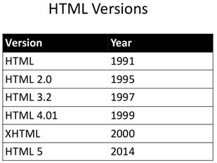
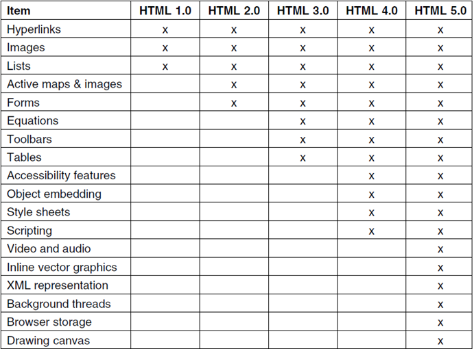
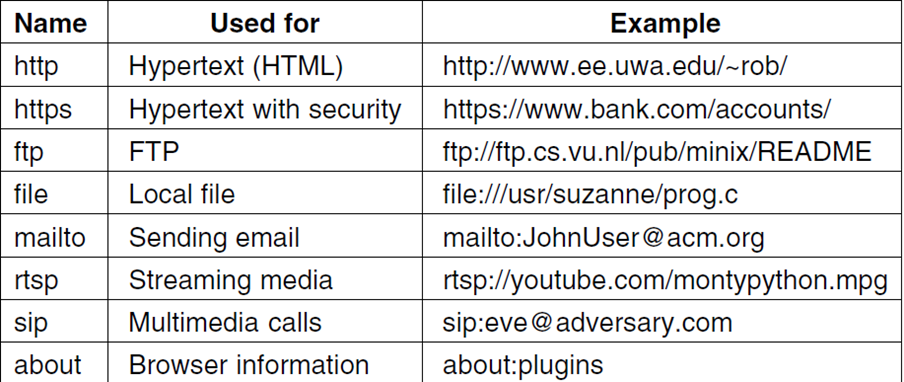
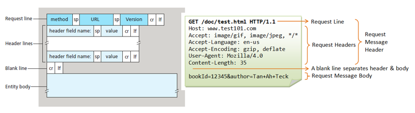
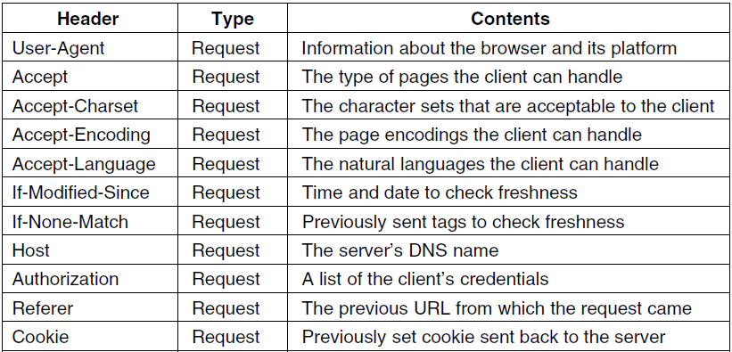
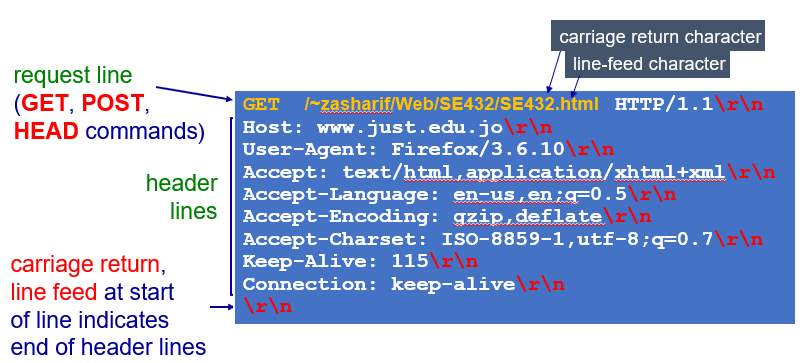
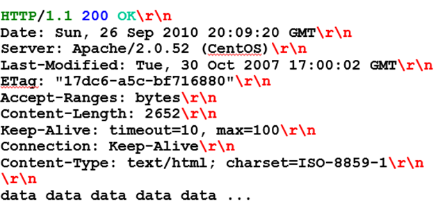
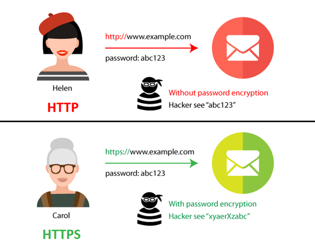

# Servicios de transferencia de hipertexto HTTP
```
Servicios en red
CFGM Sistemas microinformáticos y redes (SMX)
IES Francesc de Borja Moll
Daniel Moreno <danimrprofe@gmail.com>
```

## La World Wide Web

Una página web consiste en un  _archivo HTML base_  _ _ que incluye referencias a varios objetos

Estos  _objetos_  pueden ser archivos HTML, imágenes JPEG, Applets JAVA, archivos de AUDIO, scripts, CSS, etc.

Cada objeto se puede direccionar mediante una  _URL_


Los contenidos de las páginas web pueden ser de diferentes tipos: textos, elementos multimedia, como imágenes, vídeos, etc.

Su reproducción o visualización requiere de otros  **complementos**  que son añadidos al navegador y que quedan integrados en él de forma transparente al usuario.

* Es posible ejecutar determinadas aplicaciones complementarias que aumentan la funcionalidad de la página web.
* **Aplicaciones que se **  _ejecutan en el cliente web_
  * Se ejecutan directamente en el equipo del usuario.
  * El servidor envía el código al navegador (suele ser en Java o JavaScript) y este lo ejecuta.
  * Lógicamente, el navegador debe ser capaz de ejecutarlo, y para ello a menudo requiere de la instalación de extensiones.
* **Aplicaciones que se **  _ejecutan en el servidor _
  * Suelen ser en PHP, Perl, Python, etc.
  * Al ejecutarse estos programas generan un código HTML que es enviado al navegador. Este lo interpreta y lo muestra al usuario.


## Estructura de la WWW

La  _WWW_  es un entramado de documentos escrito en un formato de texto llamado hipertexto

El  _hipertexto_  es un sistema de organización de la información basado en la posibilidad de moverse por dentro de un texto y hacia otros textos diferentes mediante palabras clave


El lenguaje basado en hipertexto más conocido es el lenguaje  _HTML_  (Hyper\-text markup language). La versión más actual de HTML es la 5



## Comparativa de versiones



## Estructura de la WWW

* La estructura del hipertexto está formada por 3 elementos esenciales
  * _Nodos_ : unidades básicas que contienen información
  * _Enlaces_ : interconectan los nodos vinculando segmentos de información
  * _Anclajes_ : se utilizan para marcar el inicio y destino de cada enlace
* Todos estos elementos permiten acceder a la información a través de la  _navegación_  entre diferentes páginas


## Direcciones URL

El localizador uniforme de recursos o  _URL_  es una dirección que permite encontrar y acceder a un objeto concreto en internet.

Está formada por una secuencia de caracteres que sigue una determinada  _estructura_

No es obligatorio especificar todos los componentes de la URL. En caso de no hacerlo, el navegador presupone un  _valor por defecto_ .

Por ejemplo, si no especificamos protocolo se entenderá que es HTTP. Si no especificamos un puerto, será en puerto 80.


# HTTP

* La URL es una cadena de texto formada por:
  * _Protocolo_  de comunicaciones ( **http, ftp, https...) ** – HTTP en muchos casos
  * _Host o IP _ ( **www.softuni.bg, gmail.com, 127.0.0.1, web** )
  * _Puerto_  al que queremos conectar. El puerto por defecto es 80, pero podría ser uno del rango \[0…65535\]
  * _Ruta_  ( **/**  **forum**  **, /**  **path**  **/**  **index.php** )
  * _Cadena query_  <span style="color:#FFC000"> </span> ( **?id=27&lang=en** )
  * _Fragmento_  ( **\#lectures** ) – usado en el cliente para navegar a alguna sección


**URL válidas y no válidas**

* Las URL se codifican acorde a la norma RFC 1738 ([https://www.ietf.org/rfc/rfc1738.txt](https://www.ietf.org/rfc/rfc1738.txt))
* Únicamente se pueden utilizar los siguientes caracteres dentro de la URL
  
```
[0-9a-zA-Z], $, -, _, . , +, *, ', (, ), ,, !
```

* Si queremos utilizar en la URL un carácter no válido, se pueden indicar codificados precedidos por  **%\+ un código hexadecimal**
* No están permitidos los espacios en una URL, para indicarlo utilizaríamos el carácter %20

| Char | URL<br /> Encoding |
| :-: | :-: |
| space | %20 |
| щ | %D1%89 |
| " | %22 |
| # | %23 |
| $ | %24 |
| % | %25 |
| & | %26 |

URL según diferentes protocolos



# Protocolo HTTP

El protocolo de transferencia de hipertexto o HTTP establece el protocolo para el intercambio de documentos de hipertexto y contenido multimedia en Internet

HTTP fue desarrollado por la W3C y la IETF en 1999 a través de la especificación RFC 2616

Las  _versiones_  de HTTP son HTTP/1.0, 1.1, 1.2 y 2


Clientes y servidores

* _Clientes web: _
  * Máquinas que acceden a la información en la web
  * Los clientes se conectan a la www utilizando un navegador o web browser, un software utilizado por el usuario final para acceder a la web
* _Servidor web: _
  * Proporciona contenido web a través del protocolo HTTP


## ¿Qué es una página web?

* Una  _página web _ (web page) consiste en un archivo HTML base que incluye referencias a un conjunto de objetos, que pueden ser:
  * Páginas HTML, Imágenes JPEG
  * Applets Java, Archivos de Audio
  * Scripts (JavaScript), Hojas de estilos (CSS)
* Estos objetos están localizados en diferentes servidores de internet. Una imagen o un vídeo de la página puede estar alojada en otro servidor.
* Cada objeto se puede direccionar mediante una dirección URL diferente, que indica la ruta para llegar a él.

## HTTP

* **Las principales características de HTTP son:**
* Utiliza una estructura  _cliente/servidor. _ Los servidores alojan las páginas web, y los clientes acceden a ellas a través de un navegador.
* Para visualizar los datos a través de HTTP se requiere un  _navegador_  _ _  _web. _ El navegador analiza el contenido de las páginas, interpreta la forma de la página y la representa en pantalla.
* Las páginas se pueden ver  _en cualquier dispositivo_ , independientemente del hardware y SO que utilice.

* **Las principales características de HTTP son:**
  * Para la comunicación se establece una conexión TCP a través del  _puerto 80 _ (por defecto). Todos los servidores web escuchan en el mismo puerto, y por ello no hace falta especificarlo cada vez que se visita una página.
  * La comunicación se basa en mensajes de  _petición y respuesta. _ Para cada página diferente a la que accedemos, se crea una petición. El servidor contesta a esta petición con el contenido de la página.
  * Se crea una petición y respuesta por cada  _objeto_  que contiene la página.

## Ejemplo de sesión

* Una  _sesión_  HTTP es una secuencia de transacciones solicitud y respuesta
* El  _funcionamiento_  básico de una sesión HTTP es:
  * El usuario escribe una dirección en el navegador (cliente)
  * El navegador realiza una consulta DNS para averiguar la dirección IP asociada a la URL
  * Intenta establecer una conexión TCP al puerto 80 (predeterminado para servidores web)
  * Cuando esta conexión se ha establecido, el navegador envía la petición HTTP solicitando la URL

Ejemplo de sesión

Una vez establecida la conexión HTTP, el cliente pide mediante una solicitud el recurso que necesita (html, css, javascript, etc)

El servidor contesta con un código de estado y el recurso que le ha pedido el cliente, si es que existe.

Todo este proceso es  _transparente al usuario_ , que únicamente ve la carga de la página. Todo lo realiza el navegador


Ejemplo de sesión


Ejemplo de sesión

* Cuando una página web contiene imágenes, scripts, u otros objetos externos, el navegador los pide uno por uno
* En el ejemplo vemos que la página necesita:
  * Un  _hoja de estilos _ CSS que definen la apariencia de la página
  * Un archivo de  _script_  JavaScript que contendrá funciones para hacer que la página sea dinámica.
  * Una  _imagen_  en formato png


# Peticiones HTTP

**Ejemplo de sesión**

* El mensaje de  _solicitud_  del cliente tiene la siguiente estructura:
  * Línea de petición (request line)
  * Cabeceras de petición (request headers)
  * Una línea en blanco separa las cabeceras del cuerpo del mensaje
  * Un cuerpo de mensaje, si fuese necesario especificar algo más.



# HTTP

Formato de la petición

* _Línea de petición_
* Es la primera línea de una petición. Por ejemplo:
```  
GET  /Ciclos/CFGS/DAW.html   HTTP/1.1
```
* _Formato_
* Está formada por 3 partes separadas por espacios
* En primer lugar el  **método**  de petición HTTP:  _GET._  Se trata por tanto de una petición GET (queremos que nos den algo)
* Identificador URL del recurso. Tenemos que especificar la ruta hacia el objeto que queremos:  _/Ciclos/CFGS/DAW.html. _ Si queremos el documento raíz, indicaremos únicamente _ /_
* Versión HTTP que queremos utilizar:  _HTTP/1.1_

## Métodos

* El método utilizado por defecto por los navegadores es el  **GET** . Pero en determinadas situaciones se pueden utilizar otros.
* HTTP define 8  _métodos_ , los cuales indican la acción que se desea realizar sobre el recurso
  * GET
  * HEAD
  * POST
  * PUT
  * DELETE
  * TRACE
  * OPTIONS
  * CONNECT

* _Método GET_
  * Solicita una representación del recurso solicitado
  * GET /images/logo.png HTTP/1.1 (obtiene una imagen)
  * GET /pages/index.html HTTP/1.1 (obtiene una página web)
* _M_  _étodo_  _ HEAD_
  * Solicita una respuesta, idéntica a la que se generaría en una consulta GET, pero sin el cuerpo de la respuesta
  * Es útil para conseguir los metadatos incluidos en la cabecera de la respuesta, sin tener que enviar todo el contenido
* _Método POST_
  * Envía datos para ser procesados (en un formulario HTML) a un recurso específico

* _Método PUT_
  * Carga en el servidor un recurso especificado (archivo)
    * PUT /path/filename.html HTTP/1.1
* _Método DELETE_
  * Borra un recurso especificado.

* _Método TRACE_
  * Solicita al servidor que en el mensaje de respuesta incluya el mensaje de solicitud
  * Se utiliza en tareas de diagnóstico y comprobación
* _Método OPTIONS_
  * Retorna los métodos HTTP para un recurso URL específico
  * Permite adivinar qué se puede hacer sobre un recurso URL
* _Método CONNECT_
  * Se utiliza para convertir la conexión HTTP en un túnel TCP/IP transparente para utilizar comunicaciones cifradas mediante el protocolo SSL

## Cabeceras

  * Las cabeceras indican información extra que queremos hacer llegar al cliente o al servidor, relacionada con la petición o la respuesta.
  * Existen cabeceras que se pueden utilizar solo en una petición, en la respuesta o en ambas. Son opcionales y pueden o no incluirse en los mensajes.
  * El formato de las cabeceras es  _nombre:valor_
* **Ejemplos de cabeceras de petición**
  * _Host: _ especifica el recurso solicitado
  * _User\-agent_  _: _ informa del navegador que se utiliza
  * _Accept\-language_  _: _ indica en que idioma se desea recibir la página solicitada
  * _Accept\-encoding_  _, _  _accept\-charset_  _: _ indican al servidor que tipo de contenidos conoce el navegador y sabe representar

Ejemplo de sesión


Cabeceras de petición




## Formato de petición HTTP



# Respuestas HTTP

# Protocolo HTTP

Ejemplo de respuesta

El servidor informa del éxito de la petición (200 OK) y de la versión del protocolo que conoce

Indica la fecha y hora del servidor, y versión y módulos del servidor web

Content\-type: indica el tipo de contenido (text/html)

Por último, el contenido propiamente dicho del recurso solicitado (archivo index.html)




## Códigos de estado

El servidor responde con códigos de estado. El  **código de estado ** es importante y le dice al cliente cómo interpretar la respuesta del servidor

Los códigos de estado están formados por 3 dígitos y incluyen una descripción. Ejemplo:  **404 **  **Not**  ** **  **Found**  ** **

Los códigos de estado se dividen en 5  **clases**  diferentes, según el primer dígito:


Códigos de estado

* _Los otros 2 dígitos proporcionan información adicional_
* **200  OK: ** Todo funcionó bien, aquí están los datos
* **301**    **Moved**   **Permanently**  **:**  El objeto solicitado se ha movido, y se especifica la nueva localización (Location:)
* **302  Moved **  **temporarily**  **: ** La URL está temporalmente fuera de servicio, utiliza esta que está en otro sitio
* **400  **  **Bad**  ** **  **Request**  **: ** Hay un error de sintaxis en la petición
* **403  **  **Forbidden** : No puedes hacer esto, y no te diremos porqué
* **404  **  **Not**  ** **  **Found**  **: ** No existe el documento
* **408 **  **Request**  ** Time\-**  **out**  **: ** La petición tardó demasiado en llevarse a cabo por algún motivo
* **505 HTTP Version **  **Not**  ** **  **Supported**

En este caso, el servidor contesta informando que el contenido pedido ha sido  **movido de lugar ** para siempre.

También nos informa de la nueva  **dirección**  en la que podemos encontrarlo.

El navegador hace la redirección  **automáticamente** , sin que el usuario intervenga.

```
GET / HTTP/1.1
Host: http://softuni.org
User-Agent: Gecko/20100115 Firefox/3.6
<CRLF>
```

```
HTTP/1.1 301 Moved Permanently
Location: http://softuni.bg
```

# Respuesta HTTP

Cabeceras de respuesta

Las puede incluir el servidor en sus mensajes de respuesta


# Cookies

* _Navegar_  por la web significa realizar una serie de peticiones de páginas diferentes.
* El servidor  _olvida_  lo que ha sucedido anteriormente, no sabe lo que hemos hecho en páginas anteriores.
* No es adecuado cuando una página debe mostrar información diferente a cada usuario dependiendo de lo que han hecho anteriormente.
  * Páginas con subscripción
  * Comercio electrónico
* ¿Cómo podríamos  _rastrear_  a los usuarios?

_¿Podríamos rastrear a los usuarios diferenciándolos por IP?_

En las casas y oficinas, varios equipos comparten la misma IP pública. Estos equipos se ven desde fuera como uno solo.

Una IP identifica un ordenador, no el usuario que hay detrás. Varios usuarios pueden utilizar el mismo ordenador (misma IP)

Muchos ISP asignan IP a los clientes utilizando DHCP. La IP que tenemos en un momento dado, podría de repente ser la de tu vecino.

Cuando un cliente solicita una página web, el servidor le puede enviar  _información adicional _ en forma de cookie, además de la página.

Una cookie es una  _cadena de texto _ (máximo 4 KB) que el servidor puede asociar al navegador


Las cookies permiten que el sitio web  **recuerde**  las acciones y preferencias de un usuario

Por ejemplo se puede  **guardar**  el identificador de sesión, el idioma, el tamaño de letra, etc.

Cuando regrese al sitio o navegue por las páginas no tiene que volver a configurarlo

Antes de que el navegador envíe una petición para una página a un website, mira en la carpeta de cookies del disco.

**Comprueba si tiene cookies ** para el dominio al que va a hacer la solicitud. Si hay alguna, las incluye en el mensaje de petición.

El servidor recibe la petición junto a la cookie y las interpreta.


El navegador guarda las cookies durante un tiempo determinado en el disco duro del cliente.

Un campo  _expires_  especifica cuando  _caduca_ .

Para eliminar una cookie del disco duro del cliente, el servidor la vuelve a enviar de nuevo, con una fecha de expiración pasada.


## Protocolo HTTPS


El objetivo de este protocolo es realizar una  _transferencia_  de datos de forma  _segura_

Las transacciones bancarias o de pago, o en general cualquier servicio que requiera el envío de datos personales y contraseñas




El formato de la URL es igual al de  **HTTP** , excepto que el nombre del protocolo cambia por  **HTTPS**


## Características

* Necesita de un certificado X.509
* Dos tipos de certificados
  * Autofirmados
  * Firmados por una CA (autoridad de certificación)
* Permite que el tráfico de datos viaje cifrado
* Permite autenticación si el certificado está firmado por una CA
* HTTPS = HTTP \+ SSL/TLS
* Negociación SSL dependiente de la IP. No se pueden servir diferentes certificados con la misma IP

Puerto por defecto:  _443_  (80 en HTTP)

HTTPS opera  _cifrando_  el mensaje antes de ser enviado y decodificándolo antes de que llegue a su destino.

Para cifrar los mensajes se utiliza un  _sistema de clave pública _ (pública\-privada)


## Obtener un certificado

- Make\-ssl\-cert (paquete ssl\-cert)
- Openssl
- Xca

Obtener un certificado

**Openssl**

```
Openssl
# Generamos clave privada
openssl genrsa -out key 1024

# Generamos CSR y firmamos con nuestra clave privada
openssl req -new -key key -out csr
openssl x509 -req -days 365 -in csr -signkey key -out crt

# Copiamos clave y certificado en el destino
cat key crt > /etc/ssl/private/nombre-sitio.pem
CSR = solicitud de firma de certificados
```

## Características

El principal  _inconveniente_  que presenta es que si alguien consiguiera corromper la clave pública de nuestro servidor web, cambiándolo por la suya, podría descodificar los mensajes del emisor.

HTTPS no nos garantiza que quien hay detrás de la página es quien dice ser, únicamente que la información va cifrada hasta el servidor.

Si nos conectamos por HTTPS a una página fraudulenta, obtendrán nuestros datos igualmente.

