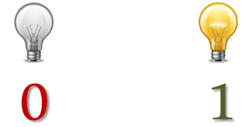
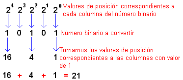
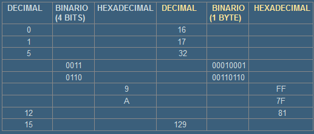
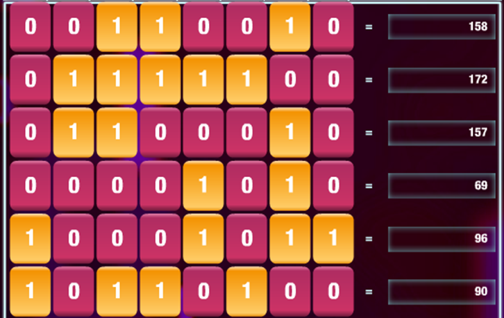

## Sistema binario

Este es el sistema utilizado por la electrónica, donde una serie de interruptores y transistores pueden tener dos estados:

- Tienen corriente o no la tienen.
- El primer caso se representa con un 1 y el segundo con un 0.

El sistema binario utiliza 2 dígitos, y cada dígito tiene distinto valor dependiendo de la posición que ocupe.

Los ordenadores con un sistema binario para:

- Guardar información
- Hacer cálculos
- Enviar y recibir información

## Convertir de decimal a binario

Para pasar un número decimal a binario:

- Realizar divisiones sucesivas por 2
- Al final, escribir los restos obtenidos en cada división en orden inverso

## Convertir de binario a decimal

Ya podéis hacer los ejercicios 1 y 2

## Códificación de caracteres

#
## Ejercicios

1.Convierte los siguientes números decimales al sistema binario:

    31
    65
    100
    144
    256

2.Convierte los siguientes números binarios a decimal:

        11011101
        1000001
        11101110
        1110001101

3.Convierte los siguientes números binarios al sistema hexadecimal:

        110010001011101
        1000111110001011101
        11011000100101

4.Convierte los siguientes números hexadecimales al sistema binario:

        AB34
        F22
        344

5.Completa la tabla:

6.Dados dos números binarios: 01001000 y 01000100 ¿Cuál de ellos es el mayor? ¿Podrías compararlos sin necesidad de convertirlos al sistema decimal?

7.Escribe los nombres de tus compañeros de la derecha e izquierda tuyos en ASCII.

8.Convierte la fecha de tu cumpleaños en binario. ¿Cuantos bits necesitarías? El formato es DD/MM/YY, cada número codificado por separado.

9.¿Cuantos bits se necesitan aproximadamente para guardar todos los nombres y fechas de nacimiento de todos los alumnos del colegio?

10.Crea un archivo de texto en el que ponga "me llamo" y tu nombre, y ábrelo con el siguiente programa. Comprueba que tamaño ocupa el archivo:

http://blog.bodurov.com/Bytes-and-Bits-Viewer/

Enlace por si no tenéis acceso al classroom:

Podéis ver el enunciado en: https://cutt.ly/cwLADpN
Enviar la tarea a danielmoreno@iesramonllull.net

## Practicar online

Podéis practicar en estas páginas:

- https://studio.code.org/projects/applab/iukLbcDnzqgoxuu810unLw
- http://flippybitandtheattackofthehexadecimalsfrombase16.com/

