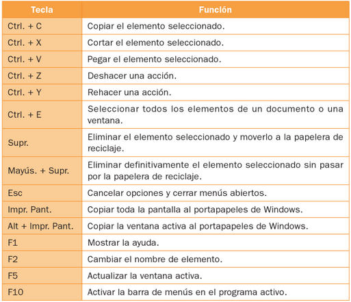
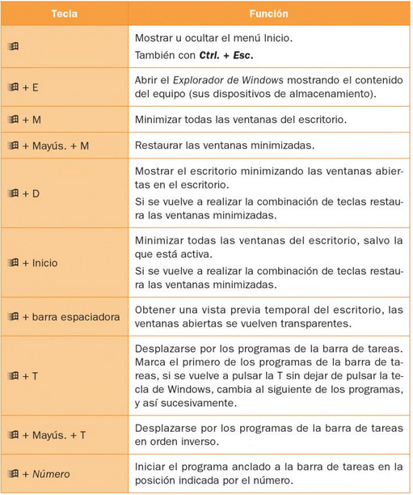
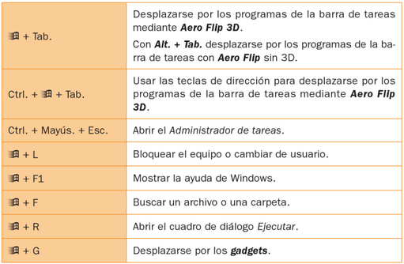

# Atajos de teclado

Se trata de una tecla o conjunto de teclas que efectúa una acción definida previamente por el sistema operativo.

## Atajos de teclado más comunes

Los atajos más comunes se suelen utilizar combinando teclas con algunas de las siguientes:

- ++ctrl++
- SUPR
- ++shift++
- ESC

## Atajos con tecla de windows

Para utilizar estos atajos necesitamos un teclado con tecla de Windows y estar trabajando con un sistema operativo de Windows.

