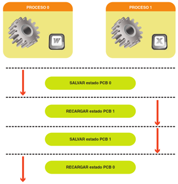

# SO. Gestión de procesos

## Introducción

Un proceso puede ser entendido como un **programa en ejecución**. Para poder realizar su tarea, requiere de ciertos **recursos** como tiempo de CPU, memoria, archivos y dispositivos de E/S, los cuales pueden ser asignados al proceso al momento de su creación o durante su ejecución.

Estos procesos suelen ejecutarse de forma **simultánea** y, aunque tradicionalmente un proceso contenía sólo un hilo de control, los sistemas operativos modernos soportan procesos con múltiples subprocesos.

Cuando se ejecuta más de un proceso de forma concurrente en un sistema, todos necesitan que el propio sistema les suministre una serie de **recursos**. El SO, gracias a la CPU (Unidad Central de Proceso), se encarga de asignar estos recursos en un orden adecuado y atendiendo a unas **prioridades**.

También realiza funciones de **sincronización** de todos los procesos, para que se ejecuten en el orden adecuado y según la prioridad decidida.

### Relación entre el SO y los procesos

EL SO responsable de varios aspectos importantes de la gestión de procesos y hilos:

La creación y eliminación de procesos de usuario y sistema

La programación de los procesos

La provisión de mecanismos para la sincronización, la comunicación y la gestión de
interbloqueo de procesos.

### Ejecución de un proceso

Cuando se ejecuta un programa:

- El programa se convierte en proceso
- Se ubica en memoria las instrucciones que lo componen y sus datos asociados
- Se le asocia a dicho proceso se le asocia una estructura de datos.

### Partes de un proceso

- Programa ejecutable
- Datos
- Pila
- Registros
- Contador de programa

Procesos padres e hijos

## Estados de un proceso

- Nuevo: si es admitido pasa al estado de preparado
- Preparado: procesos admitidos,  interrumpidos o que vienen de estar en bloqueo
- En ejecución: seleccionado por el  planificador de la cola de preparados para ejecutarse
- Bloqueado: a la espera de una operación de E/S o de completarse un evento
- Terminado: cuando se ha terminado de ejecutar el proceso

## Características de un proceso

Todos los procesos dentro de cualquier SO tienen unas características que los identifican.

Cada proceso, tiene un identificador que lo discrimina de los demás.

Es un número asignado por el SO que sirve para identificar el proceso, lanzarlo a ejecución,
detenerlo, cancelarlo, reanudarlo, etc.

Este identificador de proceso se nombra con la abreviatura PID.

## Procesos padres e hijos

En cada SO, los procesos los lanzan normalmente otros procesos.

Cada proceso que se lanza a ejecución depende, en la mayoría de los casos, de otro proceso
denominado proceso padre. Así, al nuevo proceso lanzado se le denomina proceso hijo.

## Cambio de contexto

En un sistema multiproceso o multihebra

Cuando un proceso o hilo pasa de un estado a otro (por ejemplo, de espera a ejecución) se producirá es un cambio de contexto.

El cambio de contexto puede ser

- Parcial: si se realiza entre hilos del mismo proceso.
- Completo:
  - En caso de que el cambio de contexto sea entre hilos de diferentes procesos
  - El cambio afectará a memoria, hardware, ficheros comunes, etc.

