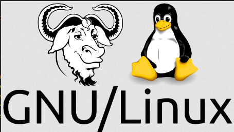
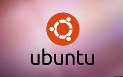
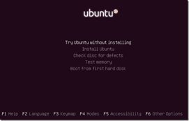

[🔙 Enrere](../) | [🏠 Pàgina principal](http://danimrprofe.github.io/apuntes/) \n\n---
title: Pygame
footer: Daniel Moreno 🌐 <github.com/danimrprofe>
_footer: ""
paginate: true
_paginate: false
_class: invert
marp: true
---

# Linux

---

La Free Software Foundation (FSF) fue fundada por ``Richard Stallman`` en 1985 para promover el uso y la distribución de software libre.

---

# Software libre

El ``software libre`` se refiere a aquellos programas que respetan la libertad de los usuarios para ejecutar, copiar, distribuir, estudiar, cambiar y mejorar el software.

---

# GNU

El proyecto ``GNU`` es un proyecto de software libre lanzado en 1983 por Richard Stallman con el objetivo de crear un ``sistema operativo completamente libre y gratuito`` llamado GNU.

---

# Linux

La mezcla de GNU y Linux se conoce como GNU/Linux. Para abreviar, a los sistemas operativos de este estilo se les llama ``linux``.

---

## ¿Cómo se mantiene?

Linux es mantenido principalmente por la **comunidad** de desarrollo de código abierto. Esta comunidad está compuesta por miles de programadores de todo el mundo que trabajan de manera desinteresada para mejorar el sistema operativo. Estos **programadores** ofrecen su tiempo, experiencia y conocimiento para mejorar el código de Linux.

Esta comunidad también recibe el apoyo de **empresas**, quienes patrocinan algunos proyectos de desarrollo de Linux. Además, la comunidad de Linux también recibe donaciones de usuarios que apoyan el desarrollo del sistema.

---

## Kernel

El kernel de Linux es el **núcleo** del sistema operativo, responsable de administrar sus recursos como memoria, procesadores y dispositivos I/O. Es un programa de bajo nivel que controla el hardware y los programas.

---

## Entorno gráfico (DE)

Los entornos gráficos como GNOME y KDE proporcionan una interfaz gráfica para interactuar con un sistema operativo. Estos entornos ofrecen herramientas para navegar por la web, ver archivos multimedia, editar documentos, etc. Otros entornos como LXDE y Xfce son más ligeros.

---

## Sistemas Linux

Los sistemas operativos Linux son desarrollados bajo la **Licencia GPL**. Estos son usados por empresas, asociaciones y colectivos de personas.

Actualmente hay más de 400 distribuciones de Linux que se adaptan a las necesidades de los usuarios.

---

##  Distribuciones Linux

Linux es un sistema operativo libre y de código abierto que permite a los usuarios modificar y mejorar el software a su gusto.

Debido a su naturaleza libre, han surgido diferentes grupos de usuarios y desarrolladores que han creado sus propias ``versiones personalizadas`` de Linux, conocidas como ``distribuciones``.

---

Las distribuciones de Linux se diferencian por sus ``características únicas``, como el sistema de gestión de paquetes, el escritorio, las herramientas de configuración y las aplicaciones preinstaladas.

Cada distribución tiene su propia ``comunidad`` de usuarios y ``desarrolladores`` que trabajan juntos para mantener y mejorar el software.

---

Las distribuciones de Linux más populares incluyen ``Debian, Ubuntu, Fedora, CentOS, Arch Linux y openSUSE``, pero hay muchas otras opciones disponibles. Cada distribución tiene su propio enfoque y filosofía, lo que significa que hay una distribución de Linux adecuada para casi cualquier tipo de usuario o caso de uso.

https://distrowatch.com/

---

## Ubuntu

Ubuntu es una de las ``distribuciones`` de Linux más populares y ampliamente utilizadas en todo el mundo. Fue lanzada en 2004 y está basada en ``Debian``, otra distribución de Linux muy conocida.

---

Una de las características principales de Ubuntu es su facilidad de uso y su enfoque en la accesibilidad para los usuarios. Viene con una amplia variedad de aplicaciones preinstaladas, incluyendo una suite de oficina, navegador web, reproductor multimedia y mucho más.

---

Ubuntu también cuenta con una gran comunidad de usuarios y desarrolladores, lo que significa que hay una gran cantidad de recursos y soporte disponibles en línea. Además, es conocida por sus actualizaciones regulares y su énfasis en la seguridad.

---

Hay varias ``versiones de Ubuntu`` disponibles, incluyendo la versión principal de escritorio, así como las versiones de servidor y para dispositivos móviles. También existen versiones personalizadas, como ``Kubuntu`` (con el escritorio KDE) y ``Xubuntu`` (con el escritorio XFCE), entre otras.

---

## Arranque DUAL

El arranque dual es una característica que permite a un usuario iniciar un sistema operativo (OS) desde dos dispositivos de almacenamiento diferentes.

Podemos elegir entre 2 o más sistemas operativos diferentes al iniciar una ordenador, como por ejemplo Windows y Linux.

---

## Instalación de Linux

Para instalar Linux, existen diferentes opciones.

- Una de ellas es **descargar una imagen** CD/DVD, grabarla y arrancar desde el CD/DVD para completar la instalación. Esta instalación requiere modificar el disco duro.
- Otra opción es utilizar un **LiveCD**, el cual no instala nada en el disco duro, sino que permite probar una versión de Linux y al apagar, todo vuelve a su estado original.
- Finalmente, es posible instalar Linux desde **Windows**, descargando un programa que se instala como una aplicación más, y que se puede desinstalar cuando se quiera.
