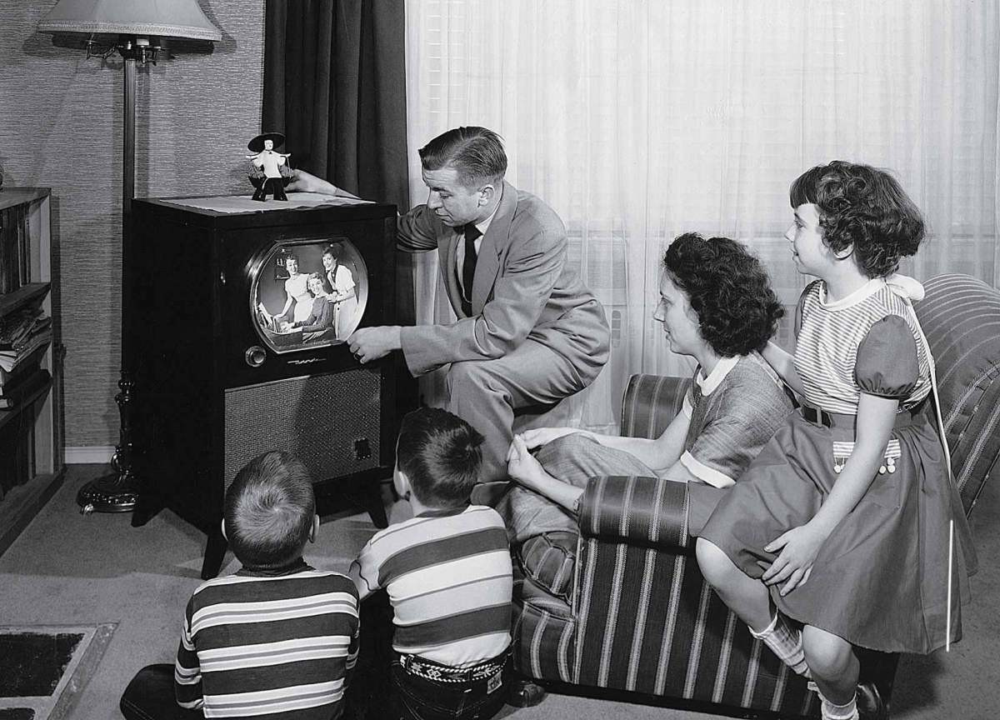
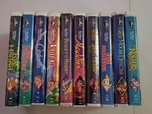
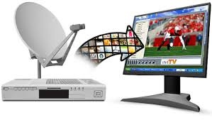
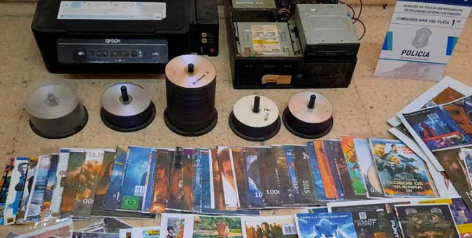
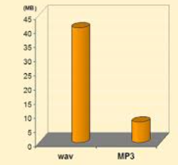
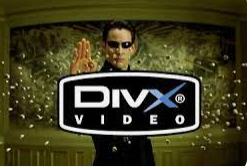
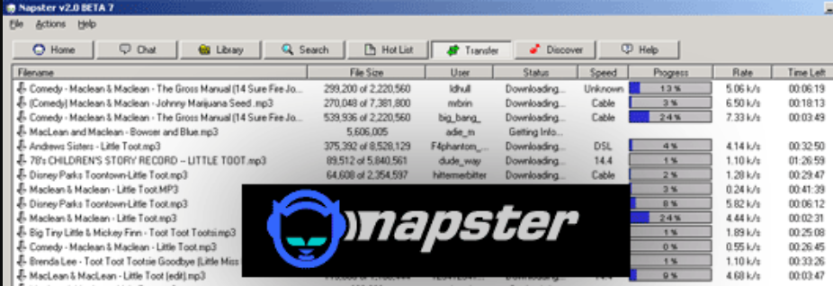

# 3. Evolución hacia el streaming

La evolución de la televisión y la forma en que consumimos contenidos ha sido muy marcada desde la creación de los primeros canales de televisión hasta la llegada de los servicios de streaming.

En la década de 1950 y 1960, la televisión se convirtió en un medio de comunicación popular y asequible. Al principio, solo había unos pocos canales disponibles, y los programas se emitían en vivo. Los espectadores tenían que sintonizar sus televisores en el momento en que se emitían los programas para poder verlos.

## VHS, DVD

A medida que avanzaba la tecnología, se crearon nuevos formatos de grabación de vídeo, como el VHS, que permitía a los espectadores grabar programas y verlos más tarde.

Con la introducción de los reproductores de CD y DVD, se creó la posibilidad de ver películas y programas de televisión sin anuncios, algo que era imposible con la televisión en vivo.

## Televisión por satélite

Con la llegada de la televisión por satélite, los usuarios tuvieron acceso a una mayor cantidad de canales y una variedad más amplia de contenidos. Sin embargo, todavía se requería un receptor de satélite y la suscripción a un servicio de televisión por satélite para poder acceder a estos contenidos.

## Redes

En los primeros días de Internet, el acceso a la red se realizaba a través de líneas telefónicas convencionales. Esto significaba que para conectarse a Internet, se debía interrumpir cualquier llamada telefónica que se estuviera realizando.

La velocidad de conexión a Internet también era muy limitada en esos días, lo que hacía que descargar archivos, como un archivo MP3, tardara mucho tiempo. Por ejemplo, descargar un archivo MP3 de tres minutos podía tomar hasta 30 minutos con una velocidad de conexión de 56 kbps.

La conexión a Internet era lenta y costosa, y hacer transmisiones en tiempo real era prácticamente imposible. Con el tiempo, la tecnología ha evolucionado y la velocidad de conexión a Internet ha mejorado significativamente, lo que ha permitido la transmisión de contenido en tiempo real y la popularización de los servicios de streaming.

## Códecs y piratería

La aparición de los códecs de audio y video, como el MP3 y el DivX, fue un gran avance en la tecnología digital.

Estos codecs permitían convertir archivos de audio y video de gran tamaño, como los de un CD o DVD, en archivos de menor tamaño que podían ser fácilmente compartidos en línea.

El MP3 en particular, fue el primer formato de compresión de audio popularizado en la era de Internet, lo que permitió el intercambio de ficheros musicales a través de la red. La compresión de audio se basa en la eliminación de ciertos elementos de sonido que no son perceptibles para el oído humano, lo que reduce el tamaño del archivo sin afectar la calidad de la reproducción.

El DivX, por otro lado, permitía la compresión de video en formatos más pequeños sin perder demasiada calidad. Estos codecs hicieron posible la creación de archivos multimedia más pequeños, que eran más fáciles de compartir y descargar a través de Internet.

Sin embargo, la popularidad de estos códecs también llevó a la proliferación de la piratería de contenido multimedia en línea. La facilidad para compartir y descargar archivos de audio y video comprimidos en línea hizo que fuera más difícil para la industria del entretenimiento controlar la distribución de su contenido y proteger sus derechos de autor. Esto ha sido un problema constante en la era digital, y ha llevado a la implementación de medidas de protección de derechos de autor y a la creación de plataformas de distribución legales para el contenido multimedia.

## Popularización de las grabadoras de CD

- Se empiezan a comercializar las grabadoras de CD domésticas.
- En un CD podían caber aproximadamente 100 archivos MP3.
- Una película en DVD (4,7 GB) se podía comprimir en el tamaño de un CD (650 MB).

## Programas de intercambio de archivos P2P

Los programas de intercambio de archivos P2P, o peer-to-peer, fueron una revolución en la forma en que las personas compartían archivos en línea. Estos programas permitían la descarga y el intercambio de archivos directamente entre los usuarios de la red, sin necesidad de una conexión centralizada.

Napster fue uno de los programas de intercambio de archivos P2P más populares de la década de 1990. Permitía a los usuarios compartir archivos de música MP3 entre sí, lo que revolucionó la industria de la música y cambió la forma en que se consumía la música en línea.

A medida que surgían otros programas de intercambio de archivos P2P, como Emule, Bittorrent y Ares, también surgían preocupaciones sobre la piratería y los derechos de autor

## Mejoras en la conexión

- Crecimiento en infraestructura como ADSL o fibra óptica
- Se desarrolló la tecnología  de  banda  ancha  (mayor velocidad) lo  que posibilitó  la  transmisión  de  video.
- Comercialización del Internet con costos cada vez menores
- Avances en las capacidades de hardware de los ordenadores

Los  navegantes empezaron  a  tener la  posibilidad  de  descargar  contenido  para disfrutarlo. Era necesario esperar a que la descarga se realizase por completo y no era un proceso rápido precisamente.

Todo lo que se descargaban se hacía de manera local y utilizando la poca  capacidad  que  por  aquel  entonces  tu  disco  duro  podía  ofrecerte
Se debía eliminar unas descargas para poder almacenar contenido nuevo