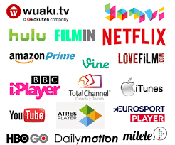

# 4. Streaming hoy en día

- Las plataformas audiovisuales de Streaming son entornos informáticos que utilizan sistemas compatibles entre sí
- Ofrecen contenido audiovisual mediante conexión a internet para poder visualizar en línea
- También podemos descargar el contenido a un dispositivo portátil para visualizarlo sin conexión
- Acceso de los usuarios a contenidos a través de métodos como el Streaming está causando un importante cambio en las formas de creación, distribución y consumo de contenidos.

## 4.1. Servicios Over the top

Permiten ver productos populares en PC, Tablet, consolas y otros dispositivos

Estos tipos de servicios se han convertido en una prioridad
estratégica para empresas de entretenimiento o cadenas de televisión.

## 4.2. Modelos de servicios

Estas empresas necesitan beneficios para funcionar, y por tanto han de ganar dinero de alguna forma. Existen diferentes estrategias:

- Modelos basados en la **publicidad**: YouTube, Google.
- Modelos basados en el **revenue-sharing**: VeVo, Blinkx, BlipTV
- Modelos **mixtos**: BBC, FreeSat, Hulu, ITV Player, etc.
- Modelos  basados  en  **suscripciones**  o  **pago  por  contenidos**: Netflix,  Apple,  Hulu  Plus,  Sky,  Amazon,  Time  Warner,  Ultraviolet, Qriocity, TiVo, HBO, etc.

Últimamente, la mayoría de servicios están basados en una combinación de publicidad y suscripción.

Algunos de los servicios más conocidos son:

