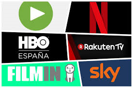

# 5. Modelo basado en suscripción

Se trata del servicio más habitual en españa. Dan  acceso  a películas, programas  y series  de  diferentes de  canales. Para ello  se han adquirido previamente derechos vía pago de una cuota mensual o pagando por la opción de ver un título concreto

En España, los más populares son:

- Netflix, Filmin, Sky
- HBO, Rakuten TV, Movistar + y Amazon Prime Video

