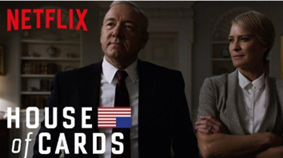
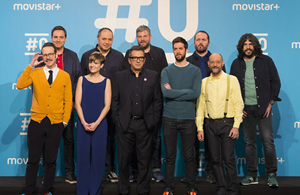
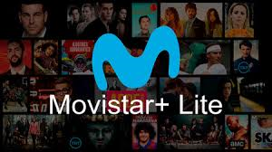
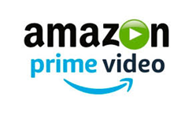
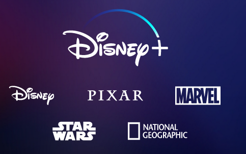
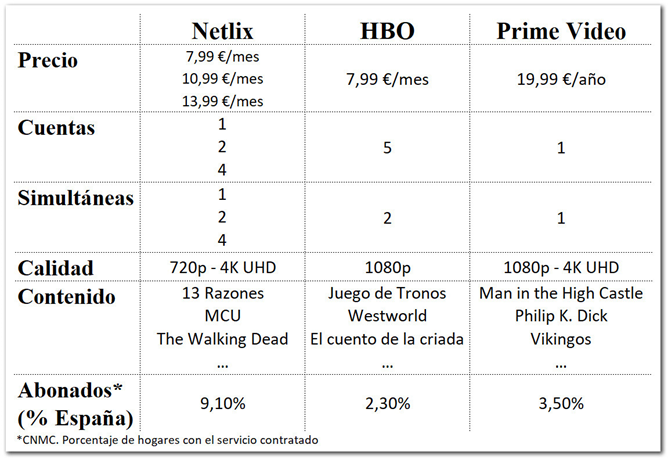

# 6. Servicios más populares

El 37% de los hogares españoles con internet declaran tener algún tipo de estas plataformas. Vamos a ver algunas de las más conocidas.

## 6.1. Netflix

- Originariamente era un servicio de alquiler y venta de DVD. Introducción de Streaming desde 2007.
- Llega a España en 2005
- Principal Servicio Premium de suscripción mensual del mundo

### Netflix original

Desde 2013 entra en la industria de producción de contenido: House of cards.

Netflix lanzó 126 series originales o películas en 2016, más que cualquier otra red o canal de cable.

## 6.2. HBO

Propiedad de **Time Warner**, existe desde 1972 en USA.

En 1999, HBO se convirtió en el primer canal de cable de los EE. UU. Fue el primer canal de televisión por cable y satélite que no usaba la red de difusión terrestre de televisión habitual.

- HBO España desde 2016
- Tiene acuerdo exclusivo con **Vodafone**
- Estrategia basada en series de actualidad

## 6.3. Movistar plus

- Telefónica compra **Canal+** a PRISA (primer operador audiovisual de pago)
- Lanzado en 2015 como fusión Canal+ y Movistar TV
- Características principales
  - 80 canales TV, 5000 títulos cine y series
  - Grabación en la nube, contenido HD y VoD
  - Visionado multidispositivo mediante Yomvi
  - No pretenden contenido de terceros, sinó ser dueños de su propio contenido y crearlo

### Movistar+ Lite

Movistar+ Lite es un nuevo servicio de Movistar, que a diferencia de su Movistar+ convencional no necesita que seas cliente de Movistar, y lo puedes contratar por separado.

## 6.4. Amazon prime video

**Características**

- Lanzado en 2006 (USA)
- Desarrollado y propiedad de Amazon

### Asociación con otros servicios

Los clientes también tienen también:

- Amazon Prime (envíos)
- [Amazon Drive](https://www.amazon.es/b?ie=UTF8&node=12935598031)
- [Reproducción sin anuncios en Twitch](https://twitch.amazon.com/tp)
- Acceso prioritario a ofertas flash

## 6.5. Disney plus

Desde el 12 de noviembre funciona en Estados Unidos, Canadá y en los Países Bajos.

A diferencia de Netflix, no habrá varios planes de suscripción y precios. Sólo habrá uno: el precio de Disney Plus es actualmente de 6,99 dólares en Estados Unidos y de 6,99 euros en Holanda.

El 31 de marzo de 2020 llegará Disney Plus a España y a otros países europeos como Alemania, Francia, Italia, Irlanda y Reino Unido.

Características:

- Cuatro transmisiones simultáneas
- Hasta siete perfiles de usuario por cada cuenta creada. Cada uno de los perfiles mantendría sus propias recomendaciones y su propio historial de visionado.

## 6.6. Comparativa suscripciones

