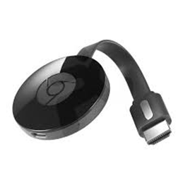
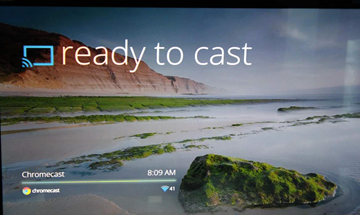

# 7. Visualización

## 7.1 Visualización online y dispositivos

Los servicios de streaming los podemos utilizar:

- Desde un navegador conectando a la página web de la plataforma
- A través de una app en caso de un móvil, tablet o SmartTV.
- En caso de no disponer de SmartTV, se pueden utilizar otros dispositivos para añadirle funcionalidades, como el chromecast.

En general existen limitaciones de dispositivos:

- Número máximo de equipos registrados
- Número máximo de dispositivos conectados simultáneamente.

## 7.2. Chromecast

**Chromecast** es un adaptador de transmisión de medios de Google que permite a los usuarios reproducir contenido en línea como videos y música en un televisor digital.

El adaptador es un **dongle** que se conecta al puerto **HDMI** del televisor; un cable se conecta a un puerto USB para alimentar el dispositivo.

Una **aplicación móvil** hace posible usar esencialmente un teléfono inteligente, tableta, computadora portátil o computadora de escritorio como control remoto de TV.

Una vez que comienza la transmisión, no es necesario mantener abierta la aplicación, y el dispositivo se puede usar para otros fines. Chromecast puede transmitir contenido desde un número creciente de fuentes, incluidas Netflix, Hulu Plus, YouTube, música y películas de Google Play y el navegador Chrome.

