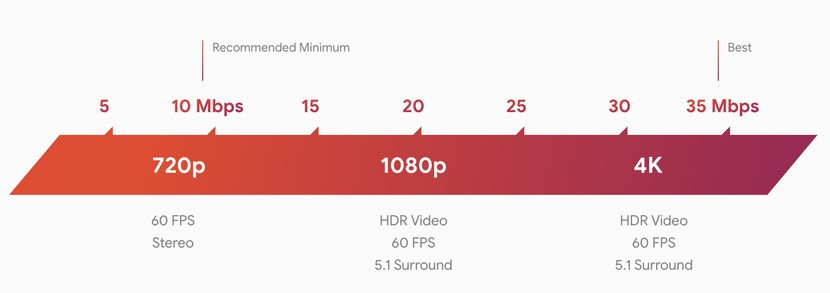

# 9. Servicios de juegos en la nube

Los servicios de juegos en la nube son plataformas de juego en línea que permiten a los usuarios jugar a juegos sin tener que descargar los archivos del juego o comprar una consola. Estas plataformas ofrecen juegos en streaming desde la nube a cualquier dispositivo con una conexión a Internet.

 Estos servicios se están volviendo cada vez más populares entre los jugadores, ya que ofrecen la posibilidad de jugar desde cualquier lugar y con cualquier dispositivo. Los servicios de juegos en la nube también ayudan a los desarrolladores a crear mejores juegos, ya que se pueden probar y actualizar más rápidamente sin tener que preocuparse de los archivos de descarga.

## Google stadia

Google Stadia es una plataforma de juegos en línea que te permite jugar juegos de alta calidad en dispositivos como teléfonos, computadoras, televisores y tabletas. Usa la tecnología de streaming de Google para transmitir los juegos directamente desde la nube, lo que significa que no necesitas descargar un juego para jugar. El servicio te permite comprar juegos, alquilarlos o jugar con una suscripción. Puedes jugar en cualquier lugar y en cualquier momento con una conexión a Internet estable.

No se necesita una consola física para jugar, sino que se puede hacer con dispositivos de los que ya disponemos.

Versiones de stadia:

## Playstation now

 Playstation Now es un servicio de streaming de videojuegos en línea que ofrece a los usuarios la posibilidad de jugar juegos de PlayStation 2, PlayStation 3 y PlayStation 4 en sus dispositivos PlayStation, PlayStation 4, PC y algunos televisores inteligentes.