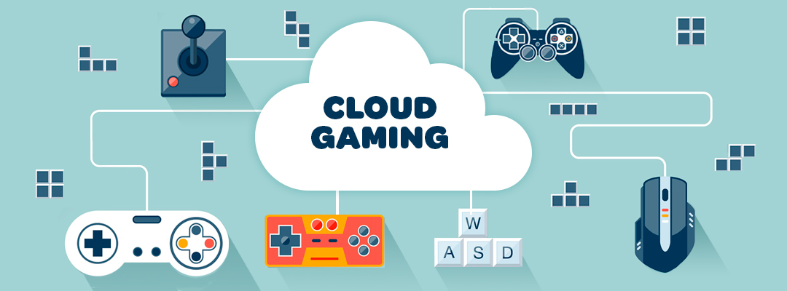
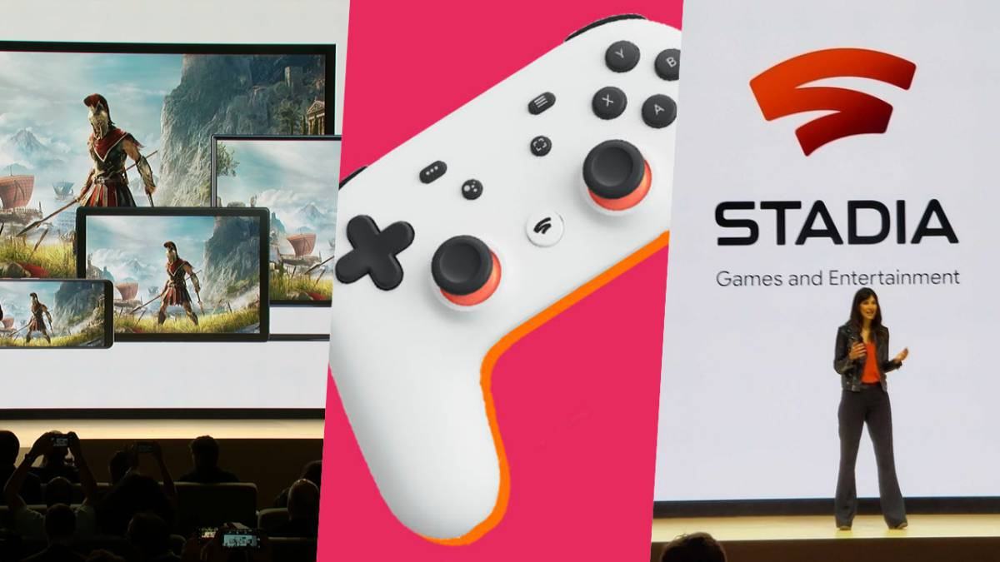

# 9. Servicios de juegos en la nube

- Son plataformas de juego en línea que permiten a los usuarios jugar a juegos **sin tener que descargar** los archivos del juego o comprar una consola.

- Estas plataformas ofrecen juegos en streaming desde la nube a cualquier dispositivo con una conexión a Internet.

---

## Google stadia

Google Stadia es una plataforma de juegos en línea que te permite jugar juegos de alta calidad en dispositivos como teléfonos, computadoras, televisores y tabletas. Usa la tecnología de streaming de Google para transmitir los juegos directamente desde la nube, lo que significa que no necesitas descargar un juego para jugar.

---

---

El servicio te permite comprar juegos, alquilarlos o jugar con una suscripción. Puedes jugar en cualquier lugar y en cualquier momento con una conexión a Internet estable.

No se necesita una consola física para jugar, sino que se puede hacer con dispositivos de los que ya disponemos.

---

Versiones de stadia:

---

## Playstation now

PlayStation Now es un servicio de suscripción de videojuegos en línea desarrollado por Sony Interactive Entertainment.

---

A continuación se presentan algunas de las características de PlayStation Now:

- Catálogo: Ofrece un catálogo de más de 800 juegos de PlayStation 2, PlayStation 3 y PlayStation 4. También incluye algunos juegos de la consola portátil PlayStation Vita.
- Transmisión en línea: Los juegos se transmiten en línea, lo que significa que no es necesario descargarlos por completo en la consola. Los usuarios pueden comenzar a jugar inmediatamente después de seleccionar el juego.
- Dispositivos compatibles: El servicio está disponible en PlayStation 4 y PlayStation 5, así como en PC con Windows.
- Suscripción: Los usuarios deben suscribirse a PlayStation Now para acceder al catálogo de juegos. Ofrece dos planes de suscripción, mensual y anual, con un costo de $9.99 y $59.99, respectivamente.