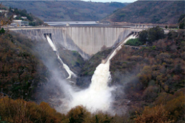
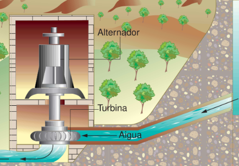

# ENERGÍA HIDRÁULICA

Se obtiene de presas, a partir del agua almacenada en los embalses de los ríos.

Cuando el agua almacenada se la deja salir, pasa a través de una turbina que gira y está conectada a un generador eléctrico. De esta manera, la energía potencial del agua almacenada se transforma en energía cinética y al final en energía eléctrica.

Las instalaciones se denominan **centrales hidroeléctricas**.

# Ventajas e inconvenientes

- Mantenimiento mínimo
- No genera residuos ni contaminantes
- Los embalses ayudan a controlar las crecidas e inundaciones.
- Suministran agua a campos, poblaciones e industria en estaciones secas. Actualmente se están instalando centrales  minihidroeléctrias, mucho más respetuosas con el medio ambiente

La energía eléctrica generada se transporta por una costosa red, ya que suelen estar alejadas de las grandes poblaciones. La cantidad de agua disponible depende de las lluvias del año. Su construcción inunda grandes territorios y crea graves alteraciones en el entorno. Existe riesgo de rotura con graves consecuencias en las poblaciones próximas

- La **sala de máquinas** es donde están situados, principalmente, la turbina, el generador eléctrico o alternador, los automatismos y otros elementos auxiliares.
- La **turbina hidráulica** es una máquina destinada a transformar la energía del agua en energía mecánica, es decir, en un movimiento de rotación que se transmite al alternador.
- El **alternador** o generador eléctrico es una máquina común en la mayoría de centrales, que recibe la energía mecánica de la turbina y la transforma en energía eléctrica.

La corriente eléctrica obtenida en el alternador, de alta intensidad y tensión media, se modifica por medio de los transformadores elevadores (se eleva la tensión y se disminuye la intensidad), para facilitarla
el transporte en líneas de alta tensión, que permiten utilizar cables más
delgados y reducir sus pérdidas.

Antes de llegar a nuestra casa, otros transformadores, los reductores, la convertirán en baja tensión (220 V), que es la que utilizamos para usos domésticos.

