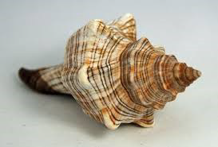
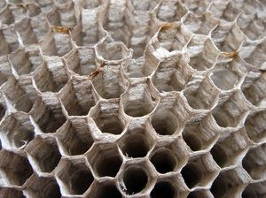
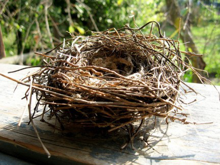
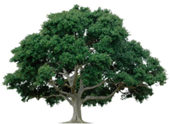
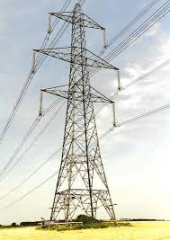
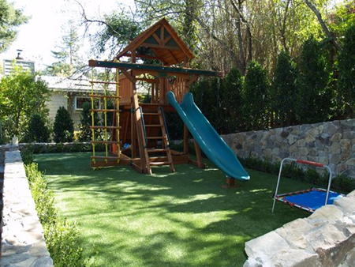
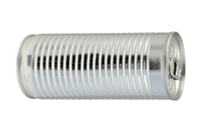

# 2. Estructures

Una estructura és un conjunt resistent i estable d’elements capaços de suportar forces i transmetre-les als punts de suport.

Tots els objectes necessiten una estructura que els permeti resistir els efectes de les forces que hi actuen.

# 2.1. Tipus d'estructures

## Naturals

- Conxes
- Nius

## Artificials

- Gratacels
- Torres elèctriques

