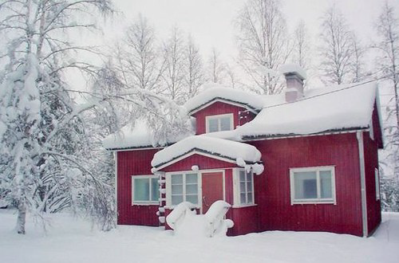
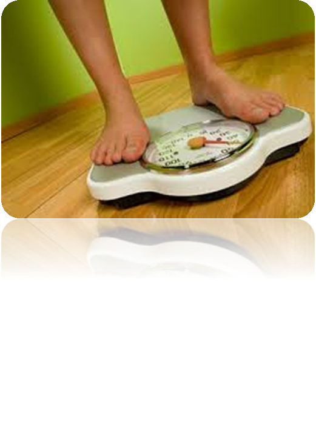

# 3. Càrregues

Son forces que actuen sobre una estructura

## Tipus de càrregues

### Càrregues permanents

No varien amb el temps

Exemples:

- El propi pes d'un objecte

### Càrregues variables

Son ocasionals i varibles

Exemples:

- Neu sobre un terrat
- Pressió de l'aigua sobre una presa

