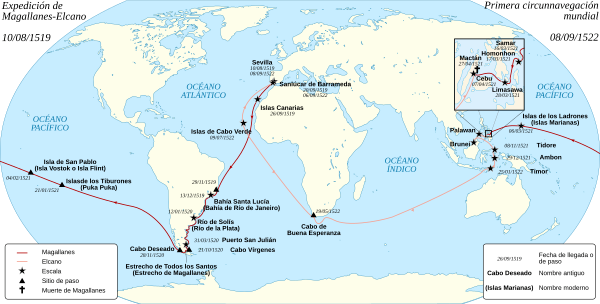
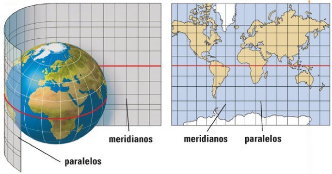

# Siglo XVI

El siglo XVI fue un periodo de gran actividad científica y tecnológica, a lo que contribuyeron los avances en la navegación, la imprenta, la minería, la industria textil y otros campos. Esta era una época en la que la ciencia moderna emergía, y los inventos y descubrimientos cambiaban la forma en que la gente vivía.

1500 Reloj

1522 Sebastián Elcano completa el viaje por todo el mundo
1530 Empieza el comercio de esclavos

1569 Mapa en proyección
1589 Telar
1589: Sir John Harrington (GB) inventa el inodoro con
depósito, pero pasó mucho tiempo antes de imponerse, y se
siguieron usando bacinas y inodoros con agujeros hacia pozo
o foso
1590 Microscopio compuesto
1593 Termómetro de agua

Uno de los principales avances tecnológicos de este siglo fue la invención del reloj. A principios del siglo XVI, el ingeniero alemán Peter Henlein inventó el primer reloj de bolsillo, y el reloj de pared fue inventado en 1510. Estos relojes eran imprescindibles para la navegación, permitiendo a los navegantes medir con precisión la longitud de sus viajes.

---

#  1500 Puntilla

Otra invención importante de este siglo fue la puntilla, inventada por la artesana italiana Isabella Cataneo. Esta técnica permitió la elaboración de prendas de vestir con detalles finos y decorados. A partir de entonces, la puntilla se convirtió en una forma de arte y se extendió por toda Europa.

En 1522, el navegante español Sebastián Elcano completó el primer viaje alrededor del mundo. Este logro contribuyó a la expansión del comercio marítimo y la apertura de nuevos mercados. Esto también permitió a los europeos traer esclavos de África para trabajar en sus colonias. Esta práctica fue muy común en el siglo XVI y contribuyó a la economía europea.

---

#  1565 Lápices

En 1565, el alemán Faber-Castell inventó el lápiz, revolucionando el proceso de escritura. Esto permitió el uso generalizado de escritura a mano y la producción de documentos y obras de arte.

---

#  1581 Péndulo

Otro avance importante en el siglo XVI fue la invención del péndulo por el físico italiano Galileo Galilei, en 1581. Esta invención permitió la medición precisa del tiempo y el desarrollo de relojes de precisión.

En 1569, el cartógrafo alemán ``Gerardus Mercator`` inventó el mapa en proyección cilíndrica, que permitió la representación de los mares y continentes con mayor precisión. Esto contribuyó a la navegación y la exploración marítima.

En 1589, el inglés Sir John Harrington inventó el inodoro con depósito. Aunque este avance fue importante, tardó mucho tiempo en imponerse y se siguieron usando bacinas y inodoros con agujeros hacia pozos o fosos.

En 1590, el italiano Galileo Galilei inventó el microscopio compuesto, una importante herramienta para la microscopía.

En 1593, el físico italiano Galileo Galilei inventó el termómetro de agua, lo que permitió la medición de la temperatura con mayor precisión.
