[🔙 Enrere](../) | [🏠 Pàgina principal](http://danimrprofe.github.io/apuntes/) \n\n---
title: B.Materiales y fabricación
footer: Daniel Moreno 🌐 <github.com/danimrprofe>
_footer: ""
paginate: true
_paginate: false
_class: invert
marp: true
---

# TECNOLOGÍA E INGENIERÍA I

---
<!-- _class: invert -->
# <!--fit --> Bloque B: Materiales y fabricación
---
# Materiales técnicos y nuevos materiales.

Los materiales técnicos son materiales que se utilizan en aplicaciones específicas y que requieren un rendimiento específico. Estos materiales deben cumplir con ciertas propiedades para poder ser utilizados en su aplicación específica.

---
# Clasificación.

Los materiales técnicos se clasifican de acuerdo a su composición, estructura, propiedades, aplicaciones, métodos de fabricación y otros criterios. La selección de un material para una aplicación específica se basa en el análisis de las propiedades del material y en el conocimiento de la aplicación.

---

# Propiedades de los materialess

Las propiedades más importantes de los materiales técnicos son la densidad, la dureza, la resistencia a la tracción, la resistencia a la compresión, la resistencia a la flexión, la resistencia a la torsión, la resistencia a la abrasión, la resistencia al impacto, la conductividad eléctrica, la conductividad térmica, la expansión térmica, la resistencia a la corrosión, la estabilidad química, la estabilidad térmica, la estabilidad dimensional, la resistencia a la fricción y el desgaste.

---
# Selección y aplicaciones características.

Los materiales técnicos se utilizan en una amplia variedad de aplicaciones, que van desde la fabricación de herramientas y dispositivos hasta la construcción de estructuras y equipos.

---
# Técnicas de fabricación

---
# Prototipado rápido y bajo demanda

Las técnicas de fabricación de prototipado rápido y bajo demanda son métodos de producción de alta tecnología que se están volviendo cada vez más populares. Estas técnicas permiten la fabricación de prototipos y productos en pequeñas cantidades de forma rápida y eficiente. Esto es especialmente útil para las empresas que necesitan producir productos en una cantidad limitada para evaluar su funcionalidad y/o para satisfacer las necesidades de un mercado reducido.

---

Las técnicas de fabricación de prototipado rápido y bajo demanda se basan en la tecnología de impresión 3D. La impresión 3D es un proceso de fabricación que se puede utilizar para producir objetos tridimensionales a partir de un modelo digital. La impresión 3D se ha utilizado durante muchos años en la industria de prototipado, pero ha ganado mayor popularidad en los últimos años debido a la mejora de la tecnología y el bajo costo de las impresoras 3D.

---

Las impresoras 3D se pueden utilizar para fabricar prototipos de productos y piezas de una manera rápida y eficiente. Esto es especialmente útil para las empresas que necesitan evaluar un producto antes de producirlo en masa. También es útil para las empresas que necesitan producir productos en pequeñas cantidades. Las impresoras 3D también se están utilizando cada vez más para producir productos finales, en lugar de solo prototipos. Esto es posible debido a la mejora de la calidad de las impresoras 3D y el bajo costo de producción.

---

Las técnicas de fabricación de prototipado rápido y bajo demanda son una forma eficiente y económica de producir productos. Estas técnicas se basan en la tecnología de impresión 3D, que permite la fabricación de prototipos y productos en pequeñas cantidades de forma rápida y eficiente. Estas técnicas son especialmente útiles para las empresas que necesitan evaluar un producto antes de producirlo en masa, o para aquellas que necesitan producir productos en pequeñas cantidades.

---
# Fabricación digital aplicada a proyectos

La fabricación digital está cambiando la forma en que se diseñan y se producen los productos. Se está volviendo cada vez más común en una variedad de industrias y está teniendo un impacto significativo en la forma en que se diseñan y se producen los productos. La fabricación digital permite que los diseñadores y los fabricantes trabajen juntos de forma más eficiente y eficaz, lo que permite que se diseñen y se fabriquen productos de mejor calidad en un tiempo más corto.

---

La fabricación digital también está cambiando la forma en que se distribuyen los productos. Los productos que se fabrican digitalmente pueden ser enviados directamente a los clientes, lo que elimina la necesidad de almacenarlos y distribuirlos a través de una cadena de suministro tradicional. La fabricación digital también permite que los productos sean personalizados para que se adapten mejor a las necesidades de los clientes.

---
# Normas de seguridad e higiene en el trabajo.

---
<!-- _class: invert -->
# <!--fit --> Bloque C. Sistemas mecánicos
---
# MECANISMOS DE TRANSMISIÓN
## TRANSMISIÓN LINEAL
---
# POLITGES

Una politja és un element mecànic format per una roda amb una ranura per on passa una co, cinta o cable. Aquesta corda pot ser arrossegada per una força externa aplicada a l'altre extrem, el que permet desplaçar una càrrega o resistència. Les polees es poden utilitzar en solitari o en conjunt.

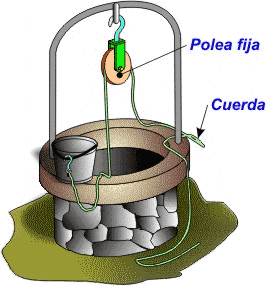

---
# Politja mòbil

La politja mòbil no és altra cosa que una politja de ganxo connectada a una corda que té un dels seus extrems ancorat a un punt fix i l'altre (extrem mòbil) connectat a un mecanisme de tracció.

---

L'inconvenient d'aquest muntatge és que per elevar la càrrega hem de fer força en sentit ascendent, cosa que resulta especialment incòmoda i poc efectiva. Per solucionar-ho es recorre a la seva utilització sota la forma de polipast (combinació de politges fixes amb mòbils).

---
# Polipast

Un polipast és un aparell que serveix per elevar o moure càrregues pesades. Aquest aparell està format per un conjunt de polies que van lligades a un ganxo o càrrega.

Quan es tira de la corda del polipasto, la càrrega es mou cap amunt, gràcies a la multiplicació de forces que es produeix amb les polies. El polipasto es pot utilitzar en una gran varietat d'activitats, com en la construcció, el trasllat de mercaderies, en tallers mecànics, entre altres.

https://www.compassproject.net/html5sims/pulleysim/pulley_en.html

---
---
# MECANISMOS DE TRANSMISIÓN
## TRANSMISIÓN **CIRCULAR**
---

# Ruedas de fricción

Las ruedas de fricción consisten en dos ruedas que se presionan entre sí para transferir el movimiento. La rueda motriz, que se encuentra conectada al motor, hace contacto con la rueda conducida y la hace girar.

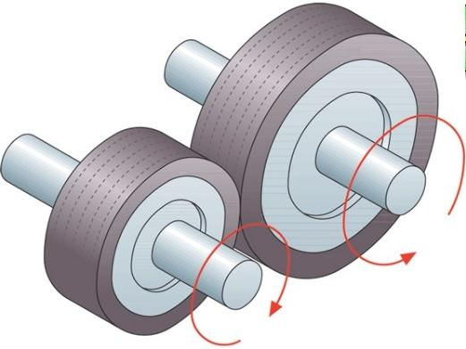

---

# Dinamo

Este sistema es utilizado en aplicaciones donde se requiere una transmisión de potencia a corta distancia.

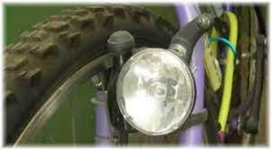

---
# Polea y correa

Por otro lado, la polea y la correa son un mecanismo de transmisión de movimiento rotativo que se utiliza en aplicaciones de mayor distancia. Consiste en una polea que se encuentra conectada al motor y que hace contacto con una correa que se extiende hacia otra polea, que a su vez transfiere el movimiento a la máquina o dispositivo que se desea mover.

---

Las correas pueden ser de diferentes tipos, como las planas, las trapezoidales o las dentadas, y su elección dependerá del tipo de aplicación.

Simulador: https://www.blocklayer.com/pulley-belteng

---
# Engranajes

Los engranajes de rueda dentada son uno de los mecanismos más utilizados para la transmisión del movimiento. En general, los engranajes de rueda dentada se componen de dos ruedas dentadas que están unidas por un eje. Las ruedas dentadas se encuentran en contacto y los dientes se interbloquean.

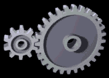

---

Las ruedas dentadas se pueden mover en el mismo sentido o en sentidos opuestos. Si las ruedas dentadas se mueven en el mismo sentido, se llama una reducción; si las ruedas dentadas se mueven en sentidos opuestos, se llama una transmisión.

---

Los engranajes de rueda dentada de rueda dentada pueden transmitir un movimiento uniforme a una velocidad diferente.

https://geargenerator.com/

---
# Cadenas

Las ``cadenas`` son uno de los mecanismos más simples para transmitir el movimiento. Una cadena es una serie de ``eslabones`` conectados. Los eslabones pueden girar libremente en torno a su eje.

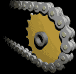

Las cadenas se utilizan principalmente en bicicletas, motocicletas, motores de bote y trenes de juguete.

---
# Cadenas: simulación

Simulador: https://www.blocklayer.com/chain-sprocket

Calculador motores y cambios de marchas: https://www.blocklayer.com/rpm-gear

---

# Piñones y platos

Se denomina ``piñón`` a la rueda de un mecanismo de cremallera o a la rueda más pequeña de un par de ruedas dentadas

En una etapa de engranaje, la rueda más grande se denomina ``corona``, mientras que en una transmisión por cadena como la de una bicicleta o motocicleta además de corona a la rueda mayor se le puede denominar ``plato``, «estrella» o «catalina»

---
# Mecanismos de transformación
## Movimiento **circular-rectilíneo**

---
# manivela-torno

Es un dispositivo que convierte el movimiento circular en movimiento lineal o viceversa. Consiste en una manivela que gira alrededor de un eje y que está conectada a un mecanismo de torno que se encarga de transformar el movimiento.

---

---

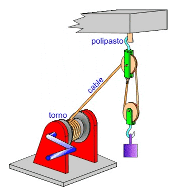

---
# piñón-cremallera

Es un sistema de engranajes que se utiliza para transformar el movimiento circular en movimiento lineal. Consiste en un piñón que gira alrededor de un eje y que se conecta a una cremallera que se mueve linealmente. Al girar el piñón, la cremallera se desplaza en la dirección deseada.

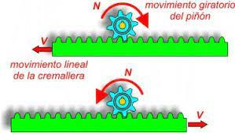

---

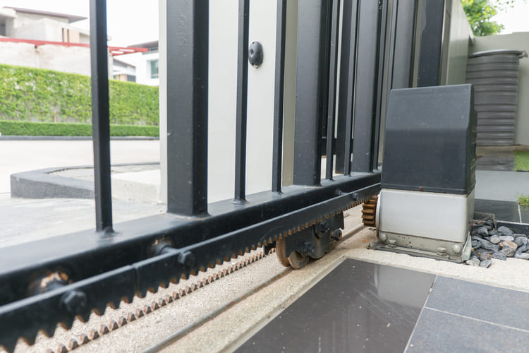

---
# Tornillo-tuerca

Es un sistema de rosca que se utiliza para transformar el movimiento circular en movimiento lineal. Consiste en un ``tornillo`` con una ``rosca`` que se conecta a una ``tuerca`` con una rosca correspondiente. Al girar el tornillo, la tuerca se desplaza a lo largo del tornillo en la dirección deseada.

---

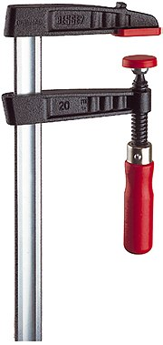

---

---

# Tornillo sin fin

Es un tipo de engranaje que se utiliza para transformar el movimiento circular en movimiento lineal. Consiste en un tornillo con una rosca sin fin que se conecta a una rueda dentada que se llama corona. Al girar el tornillo sin fin, la corona se desplaza en la dirección deseada.

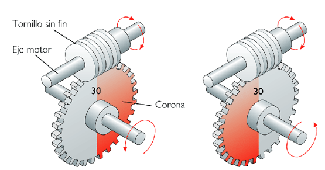

---

Este sistema se utiliza principalmente en maquinaria que requiere un alto grado de precisión, como los relojes, y también para sistemas reductores de la velocidad.

Se trata de un sistema que no reversible.

---
# Mecanismos de transformación
## Circular-rectilíneo alternativo

---
# Biela-manivela

Es un mecanismo que se utiliza para transformar el movimiento lineal en movimiento circular o viceversa. Consiste en una ``biela``, que es una barra que se mueve linealmente, conectada a una ``manivela``, que es un brazo que gira alrededor de un eje. Al mover la biela, la manivela gira y viceversa.

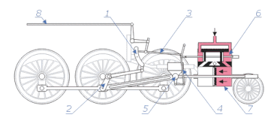

---
# Leva y excéntrica

Son mecanismos que se utilizan para transformar el movimiento circular en movimiento lineal o viceversa. Una leva es una pieza de forma irregular que se mueve en un movimiento circular y que, al hacer contacto con otra pieza, produce un movimiento lineal.

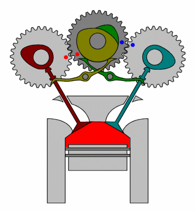

---
# Árbol de levas

Un árbol de levas es un componente del motor de combustión interna que se encarga de controlar la apertura y cierre de las válvulas de admisión y escape. Es un eje con levas o protuberancias que giran en sincronización con el movimiento del cigüeñal, y que están diseñadas para presionar sobre los taqués o balancines, moviendo a su vez las válvulas.

---

El árbol de levas puede estar ubicado en la culata o en el bloque del motor, dependiendo del diseño del motor. En los motores de cuatro tiempos, el árbol de levas gira a la mitad de la velocidad del cigüeñal y tiene tantas levas como válvulas tenga el motor.

---

# Excéntrica

Una ``excéntrica`` es una pieza circular que gira alrededor de un eje descentrado y que se utiliza para producir un movimiento lineal.

---

# Cigüeñal

Es un componente importante en la mayoría de los motores de combustión interna. Se utiliza para transformar el movimiento lineal de los pistones en movimiento circular. Consiste en un eje que gira alrededor de un punto central y que tiene una serie de contrapesos y muñequillas en ángulos específicos. 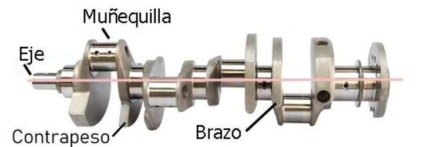

---

Los ``pistones`` se conectan a las muñequillas y, al girar el cigüeñal, se produce un movimiento circular que impulsa el motor.

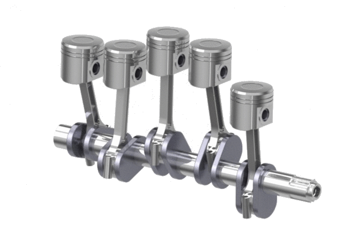

---
# Sistemes de retenció
---

Los mecanismos de retención son órganos destinados a interrumpir a voluntad el movimiento de rotación del eje y se les conoce con el nombre de frenos o trinquetes.

---
# Frens

Los sistemas de frenado son elementos mecánicos que se utilizan para reducir o detener el movimiento de una máquina. Su funcionamiento consiste en aumentar las resistencias pasivas que se producen en una máquina durante su funcionamiento.

La energía cinética que poseen los elementos móviles se transforma en trabajo durante la deceleración, generando calor que es necesario eliminar rápidamente.

---

Para prolongar la duración de los elementos de frenado y hacer que los mecanismos vuelvan a estar rápidamente en condiciones de actuar de forma eficaz, se utilizan materiales adecuados para revestir las superficies de desgaste de los frenos, como el acero con bronce, llautó, fosa o acero, y las pastillas de freno pueden estar hechas de materiales metálicos o cerámicos, dependiendo del tipo de freno y de las condiciones de funcionamiento.

---

# Frens de sabates

Les sabates de frens són un dels tipus més comuns de frens que s'utilitzen en vehicles i altres màquines. Les sabates de frens consisteixen en una peça que gira (tambor) solidària a la roda o a l'eix, i elements fixes (sabates) que es pressionen contra el tambor per disminuir la velocitat.

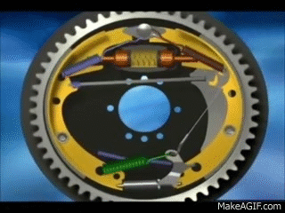

---

# Materials

A més, els materials que es fan servir per revestir les sabates de frens són importants per a la seva eficàcia. Els materials metàl·lics són els més comuns perquè són millors conductors del calor i es refreden més ràpidament. Els coeficients de fregament varien en funció del material i la temperatura de funcionament. També existeixen altres materials no metàl·lics que es poden utilitzar per revestir les sabates de frens, com ara la fibra de vidre o la ceràmica.

---

# Tipus

Les sabates de frens poden ser de tipus interior o exterior. En els frens de sabata interior, les sabates pressionen contra la cara interna del tambor per reduir la velocitat. En els frens de sabata exterior, les sabates pressionen contra la cara externa del tambor per realitzar la mateixa funció.

---

# Frens de disc

Els frens de disc funcionen mitjançant una pinça que pren un disc col·locat en l'eix de gir. La pinça pressiona dues pastilles de fre, una a cada costat del disc, per frenar el moviment. Això es fa mitjançant èmbols que s'accionen amb pressió hidràulica.

---

El líquid que circula en el sistema de frenat es diu líquid de frens.

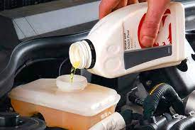

---

# Tipus de frens de disc

Hi ha dos tipus de frens de disc: sistema rígid i sistema flotant. En el sistema rígid, els èmbols pressionen per ambdós costats del disc de manera simultània, mentre que en el sistema flotant, una pinça solidària duu dos pistons, un acciona directament sobre una de les pastilles de fre i l'altre acciona sobre l'altra per mitjà de la porta de la pinça.

---

---

---

# Accionament dels sistemes de frenat

Hi ha diferents tipus d'accionament dels sistemes de frenat que s'utilitzen en vehicles i altres màquines. Els dos tipus més comuns són els sistemes de frenat mecànics i hidràulics.

---

Els sistemes de frenat ``mecànics`` utilitzen una vareta per mitjà d'una palanca per fer girar la lleva i separar les sabates de frens per aplicar-les contra el tambor.

---

Els sistemes de frenat ``hidràulics`` utilitzen un líquid per transmetre la pressió a través d'una columna de líquid que actua com a transmissor d'energia. La bomba "cilindre mestre" transmet la pressió del pedal de fre a través de les canalitzacions per accionar els bombins que apliquen la força de frenat als discos.

---

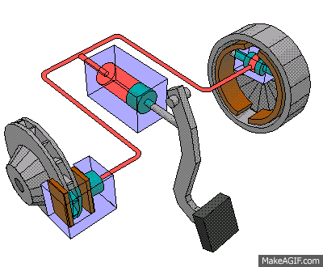

---

Els ``líquids`` utilitzats en els sistemes de frenat hidràulics són generalment obtinguts per síntesi, i són capaços d'absorbir la humitat de l'aire per prevenir la corrosió. Els sistemes de frenat hidràulics són els més comuns en l'actualitat.

---
# Servofrens

Els servofrens són un tipus especial de sistema de frenat que ajuda a reduir l'esforç de la força que s'ha de realitzar en el pedal de fre. Els servofrens utilitzen una font externa d'energia, com ara l'aire comprimit o l'energia hidràulica, per ajudar a aplicar la força als frens i reduir l'esforç que s'ha de fer en el pedal.

Els servofrens pneumàtics són els més habituals i utilitzen una vàlvula per deixar passar aire comprimit que acciona els èmbols per aplicar la força als frens.

---
# Trinquets

Es un mecanismo que permite que una pieza o componente se mueva en una dirección determinada, pero no en la dirección opuesta. El trinquete generalmente está compuesto por una rueda dentada y una palanca que se encajan entre los dientes de la rueda dentada para evitar que la pieza se mueva hacia atrás.

Permeten rotació d’un eix en un sentit determinat l’impideixen en l’oposat

---

# Sistema de trinquet. Compost de:

- ``Roda dentada``. Dents tenen un costat recte i l’altre corb.
- Nucli o ``trinquet``. Articulat en una part fixa, encaixa en el costat recte de la dent
- Bon funcionament quan el trinquet, en contacte amb la dent, tendeix espontàniament a introduir-se a l’espai lliure.

---

# Resorte

Es un componente elástico que se utiliza para almacenar y liberar energía en una variedad de aplicaciones mecánicas.

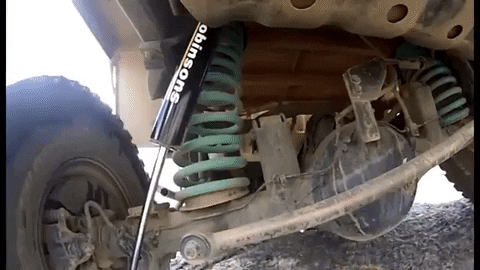

Los resortes pueden ser de diferentes tipos, como ``helicoidales``, de láminas, de torsión, entre otros, y se utilizan en una amplia gama de aplicaciones, desde relojes hasta vehículos.

---
# Soporte de elementos mecánicos

Los cojinetes y rodamientos se utilizan en una gran variedad de máquinas, desde ventiladores y bombas hasta automóviles y aviones. También se utilizan en muchos otros tipos de equipos, como escaleras mecánicas y maquinaria pesada. Los rodamientos son especialmente importantes en las ruedas de los automóviles, ya que soportan el peso del vehículo y permiten que las ruedas se muevan libremente.

---
# Cojinetes

Un cojinete es un dispositivo que se utiliza para reducir la fricción entre las piezas móviles de una máquina. Esto permite que las piezas se muevan más fácilmente y con menos desgaste.

---

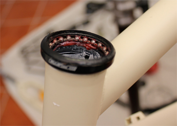

---
<!-- _class: invert -->
# <!--fit --> Mecanismes d’acoblament d’eixos
---

Son dispositivos que se utilizan para conectar dos ejes de manera que puedan transmitir energía mecánica entre ellos. Los acoplamientos pueden ser de diferentes tipos, como acoplamientos rígidos, flexibles, de engranajes, hidráulicos, entre otros, y se utilizan en una amplia gama de aplicaciones mecánicas.

---
# Acoblament per maniguet

Acoblament per maniguet és un tipus senzill i tosc d'acoblament adequat per a màquines amb velocitats reduïdes i d'ús ocasional. L'estructura està formada per un maniguet de fundició amb un canal interior que acull dues xavetes, les quals sostenen els extrems dels eixos i es fixen al maniguet mitjançant cargols de cap avellanat. Una protecció de xapa cobreix els talons de les xavetes per a evitar que surtin de les ranures del maniguet.

---

Debido a l'asimetria produïda per les ranures i les xavetes, així com l'excentricitat que es produeix per la introducció forçada de les xavetes, és important allunyar el centre de gravetat de l'acoblament dels arbres per a evitar vibracions i irregularitats en el moviment. A més, es pot assegurar la unió entre el maniguet i els arbres mitjançant clavilla cònica transversal si l'esforç a transmetre és petit.

---

# JUNTA CARDAN

La junta Cardan és un element mecànic que s'utilitza per a transferir el moviment de rotació d'un eix a un altre quan estan desalineats. Està formada per dues forquilles solidàries als arbres d'entrada i de sortida, i una peça central denominada creueta.

---

Quan l'eix d'entrada gira, arrossega la creueta, i aquesta a la vegada arrossega l'eix de sortida. No obstant, la velocitat de gir de sortida sofreix algunes variacions a causa dels angles que es formen.

Per evitar aquestes variacions, s'instal·len sempre dues juntes Cardan que es compensen entre si. A aquest element se l'anomena doble Cardan.

---
# Junta homocinètica

La junta homocinètica té com a finalitat connectar dos eixos situats longitudinalment que no són continus, de manera que la velocitat entre ells sigui sempre igual.

Aquesta connexió es fa a través del palier de transmissió de les rodes, que s'uneix per un extrem amb el diferencial i per l'altre amb la caixa de la roda.

---

---

Aquesta transmissió està sotmesa a moviments oscil·latoris de la suspensió i moviments giratoris de la direcció, per la qual cosa ha de ser articulada. La junta homocinètica actua com una mena de ròtula complexa que permet aquests moviments sense que les rodes perdin tracció ni les transmissions es vegin afectades.

---

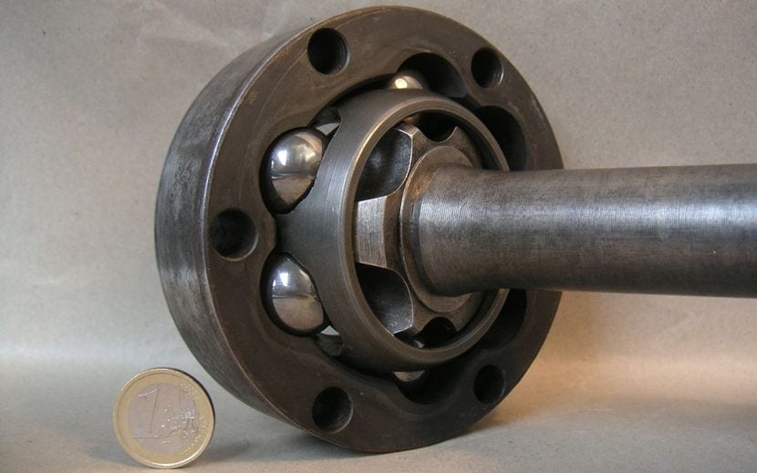

---
# Embragatges

Els embragatges són elements fonamentals per als mecanismes que requereixen acoblament i desacoblament del motor i la transmissió.

---
# Tipus d’embragatges:

- De dents
- De fricció
- De disc
- De diafragma
- Cònics
- Automàtics
- Electromagnètics
- De disc
- De pols electromagnètica
- Hidràulic

---
# Embragatges. Accionament

Hi ha diversos tipus d'accionament d'embragatge, entre els quals es destaquen l'accionament mecànic, hidràulic i automàtic.

L'accionament mecànic es compon de diversos elements que integren el comandament de l'embragatge, com ara el pedal d'accionament, el cable que transmet l'esforç, la palanca de dessembragatge i el coixinet de "empuje" que desplaça els elements de fricció.

---

L'accionament hidràulic s'utilitza quan es necessita realitzar un major esforç o quan la distància entre el pedal i l'embragatge és molt llarga. Aquest sistema es compon de cilindres emissor i receptor, un dipòsit per a líquid hidràulic i una canonada de canalització.

---

Per últim, l'accionament automàtic permet efectuar l'acoblament sense accionar l'embragatge, mitjançant l'ús de l'electrònica. Aquest sistema és més complex i requereix una major tecnologia, però permet un funcionament més suau i còmode dels mecanismes. En resum, l'elecció de l'accionament d'embragatge adequat depèn de les necessitats i requisits dels mecanismes a acoblar i desacoblar.

---
# Coixinets

Els coixinets són elements fonamentals per als mecanismes que necessiten suportar moviments giratoris i realitzar diferents funcions, com sustentar el pes, guiar la rotació i evitar desplaçaments. Aquests coixinets poden ser col·locats en el bastidor de la màquina o suports independents que en facilitin el muntatge.

---

En funció de la forma en què es produeix el lliscament de l'eix, hi ha dos tipus de coixinets: els de fricció i els de rodaments.

---

- En els coixinets de ``fricció``, els eixos giren lliscant en el coixinet
- En els coixinets de ``rodaments`` s'interposen una sèrie d'esferes, cilindres i cons, el que fa que el lliscament es produeixi per rodadura i disminueixi el coeficient de fregament.

---

Els coixinets també es classifiquen segons la direcció dels esforços que suporten. Els coixinets axials impedeixen el desplaçament en la direcció de l'eix, mentre que els coixinets radials impedeixen el desplaçament en la direcció del radi. Hi ha també coixinets mixtes que impedeixen tant en sentit axial com radial.

---

En resum, els coixinets són elements essencials per als mecanismes que necessiten suportar moviments giratoris i realitzar diferents funcions, i la seva correcta elecció és clau per a l'optimització dels mecanismes.

---
<!-- _class: invert -->
# <!--fit --> Mecanismes de lubricació d’eixos
---

# Lubrificació

La lubricació és el procés de posar una substància entre dues peces per disminuir el fregament i prevenir l'oxidació, la brutícia i altres formes de desgast. Això produeix una millor eficiència i vida útil dels mecanismes.

Un manteniment adequat del sistema de lubricació i la neteja també són essencials per a una lubricació eficaç. Si la lubricació és inadequada o insuficient, es pot provocar un augment del fregament i de la temperatura, cosa que pot accelerar el desgast i afectar negativament la vida útil dels mecanismes.

---
# Olis

Denominació

Societat d’enginyers automovilistes (SAE)

Estableix escala de denominacions segons consistència

Lletra W (Ex: 40W)

Olis mes fluits

---
# Circuits

Els sistemes de lubrificació disposen de diferents mecanismes per a la recirculació del lubricant. L'oli ha de ser bombejat a través del circuit i després retornat a un recipient (càrter) on es recull.

A partir d'aquí, el procés comença de nou. La reutilització de l'oli requereix filtració. El filtratge en derivació implica la presa d'una derivació d'oli a pressió abans de que arribi als punts de lubricació per passar-lo per un filtre.

---

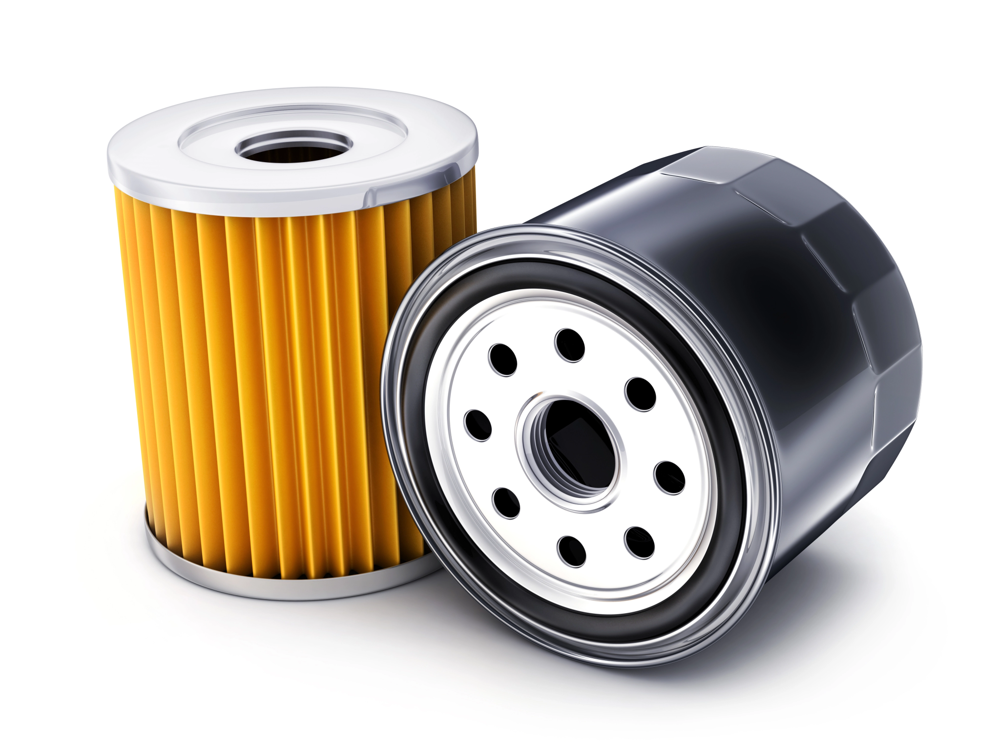

---

Això té l'avantatge que, si el filtre s'obstrueix, la lubricació no es veu afectada. El filtratge en ple cabal implica que una bomba recull l'oli del càrter i l'envia directament al filtre, i s'utilitza en motors de velocitat baixa.

 ---
# Diseño, cálculo, montaje y experimentación física o simulada.

---
# Aplicación práctica a proyectos.

---
# D. Sistemas eléctricos y electrónicos
---

https://portal.edu.gva.es/iesantoniosequeros/wp-content/uploads/sites/607/2021/05/1BACH-TEMA7.pdf

https://fq.iespm.es/documentos/janavarro/electrotecnia/T1_Circuitos_CC_1.pdf

---
# Circuitos y máquinas eléctricas de corriente continua.

---
# Interpretación y representación esquematizada de circuitos, cálculo, montaje y experimentación física o simulada.

---
# Aplicación a proyectos.

---

<!-- _class: invert -->
# <!--fit --> Bloque E: automatización
---

https://sites.google.com/site/federubiotecindbachillerato/home/2o-bachillerato/control-y-programacin

http://www.juntadeandalucia.es/educacion/permanente/materiales/index.php?etapa=4&materia=48&unidad=4

---
# Lenguajes de programación textual. Creación de programas aplicados a la automatización de procesos.

---
# Sistemas de control. Conceptos y elementos.

---
# Modelización de sistemas sencillos.

---
# Inteligencia Artificial aplicada a los sistemas de control.

https://zeuscontrol.com/inteligencia-artificial-aplicada-a-los-sistemas-de-vision/

---
# Protocolos de comunicación. Telemetría y monitorización.

---
# Internet de las cosas y Big Data.

---
# Robótica: modelización de movimientos y acciones mecánicas.

---

<!-- _class: invert -->
# <!--fit --> Bloque F: tecnología sostenible
---

Sistemas y mercados energéticos.
Consumo energético sostenible, técnicas y criterios de ahorro.
Suministros domésticos.

---
# Consumo energético sostenible

La energía es un insumo indispensable en la sociedad actual, ya que es la base para el funcionamiento de la mayoría de los sectores económicos. Los sistemas energéticos se han ido adaptando a las nuevas necesidades a medida que el consumo energético ha ido aumentando, pero el objetivo debe ser el de alcanzar un consumo energético sostenible.

---
# Técnicas y criterios de ahorro energético

Las técnicas y criterios de ahorro energético son esenciales para alcanzar un consumo energético sostenible.

En primer lugar, es necesario reducir el consumo de energía en los hogares, ya que este es el sector que más consume. Para ello, se pueden utilizar aparatos de bajo consumo, mejorar la eficiencia en el uso de los equipos eléctricos o instalar sistemas de ahorro de energía.

En segundo lugar, es necesario mejorar la eficiencia en el transporte, ya que este sector también consume mucha energía. Se puede utilizar el transporte público, mejorar la eficiencia de los vehículos o utilizar vehículos eléctricos.

---
# Energías renovables

Por último, es necesario tener un suministro energético seguro y sostenible. Para ello, se pueden utilizar energías renovables, como la solar, la eólica o la hidráulica, o bien mejorar la eficiencia en el uso de los recursos energéticos.

---
# Instalaciones en viviendas

---
#  Eléctricas, de agua y climatización, de comunicación y domóticas.

---
# Energías renovables, eficiencia energética y sostenibilidad.
