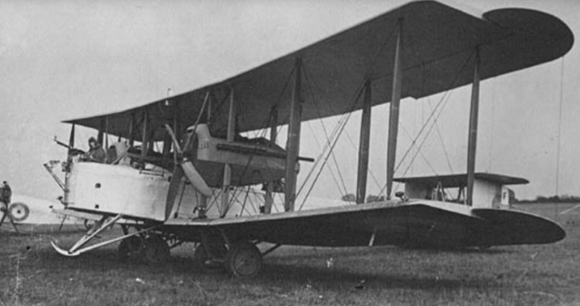
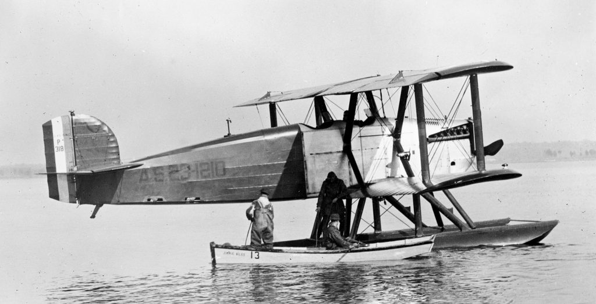

# Aviación

---

# Primer vuelo de los hermanos Wright

El 17 de diciembre de 1903, los hermanos Wright realizaron el primer vuelo motorizado controlado de la historia en Kitty Hawk, Carolina del Norte. Orville Wright pilotó el vuelo histórico, que duró 12 segundos y recorrió 36 metros.

---

# Primer vuelo transatlántico

El 14-15 de junio de 1919, el aviador británico John Alcock y el navegante Arthur Whitten Brown realizaron el primer vuelo sin escalas sobre el Atlántico Norte. Partieron de Terranova, Canadá, y aterrizaron en una turbera cerca de Clifden, en la costa oeste de Irlanda.

---

# Primer vuelo alrededor del mundo

El 28 de septiembre de 1924, el equipo de la Fuerza Aérea de los Estados Unidos liderado por el teniente coronel Leslie Arnold completó el primer vuelo alrededor del mundo. La hazaña tomó 175 días y cubrió una distancia de 44,342 kilómetros.

---

# Primer vuelo comercial transcontinental

En 1929, la compañía aérea estadounidense Transcontinental Air Transport (más tarde conocida como TWA) comenzó a operar vuelos transcontinentales entre Nueva York y Los Ángeles, utilizando una combinación de vuelos aéreos y terrestres.

---

# Primer vuelo supersónico

El 14 de octubre de 1947, el piloto estadounidense Chuck Yeager rompió la barrera del sonido a bordo del avión experimental Bell X-1.

---

# Primer vuelo al espacio

El 12 de abril de 1961, el cosmonauta soviético ``Yuri Gagarin`` se convirtió en el primer ser humano en viajar al espacio, a bordo de la nave ``Vostok 1``.

---

# Primer vuelo comercial a ``reacción``

El 2 de mayo de 1952, la aerolínea británica BOAC comenzó a operar vuelos comerciales regulares utilizando el avión a reacción de Havilland Comet.

---

# Primer vuelo comercial a ``gran altitud``

El 4 de octubre de 1958, la aerolínea estadounidense Pan American World Airways comenzó a operar vuelos comerciales en su avión Boeing 707, que podía volar a altitudes más altas que los aviones anteriores.

---

# Primer vuelo del ``Concorde``

El 2 de marzo de 1969, el avión supersónico Concorde realizó su primer vuelo de prueba en Toulouse, Francia.

---

# Primer vuelo del avión ``Airbus A380``

El 27 de abril de 2005, el avión comercial más grande del mundo, el Airbus A380, realizó su primer vuelo de prueba en Toulouse, Francia.